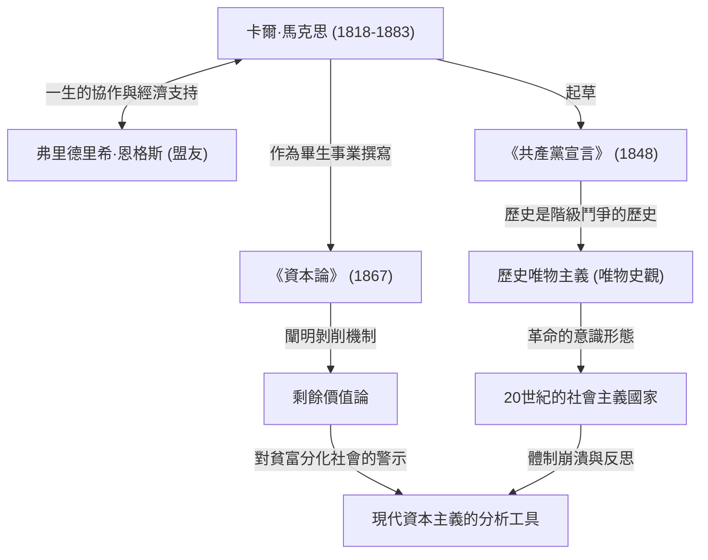

卡爾·馬克思。聽到這個名字，你會想到什麼？有些人可能會把他看作歷史上的偉人、「共產主義之父」，而另一些人可能會把他視為「催生獨裁國家的危險思想家」。然而，如果剝去意識形態的面紗，純粹地審視他的思想，我們會發現他是一個「比任何人都更深刻地分析了資本主義系統漏洞（矛盾）的天才除錯員（Debugger）」。

我們今天所面臨的貧富分化、惡劣的勞動環境以及週期性的經濟危機——令人驚訝的是，這正是馬克思在150多年前就預見到的「資本主義結構性缺陷」。在本文中，我們將以專業歷史作家的視角，深入探討卡爾·馬克思波瀾壯闊的一生、他所建立的哲學核心，以及為什麼他的思想在現代社會再次備受矚目。

## 生涯軌跡：反叛的思想家是如何誕生的

1818年，卡爾·海因里希·馬克思出生於普魯士王國（今德國）特里爾市一個富裕的猶太律師家庭。在波昂大學和柏林大學學習法律和哲學期間，他深受當時席捲德國哲學界的黑格爾哲學的影響。然而，他並沒有簡單地肯定現狀，而是傾向於批判現實社會矛盾的「青年黑格爾派」。

大學畢業後，馬克思開始以記者的身份活動，但他對政府的尖銳批評導致報紙被迫停刊，他流亡到了巴黎。在巴黎的這段時期成為決定他一生的重要轉折點。在這裡，他與一生的摯友弗里德里希·恩格斯命運般地相遇了。作為富裕紡織廠兒子的恩格斯向馬克思講述了英國工人階級悲慘的現實，兩人一拍即合。此後，恩格斯成為了在思想和經濟上持續支持馬克思的無與倫比的夥伴。

此後，他依然被各國政府視為危險分子，先後流亡布魯塞爾、科隆，最終定居倫敦。在倫敦的生活極度貧困，他在營養不良和疾病中接連失去孩子，經歷了極其悲慘的遭遇。儘管如此，馬克思每天仍堅持去大英博物館閱覽室，飽覽浩如煙海的經濟學文獻。他嘔心瀝血的研究結晶，正是他的代表作《資本論》。

## 圖解馬克思思想

下面的關聯圖梳理了他的成就和思想影響的全貌。

## 馬克思哲學的核心：唯物史觀與剩餘價值之謎

馬克思的思想大致由「哲學」、「歷史觀」和「經濟學」三大支柱組成，而其核心是「歷史唯物主義（唯物史觀）」和「剩餘價值論」。

### 推動歷史的是「物質條件」
歷史唯物主義是一種革命性的觀念，即「不是人們的意識決定人們的存在，相反，是人們的社會存在決定人們的意識」。以前的歷史學家用王侯貴族的英雄事蹟或宗教理念來講述歷史，而馬克思則將「生產力」與「生產關係」的矛盾定義為推動歷史進入下一階段的動力（引擎）。《共產黨宣言》中著名的論斷「至今一切社會的歷史都是階級鬥爭的歷史」，正是這一歷史觀的簡明表達。

### 「剩餘價值」——為什麼工人富裕不起來？
他在經濟學領域最大的成就是「剩餘價值論」，它在邏輯上闡明了資本主義是如何產生利潤，同時又擴大了貧富差距的。
資本家僱傭工人並支付工資。然而，工人通過勞動創造的價值超過了他們工資（勞動力價值）的部分。馬克思將這部分超出工資創造的價值稱為「剩餘價值」，並揭示這正是資本家利潤的源泉，也是對工人「剝削」的真相。
換句話說，他主張，資本主義系統正常運轉的狀態本身，就註定會導致「財富分配不均」和「工人的貧困」。

## 對後世的巨大影響與現代的馬克思

馬克思逝世後，他的思想在20世紀字面意義上將世界一分為二。俄國革命的領導者列寧將他的理論付諸實踐，誕生了人類歷史上第一個社會主義國家——蘇聯。此後，它波及中國、古巴等世界各地，並以冷戰的形式與資本主義陣營對峙。結果蘇聯解體，許多打著馬克思主義旗號的國家體制陷入癱瘓。因此，曾有一段時期人們宣稱「馬克思已終結」。

然而，進入21世紀，經歷了雷曼兄弟危機和全球大流行病，他的思想再次受到關注。財富集中在極少數全球企業和富豪手中，中產階級衰落，深受非正式僱傭和「狗屁工作」（Bullshit Jobs）折磨的現代人，正是馬克思在《資本論》中所描繪的「異化勞動者」。
即便是面對氣候變化和環境破壞等全球性挑戰，馬克思從根本上質疑資本主義無限追求利潤的視角，也被指出新自由主義侷限的現代經濟學家所更新，並作為一種強大的分析工具而復甦。

## 結語：思考未來的「作業系統 (OS)」

卡爾·馬克思並沒有繪製出一幅未來烏托邦的詳細藍圖。他留下的是為了解讀資本主義這個極其強大且冷酷的系統的「原始碼」，並指出其脆弱性的堅實邏輯。
當我們試圖設計一個更好的社會系統時，他留下的宏大思想並非過去的遺物，而是作為修復現代社會漏洞不可或缺的「作業系統 (思維基礎)」，在今天依然持續發揮著作用。
