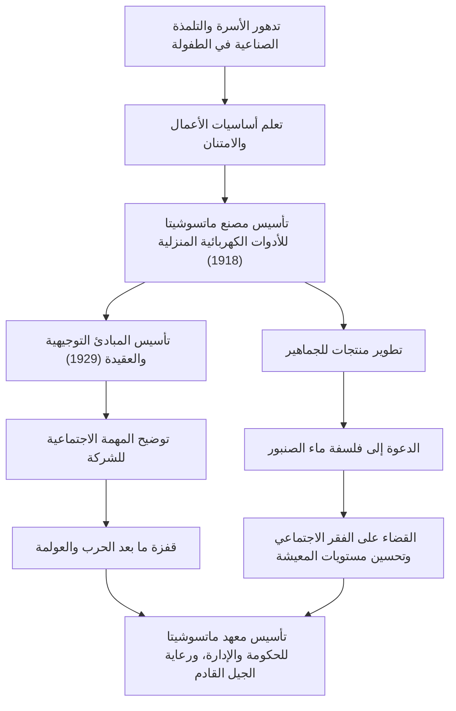

لا يزال كونوسوكي ماتسوشيتا، المعروف باسم "إله الإدارة" في التاريخ الصناعي الياباني، يؤثر على العديد من المتخصصين في مجال الأعمال حتى يومنا هذا. بصفته مؤسس باناسونيك (ماتسوشيتا إلكتريك إندستريال سابقًا)، فهو مشهور بفلسفاته الإدارية الفريدة مثل "فلسفة ماء الصنبور" و"جمع الحكمة الجماعية". يتعمق هذا المقال في رحلته من طفولة اتسمت بالفقر والمرض إلى بناء شركة عالمية، والإرث العاطفي الذي تركه للأجيال القادمة.

## عصر التلمذة الصناعية المولود من رحم الشدائد

وُلد كونوسوكي ماتسوشيتا في عام 1894 (ميجي 27) لعائلة زراعية ثرية في محافظة واكاياما. ومع ذلك، دُمرت الأسرة بسبب فشل والده في المضاربة على الأرز. في سن التاسعة، غادر والديه وذهب إلى أوساكا كمتدرب. لم تكن الحياة والعمل في متجر للمواقد النحاسية ولاحقًا في متجر للدراجات أمرًا سهلاً على الإطلاق، ولكن خلال هذا الوقت تعلم ماتسوشيتا "أساسيات العمل" وروح "العميل أولاً" بشكل مباشر.

كان لتجربته في متجر الدراجات، على وجه الخصوص، تأثير عميق على حياته المهنية اللاحقة. في ذلك الوقت، كانت الدراجات آلات باهظة الثمن ومتطورة. من خلال إصلاحها وبيعها، لم يطور اهتمامًا بالتكنولوجيا فحسب، بل رسخ أيضًا في ذهنه أهمية علاقات الثقة في العمل. أصبحت مصاعب شبابه أصل "روح الامتنان" التي سيدافع عنها لاحقًا.

## تأسيس وقفزة ماتسوشيتا إلكتريك

في عام 1918 (تايشو 7)، وفي سن 23، حقق ماتسوشيتا الاستقلال وأسس "مصنع ماتسوشيتا للأدوات الكهربائية المنزلية" مع زوجته مومينو وصهره توشيو إيوي (الذي أسس لاحقًا سانيو إلكتريك). كانت منتجاتهم الأولى، "قابس الملحق المحسن" و"المقبس ثنائي الاتجاه"، ذات جودة عالية ولكنها أرخص من المنتجات التقليدية، مما جعلها تحقق نجاحات هائلة على الفور.

لم يكمن الجوهر الحقيقي لماتسوشيتا في صنع منتجات جيدة فحسب، بل في الفهم الدقيق للاحتياجات المجتمعية ودمج تقنيات المبيعات المبتكرة. أنتج سلسلة من المنتجات الناجحة مثل المصابيح المربعة ومصابيح ناشيونال، مما أدى إلى توسيع نطاق العمل بسرعة. في عام 1929، أسس "الهدف الإداري الأساسي وعقيدة الشركة"، موضحًا أن الغرض من المؤسسة لم يكن مجرد السعي وراء الربح، بل المساهمة في المجتمع.

## الوطنية الصناعية و"فلسفة ماء الصنبور"

حتى في مواجهة أزمات غير مسبوقة مثل كساد شوا والحرب العالمية الثانية، ظلت معتقدات ماتسوشيتا ثابتة. إن "فلسفة ماء الصنبور" التي دافع عنها تعبر بشكل مباشر عن مهمة ماتسوشيتا إلكتريك. الفلسفة القائلة بأنه "من خلال توفير إمدادات لا حدود لها من السلع عالية الجودة بأسعار منخفضة، مثل ماء الصنبور، سنقضي على الفقر في العالم" توقعت عصر الإنتاج الضخم والاستهلاك الضخم، بينما كانت متجذرة في نفس الوقت في الإنسانية العميقة.

بعد الحرب، عندما واجه أزمة التطهير من المناصب العامة من قبل القيادة العامة (GHQ)، عاد بفضل حملة التماسات عاطفية من النقابات العمالية والشركاء التجاريين. يتحدث هذا الحدث كثيرًا عن مدى ثقة موظفيه ومجتمعه به وحبهم له. ركبت شركة ماتسوشيتا إلكتريك المُعاد تأسيسها موجة طفرة الأجهزة المنزلية، ونمت بسرعة لتصبح شركة عالمية.

## كونوسوكي ماتسوشيتا الإنسان وإرثه

لم يكن ماتسوشيتا قائد أعمال فحسب، بل كان أيضًا مفكرًا متميزًا. كما يمثله قوله "الشركة هي موظفوها"، فقد صب شغفًا غير عادي في تنمية الموارد البشرية. في سنواته الأخيرة، أسس معهد ماتسوشيتا للحكومة والإدارة، مستثمرًا ثروته الشخصية لرعاية الجيل القادم من القادة.

فلسفته الإدارية ليست نظرية معقدة، بل هي نظرية بسيطة تعتمد على علم النفس البشري والحقيقة. تقدم الكلمات العديدة التي تم جمعها في كتابه "المسار" (Michi wo Hiraku)، مثل "التمتع بقلب نقي" و"الانخراط في أنشطة يومية جديدة"، رؤى عميقة حتى بالنسبة لنا الذين نعيش في العالم الحديث.

أعظم إرث تركه كونوسوكي ماتسوشيتا ليس مجرد منتجات ملموسة أو حجم مؤسسته. إنه يكمن في "قلب الإدارة" نفسه: المساهمة في المجتمع من خلال الأعمال والسعي وراء السعادة الإنسانية. في عالم اليوم سريع التغير، تتألق فلسفته التي تركز على الإنسان أكثر من أي وقت مضى.
