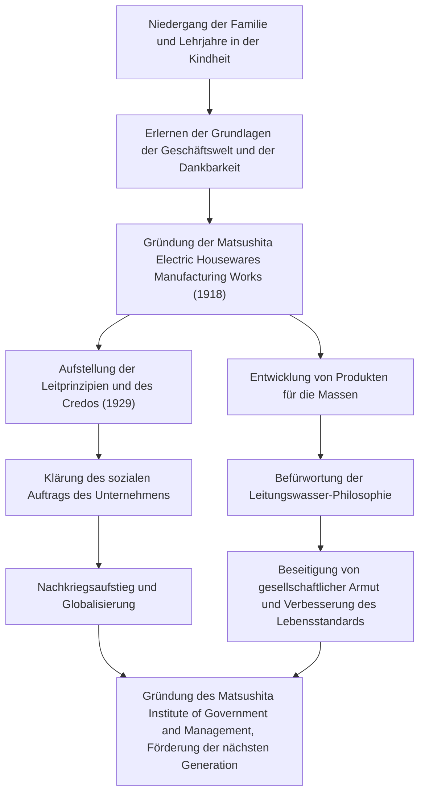

Konosuke Matsushita, der in der japanischen Industriegeschichte als „Gott des Managements“ bezeichnet wird, beeinflusst auch heute noch viele Geschäftsleute. Als Gründer von Panasonic (ehemals Matsushita Electric Industrial) ist er für seine einzigartigen Managementphilosophien wie die „Leitungswasser-Philosophie“ und das „Sammeln von kollektivem Wissen“ bekannt. Dieser Artikel befasst sich mit seinem Weg von einer durch Armut und Krankheit geprägten Kindheit bis zum Aufbau eines Weltkonzerns und dem leidenschaftlichen Vermächtnis, das er künftigen Generationen hinterließ.

## Die aus der Not geborene Zeit der Lehre

Konosuke Matsushita wurde 1894 (Meiji 27) in einer wohlhabenden Bauernfamilie in der Präfektur Wakayama geboren. Die Familie wurde jedoch durch die gescheiterten Reisspekulationen seines Vaters in den Ruin getrieben. Im zarten Alter von 9 Jahren verließ er seine Eltern und ging als Lehrling nach Osaka. Das Leben und Arbeiten in einem Geschäft für Kohlenbecken und später in einem Fahrradgeschäft war keineswegs einfach, aber in dieser Zeit lernte Matsushita die „Grundlagen des Geschäfts“ und den Geist „Der Kunde steht an erster Stelle“ aus erster Hand kennen.

Besonders seine Erfahrungen im Fahrradgeschäft hatten einen tiefgreifenden Einfluss auf seine spätere Karriere. Damals waren Fahrräder teure, hochmoderne Maschinen. Durch deren Reparatur und Verkauf entwickelte er nicht nur ein Interesse an Technologie, sondern prägte sich auch zutiefst ein, wie wichtig vertrauensvolle Beziehungen in der Geschäftswelt sind. Die Härten seiner Jugend wurden zum Ursprung des „Geistes der Dankbarkeit“, den er später befürworten sollte.

## Die Gründung und der Aufstieg von Matsushita Electric

Im Jahr 1918 (Taisho 7), im Alter von 23 Jahren, machte sich Matsushita unabhängig und gründete zusammen mit seiner Frau Mumeno und seinem Schwager Toshio Iue (der später Sanyo Electric gründete) die „Matsushita Electric Housewares Manufacturing Works“. Ihre ersten Produkte, der „verbesserte Anschlussstecker“ und die „Zwei-Wege-Fassung“, waren von hoher Qualität, aber billiger als herkömmliche Produkte, was sie sofort zu massiven Hits machte.

Matsushitas wahres Wesen bestand nicht nur darin, gute Produkte herzustellen, sondern die gesellschaftlichen Bedürfnisse genau zu erfassen und innovative Verkaufstechniken zu integrieren. Er produzierte eine Reihe von Erfolgsprodukten wie quadratische Lampen und National-Lampen und expandierte das Geschäft rasant. 1929 etablierte er die „Grundlegenden Managementziele und das Unternehmenscredo“, in denen klargestellt wurde, dass der Zweck des Unternehmens nicht nur das Streben nach Profit, sondern ein Beitrag für die Gesellschaft sei.

## Industriepatriotismus und die „Leitungswasser-Philosophie“

Selbst angesichts beispielloser Krisen wie der Showa-Depression und dem Zweiten Weltkrieg blieben Matsushitas Überzeugungen unerschütterlich. Die von ihm befürwortete „Leitungswasser-Philosophie“ bringt die Mission von Matsushita Electric am direktesten zum Ausdruck. Die Philosophie, dass „wir durch die Bereitstellung eines unbegrenzten Angebots an hochwertigen Gütern zu niedrigen Preisen, wie Leitungswasser, die Armut aus der Welt beseitigen werden“, nahm die Ära der Massenproduktion und des Massenkonsums vorweg und war gleichzeitig tief im Humanitarismus verwurzelt.

Nach dem Krieg, als ihm eine Säuberung von öffentlichen Ämtern durch das GHQ drohte, gelang ihm dank einer leidenschaftlichen Petitionskampagne von Gewerkschaften und Geschäftspartnern ein Comeback. Diese Episode spricht Bände darüber, wie sehr er von seinen Mitarbeitern und der Gesellschaft vertraut und geliebt wurde. Die wieder eingesetzte Matsushita Electric ritt auf der Welle des Booms der Haushaltsgeräte und wuchs schnell zu einem globalen Konzern heran.

## Der Mensch Konosuke Matsushita und sein Vermächtnis

Matsushita war nicht nur ein Wirtschaftsführer, sondern auch ein herausragender Denker. Wie sein Sprichwort „Ein Unternehmen sind seine Mitarbeiter“ zeigt, steckte er außerordentliche Leidenschaft in die Personalentwicklung. In seinen späteren Jahren gründete er das Matsushita Institute of Government and Management und investierte sein persönliches Vermögen, um die nächste Generation von Führungskräften heranzuziehen.

Seine Managementphilosophie ist keine komplexe, sondern eine einfache Theorie, die auf der menschlichen Psychologie und Wahrheit basiert. Die zahlreichen in seinem Buch „Der Weg“ (Michi wo Hiraku) gesammelten Worte, wie z. B. „ein reines Herz haben“ und „sich täglich an neuen Aktivitäten beteiligen“, bieten selbst uns, die wir in der modernen Welt leben, tiefe Einblicke.

Das größte Vermächtnis, das Konosuke Matsushita hinterlassen hat, sind nicht nur greifbare Produkte oder die Größe seines Unternehmens. Es liegt im „Herzen des Managements“ selbst: durch das Geschäft einen Beitrag zur Gesellschaft zu leisten und nach menschlichem Glück zu streben. In der heutigen, sich schnell verändernden Welt leuchtet seine auf den Menschen ausgerichtete Philosophie heller denn je.
