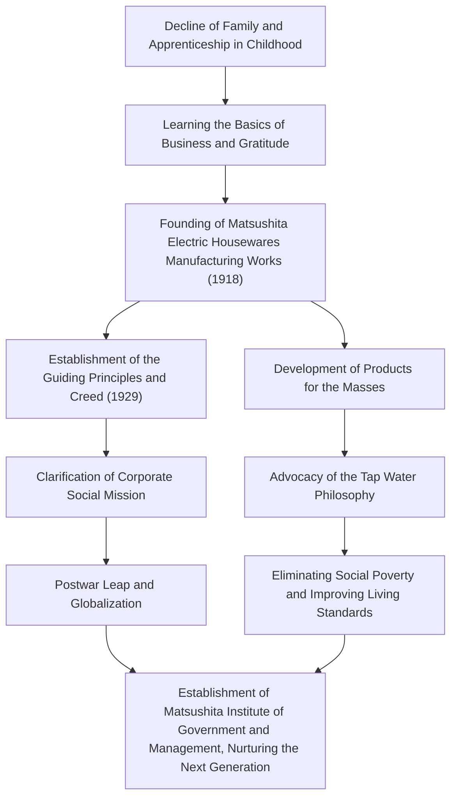

Konosuke Matsushita, known as the "God of Management" in Japanese industrial history, continues to influence many business professionals today. As the founder of Panasonic (formerly Matsushita Electric Industrial), he is renowned for his unique management philosophies such as the "Tap Water Philosophy" and "Gathering Collective Wisdom." This article delves into his journey from a childhood marked by poverty and illness to building a global corporation, and the passionate legacy he left for future generations.

## The Era of Apprenticeship Born from Adversity

Konosuke Matsushita was born in 1894 (Meiji 27) to a wealthy farming family in Wakayama Prefecture. However, the family was ruined due to his father's failure in rice speculation. At the tender age of 9, he left his parents and went to Osaka as an apprentice. Living and working at a brazier shop and later a bicycle shop was by no means easy, but it was during this time that Matsushita learned the "basics of business" and the "customer first" spirit firsthand.

His experience at the bicycle shop, in particular, had a profound impact on his later career. At that time, bicycles were expensive, cutting-edge machines. Through repairing and selling them, he not only developed an interest in technology but also deeply etched into his mind the importance of trusting relationships in business. The hardships of his youth became the origin of the "spirit of gratitude" he would later advocate.

## The Founding and Leap of Matsushita Electric

In 1918 (Taisho 7), at the age of 23, Matsushita achieved independence and founded the "Matsushita Electric Housewares Manufacturing Works" with his wife, Mumeno, and his brother-in-law, Toshio Iue (who later founded Sanyo Electric). Their first products, the "improved attachment plug" and the "two-way socket," were of high quality yet cheaper than conventional products, making them instant massive hits.

Matsushita's true essence lay not only in making good products but in accurately grasping societal needs and incorporating innovative sales techniques. He produced a series of hit products such as square lamps and National lamps, rapidly expanding the business. In 1929, he established the "Basic Management Objective and Company Creed," clarifying that the purpose of the enterprise was not merely profit-seeking, but contribution to society.

## Industrial Patriotism and the "Tap Water Philosophy"

Even in the face of unprecedented crises such as the Showa Depression and World War II, Matsushita's beliefs remained unshaken. The "Tap Water Philosophy" he advocated most directly expresses the mission of Matsushita Electric. The philosophy that "by providing a limitless supply of high-quality goods at low prices, like tap water, we will eliminate poverty from the world" anticipated the era of mass production and mass consumption, while at the same time being rooted in profound humanitarianism.

After the war, when he faced the crisis of being purged from public office by the GHQ, he made a comeback thanks to a passionate petition campaign from labor unions and business partners. This episode speaks volumes about how trusted and loved he was by his employees and society. The reinstated Matsushita Electric rode the wave of the home appliance boom, rapidly growing into a global corporation.

## Konosuke Matsushita the Human and His Legacy

Matsushita was not only a business leader but also an outstanding thinker. As represented by his saying "A company is its people," he poured extraordinary passion into human resource development. In his later years, he established the Matsushita Institute of Government and Management, investing his personal fortune to nurture the next generation of leaders.

His management philosophy is not a complex theory, but a simple one based on human psychology and truth. The numerous words collected in his book "The Path" (Michi wo Hiraku), such as "having a pure heart" and "engaging in new daily activities," offer profound insights even to us living in the modern world.

The greatest legacy left by Konosuke Matsushita is not just tangible products or the scale of his enterprise. It lies in the "heart of management" itself: contributing to society through business and pursuing human happiness. In today's rapidly changing world, his human-centered philosophy shines brighter than ever.
