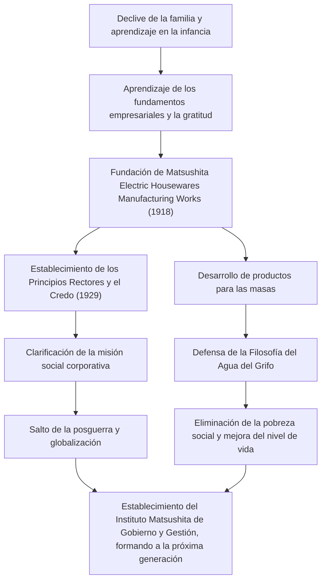

Konosuke Matsushita, aclamado como el "Dios de la Gestión" en la historia industrial de Japón, sigue influyendo en muchos profesionales de los negocios en la actualidad. Como fundador de Panasonic (anteriormente Matsushita Electric Industrial), es conocido por sus singulares filosofías de gestión, como la "Filosofía del Agua del Grifo" y "Reunir la sabiduría colectiva". Este artículo profundiza en su trayectoria, desde una infancia marcada por la pobreza y la enfermedad hasta la construcción de una corporación mundial, y el apasionado legado que dejó a las generaciones posteriores.

## La era del aprendizaje nacida de la adversidad

Konosuke Matsushita nació en 1894 (Meiji 27) en el seno de una próspera familia de agricultores en la prefectura de Wakayama. Sin embargo, la familia se arruinó debido al fracaso de su padre en la especulación del arroz. Con tan solo 9 años, dejó a sus padres y se fue a Osaka como aprendiz. Vivir y trabajar en una tienda de braseros y luego en una de bicicletas no fue nada fácil, pero fue durante esta época cuando Matsushita aprendió de primera mano los "fundamentos de los negocios" y el espíritu de "el cliente es lo primero".

Su experiencia en la tienda de bicicletas, en particular, tuvo un profundo impacto en su carrera posterior. En aquella época, las bicicletas eran máquinas caras y de vanguardia. A través de su reparación y venta, no solo desarrolló un interés por la tecnología, sino que también grabó profundamente en su mente la importancia de las relaciones de confianza en los negocios. Las dificultades de su juventud se convirtieron en el origen del "espíritu de gratitud" que defendería más tarde.

## La fundación y el salto de Matsushita Electric

En 1918 (Taisho 7), a la edad de 23 años, Matsushita logró independizarse y fundó la "Matsushita Electric Housewares Manufacturing Works" con su esposa, Mumeno, y su cuñado, Toshio Iue (quien más tarde fundaría Sanyo Electric). Sus primeros productos, el "enchufe accesorio mejorado" y el "enchufe de dos vías", eran de alta calidad pero más baratos que los productos convencionales, por lo que se convirtieron instantáneamente en éxitos masivos.

La verdadera esencia de Matsushita no residía únicamente en fabricar buenos productos, sino en captar con precisión las necesidades de la sociedad e incorporar técnicas de venta innovadoras. Produjo una serie de productos de éxito, como lámparas cuadradas y lámparas National, expandiendo rápidamente el negocio. En 1929, estableció los "Principios Básicos de Gestión y Credo de la Empresa", aclarando que el propósito de la empresa no era simplemente la búsqueda de beneficios, sino la contribución a la sociedad.

## Patriotismo industrial y la "Filosofía del agua del grifo"

Incluso frente a crisis sin precedentes como la Depresión de Showa y la Segunda Guerra Mundial, las creencias de Matsushita se mantuvieron inquebrantables. La "Filosofía del Agua del Grifo" que propugnaba expresa de la forma más directa la misión de Matsushita Electric. La idea de que "proporcionando un suministro ilimitado de bienes de alta calidad a precios bajos, como el agua del grifo, eliminaremos la pobreza del mundo", se anticipó a la era de la producción y el consumo masivos, al mismo tiempo que estaba arraigada en un profundo humanitarismo.

Después de la guerra, cuando se enfrentó a la crisis de ser destituido de su cargo público por el Cuartel General General (GHQ), logró regresar gracias a una apasionada campaña de peticiones de los sindicatos y socios comerciales. Este episodio dice mucho sobre lo respetado y querido que era por sus empleados y la sociedad. La Matsushita Electric, una vez reincorporada, se subió a la ola del auge de los electrodomésticos, creciendo rápidamente hasta convertirse en una corporación mundial.

## Konosuke Matsushita, la persona y su legado

Matsushita no era solo un líder empresarial, sino también un pensador excepcional. Tal y como representa su dicho "Una empresa es su gente", vertió una pasión extraordinaria en el desarrollo de los recursos humanos. En sus últimos años, estableció el Instituto Matsushita de Gobierno y Gestión, invirtiendo su fortuna personal para formar a la próxima generación de líderes.

Su filosofía de gestión no es una teoría compleja, sino sencilla, basada en la psicología humana y la verdad. Las numerosas palabras recopiladas en su libro "El Camino" (Michi wo Hiraku), como "tener un corazón puro" y "comprometerse en nuevas actividades diarias", ofrecen profundos conocimientos incluso a quienes vivimos en el mundo moderno.

El mayor legado que dejó Konosuke Matsushita no son solo productos tangibles o la escala de su empresa. Reside en el "corazón de la gestión" en sí: contribuir a la sociedad a través de los negocios y buscar la felicidad humana. En el mundo rápidamente cambiante de hoy, su filosofía centrada en el ser humano brilla más que nunca.
