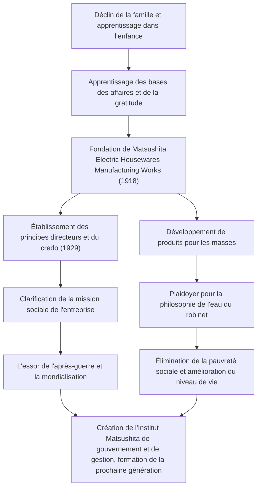

Konosuke Matsushita, connu sous le nom de « Dieu de la gestion » dans l'histoire industrielle japonaise, continue d'influencer de nombreux professionnels des affaires aujourd'hui. En tant que fondateur de Panasonic (anciennement Matsushita Electric Industrial), il est réputé pour ses philosophies de gestion uniques telles que la « philosophie de l'eau du robinet » et le fait de « rassembler la sagesse collective ». Cet article se penche sur son parcours, depuis une enfance marquée par la pauvreté et la maladie jusqu'à la construction d'une entreprise mondiale, ainsi que sur l'héritage passionné qu'il a laissé aux générations futures.

## L'ère de l'apprentissage née de l'adversité

Konosuke Matsushita est né en 1894 (Meiji 27) dans une riche famille d'agriculteurs de la préfecture de Wakayama. Cependant, la famille a été ruinée en raison de l'échec de son père dans la spéculation sur le riz. À l'âge de 9 ans, il quitte ses parents et part à Osaka comme apprenti. Vivre et travailler dans un magasin de braseros puis dans un magasin de vélos n'était en aucun cas facile, mais c'est au cours de cette période que Matsushita a appris les « bases des affaires » et l'esprit du « client d'abord ».

Son expérience dans le magasin de vélos, en particulier, a eu un impact profond sur sa carrière ultérieure. À l'époque, les vélos étaient des machines chères et à la pointe de la technologie. Grâce à leur réparation et à leur vente, il a non seulement développé un intérêt pour la technologie, mais a également gravé profondément dans son esprit l'importance des relations de confiance dans les affaires. Les épreuves de sa jeunesse sont devenues l'origine de l'« esprit de gratitude » qu'il défendra plus tard.

## La fondation et l'essor de Matsushita Electric

En 1918 (Taisho 7), à l'âge de 23 ans, Matsushita obtient son indépendance et fonde la « Matsushita Electric Housewares Manufacturing Works » avec son épouse, Mumeno, et son beau-frère, Toshio Iue (qui fondera plus tard Sanyo Electric). Leurs premiers produits, la « fiche de fixation améliorée » et la « douille bidirectionnelle », étaient de haute qualité mais moins chers que les produits conventionnels, ce qui en a fait d'immenses succès instantanés.

La véritable essence de Matsushita ne résidait pas seulement dans la fabrication de bons produits, mais dans la compréhension précise des besoins de la société et l'intégration de techniques de vente innovantes. Il a produit une série de produits à succès tels que les lampes carrées et les lampes National, développant rapidement l'entreprise. En 1929, il établit « l'objectif de gestion de base et le credo de l'entreprise », précisant que le but de l'entreprise n'était pas simplement la recherche de profit, mais la contribution à la société.

## Le patriotisme industriel et la « philosophie de l'eau du robinet »

Même face à des crises sans précédent telles que la dépression de Showa et la Seconde Guerre mondiale, les convictions de Matsushita sont restées inébranlables. La « philosophie de l'eau du robinet » qu'il a prônée exprime le plus directement la mission de Matsushita Electric. La philosophie selon laquelle « en fournissant un approvisionnement illimité de biens de haute qualité à bas prix, comme l'eau du robinet, nous éliminerons la pauvreté dans le monde » anticipait l'ère de la production et de la consommation de masse, tout en étant enracinée dans un profond humanisme.

Après la guerre, lorsqu'il fut confronté à la crise d'être purgé de ses fonctions publiques par le GHQ, il a fait son retour grâce à une campagne de pétition passionnée des syndicats et de ses partenaires commerciaux. Cet épisode en dit long sur la confiance et l'amour que lui portaient ses employés et la société. L'entreprise Matsushita Electric réintégrée a surfé sur la vague du boom de l'électroménager, devenant rapidement une entreprise mondiale.

## Konosuke Matsushita l'homme et son héritage

Matsushita n'était pas seulement un chef d'entreprise, mais aussi un penseur exceptionnel. Comme le représente son dicton « Une entreprise, ce sont ses employés », il a mis une passion extraordinaire dans le développement des ressources humaines. Dans ses dernières années, il a créé l'Institut Matsushita de gouvernement et de gestion, investissant sa fortune personnelle pour former la prochaine génération de dirigeants.

Sa philosophie de gestion n'est pas une théorie complexe, mais simple, basée sur la psychologie humaine et la vérité. Les nombreuses paroles recueillies dans son livre « La Voie » (Michi wo Hiraku), telles que « avoir un cœur pur » et « s'engager dans de nouvelles activités quotidiennes », offrent de profondes réflexions même à nous qui vivons dans le monde moderne.

Le plus grand héritage laissé par Konosuke Matsushita n'est pas seulement des produits tangibles ou la taille de son entreprise. Il réside dans le « cœur de la gestion » lui-même : contribuer à la société par le biais des affaires et poursuivre le bonheur humain. Dans le monde d'aujourd'hui en évolution rapide, sa philosophie centrée sur l'humain brille plus que jamais.
