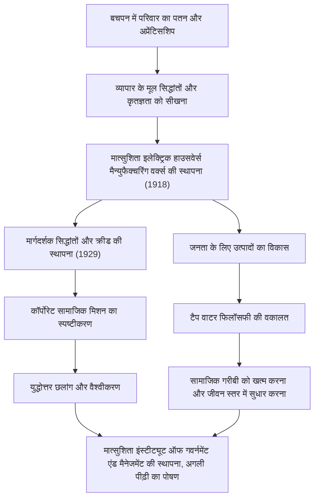

जापानी औद्योगिक इतिहास में "प्रबंधन के देवता" के रूप में जाने जाने वाले कोनोसुके मात्सुशिता, आज भी कई व्यावसायिक पेशेवरों को प्रभावित करते हैं। पैनासोनिक (पूर्व में मात्सुशिता इलेक्ट्रिक इंडस्ट्रियल) के संस्थापक के रूप में, उन्हें उनके अनूठे प्रबंधन दर्शन जैसे कि "टैप वाटर फिलॉसफी" (नल का जल दर्शन) और "सामूहिक ज्ञान इकट्ठा करना" के लिए जाना जाता है। यह लेख गरीबी और बीमारी से चिह्नित बचपन से लेकर एक वैश्विक निगम के निर्माण तक की उनकी यात्रा, और भविष्य की पीढ़ियों के लिए उनके द्वारा छोड़ी गई भावुक विरासत पर गहराई से प्रकाश डालता है।

## विपत्ति से जन्मा अप्रेंटिसशिप का युग

कोनोसुके मात्सुशिता का जन्म 1894 (मीजी 27) में वाकायामा प्रान्त के एक धनी कृषक परिवार में हुआ था। हालाँकि, चावल की सट्टेबाजी में उनके पिता की विफलता के कारण परिवार बर्बाद हो गया। केवल 9 वर्ष की निविदा आयु में, उन्होंने अपने माता-पिता को छोड़ दिया और एक अप्रेंटिस (प्रशिक्षु) के रूप में ओसाका चले गए। ब्राज़ियर की दुकान और बाद में एक साइकिल की दुकान पर रहना और काम करना कोई आसान बात नहीं थी, लेकिन इसी दौरान मात्सुशिता ने "व्यापार के मूल सिद्धांतों" और "ग्राहक पहले" की भावना को प्रत्यक्ष रूप से सीखा।

विशेष रूप से साइकिल की दुकान पर उनके अनुभव ने उनके बाद के करियर पर गहरा प्रभाव डाला। उस समय, साइकिलें महंगी और अत्याधुनिक मशीनें थीं। उनकी मरम्मत और बिक्री के माध्यम से, उन्होंने न केवल प्रौद्योगिकी में रुचि विकसित की, बल्कि व्यवसाय में भरोसेमंद रिश्तों के महत्व को भी अपने दिमाग में गहराई से उकेरा। उनके युवाओं की कठिनाइयाँ "कृतज्ञता की भावना" का मूल बन गईं, जिसकी वकालत वे बाद में करेंगे।

## मात्सुशिता इलेक्ट्रिक की स्थापना और छलांग

1918 (ताइशो 7) में, 23 वर्ष की आयु में, मात्सुशिता ने स्वतंत्रता प्राप्त की और अपनी पत्नी मुमेनो और अपने बहनोई तोशियो इउ (जिन्होंने बाद में सान्यो इलेक्ट्रिक की स्थापना की) के साथ "मात्सुशिता इलेक्ट्रिक हाउसवेर्स मैन्युफैक्चरिंग वर्क्स" की स्थापना की। उनके पहले उत्पाद, "उन्नत अटैचमेंट प्लग" और "टू-वे सॉकेट", उच्च गुणवत्ता वाले थे, फिर भी पारंपरिक उत्पादों की तुलना में सस्ते थे, जिससे वे तुरंत भारी हिट बन गए।

मात्सुशिता का असली सार केवल अच्छे उत्पाद बनाने में नहीं था, बल्कि सामाजिक जरूरतों को सटीक रूप से समझने और नवीन बिक्री तकनीकों को शामिल करने में था। उन्होंने स्क्वायर लैंप और नेशनल लैंप जैसे हिट उत्पादों की एक श्रृंखला का उत्पादन किया, और व्यवसाय का तेजी से विस्तार किया। 1929 में, उन्होंने "बुनियादी प्रबंधन उद्देश्य और कंपनी क्रीड" की स्थापना की, यह स्पष्ट करते हुए कि उद्यम का उद्देश्य केवल लाभ कमाना नहीं था, बल्कि समाज में योगदान देना था।

## औद्योगिक देशभक्ति और "टैप वाटर फिलॉसफी"

शोवा डिप्रेशन और द्वितीय विश्व युद्ध जैसे अभूतपूर्व संकटों के सामने भी, मात्सुशिता का विश्वास अडिग रहा। "टैप वाटर फिलॉसफी" जिसकी उन्होंने वकालत की, वह मात्सुशिता इलेक्ट्रिक के मिशन को सबसे सीधे तौर पर व्यक्त करती है। यह दर्शन कि "नल के पानी की तरह कम कीमतों पर उच्च गुणवत्ता वाले सामानों की असीमित आपूर्ति प्रदान करके, हम दुनिया से गरीबी को खत्म करेंगे" ने बड़े पैमाने पर उत्पादन और बड़े पैमाने पर खपत के युग की भविष्यवाणी की, जबकि साथ ही साथ गहन मानवतावाद में भी निहित है।

युद्ध के बाद, जब उन्हें जीएचक्यू द्वारा सार्वजनिक कार्यालय से हटाए जाने के संकट का सामना करना पड़ा, तो उन्होंने श्रमिक संघों और व्यापारिक भागीदारों के एक भावुक याचिका अभियान की बदौलत वापसी की। यह प्रकरण इस बात की बहुत कुछ कहता है कि उनके कर्मचारी और समाज उन पर कितना भरोसा करते थे और प्यार करते थे। बहाल मात्सुशिता इलेक्ट्रिक ने घरेलू उपकरण बूम की लहर पर सवार होकर, तेजी से एक वैश्विक निगम में विकसित किया।

## कोनोसुके मात्सुशिता: मनुष्य और उनकी विरासत

मात्सुशिता केवल एक व्यापारिक नेता नहीं थे, बल्कि एक उत्कृष्ट विचारक भी थे। जैसा कि उनके कथन "एक कंपनी उसके लोग हैं" द्वारा दर्शाया गया है, उन्होंने मानव संसाधन विकास में असाधारण जुनून डाला। अपने बाद के वर्षों में, उन्होंने नेताओं की अगली पीढ़ी का पोषण करने के लिए अपने व्यक्तिगत भाग्य का निवेश करते हुए, मात्सुशिता इंस्टीट्यूट ऑफ गवर्नमेंट एंड मैनेजमेंट की स्थापना की।

उनका प्रबंधन दर्शन कोई जटिल सिद्धांत नहीं है, बल्कि मानव मनोविज्ञान और सत्य पर आधारित एक सरल सिद्धांत है। उनकी पुस्तक "द पाथ" (मिची वो हिराकु) में एकत्र किए गए कई शब्द, जैसे "शुद्ध हृदय होना" और "नई दैनिक गतिविधियों में संलग्न होना", आधुनिक दुनिया में रहने वाले हम लोगों को भी गहरी अंतर्दृष्टि प्रदान करते हैं।

कोनोसुके मात्सुशिता द्वारा छोड़ी गई सबसे बड़ी विरासत केवल मूर्त उत्पाद या उनके उद्यम का पैमाना नहीं है। यह "प्रबंधन के हृदय" में ही निहित है: व्यवसाय के माध्यम से समाज में योगदान देना और मानव सुख की खोज करना। आज की तेजी से बदलती दुनिया में, उनका मानव-केंद्रित दर्शन पहले से कहीं अधिक चमकता है।
