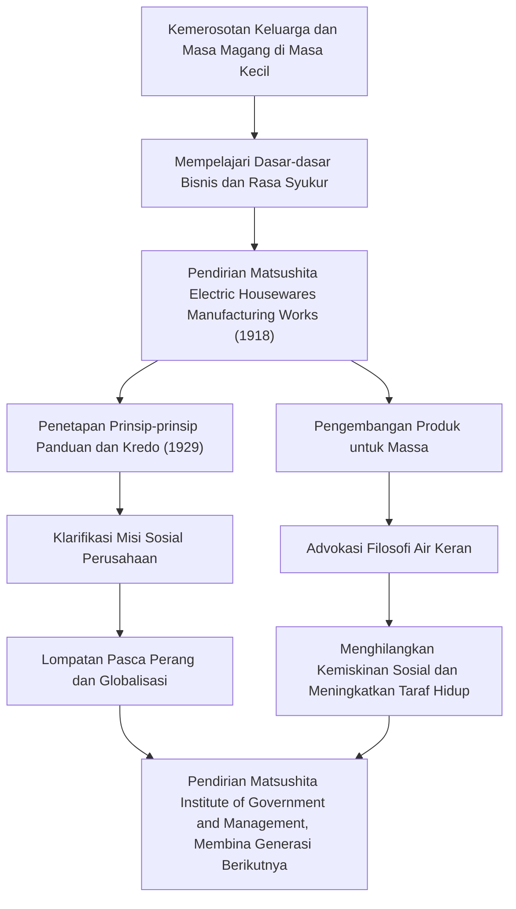

Konosuke Matsushita, yang dikenal sebagai "Dewa Manajemen" dalam sejarah industri Jepang, terus mempengaruhi banyak profesional bisnis hingga hari ini. Sebagai pendiri Panasonic (sebelumnya Matsushita Electric Industrial), ia terkenal dengan filosofi manajemennya yang unik seperti "Filosofi Air Keran" dan "Mengumpulkan Kebijaksanaan Kolektif." Artikel ini menggali perjalanannya dari masa kecil yang diwarnai dengan kemiskinan dan penyakit hingga membangun sebuah perusahaan global, dan warisan penuh semangat yang ia tinggalkan untuk generasi mendatang.

## Era Magang yang Lahir dari Kesulitan

Konosuke Matsushita lahir pada tahun 1894 (Meiji 27) dalam keluarga petani kaya di Prefektur Wakayama. Namun, keluarga tersebut hancur karena kegagalan ayahnya dalam spekulasi beras. Pada usia yang masih muda, 9 tahun, ia meninggalkan orang tuanya dan pergi ke Osaka sebagai pekerja magang. Tinggal dan bekerja di toko pemanas ruangan dan kemudian di toko sepeda tidaklah mudah, tetapi pada masa inilah Matsushita belajar secara langsung "dasar-dasar bisnis" dan semangat "mengutamakan pelanggan."

Pengalamannya di toko sepeda, khususnya, berdampak besar pada kariernya di kemudian hari. Pada masa itu, sepeda adalah mesin yang mahal dan mutakhir. Melalui perbaikan dan penjualannya, ia tidak hanya mengembangkan minat pada teknologi tetapi juga menanamkan dalam benaknya pentingnya hubungan kepercayaan dalam bisnis. Kesulitan di masa mudanya menjadi cikal bakal "semangat rasa syukur" yang akan ia dukung di kemudian hari.

## Pendirian dan Lompatan Matsushita Electric

Pada tahun 1918 (Taisho 7), pada usia 23 tahun, Matsushita mencapai kemandirian dan mendirikan "Matsushita Electric Housewares Manufacturing Works" bersama istrinya, Mumeno, dan saudara iparnya, Toshio Iue (yang kemudian mendirikan Sanyo Electric). Produk pertama mereka, "steker tambahan yang disempurnakan" dan "stopkontak dua arah," memiliki kualitas tinggi namun lebih murah daripada produk konvensional, menjadikannya sukses besar dalam sekejap.

Esensi sejati Matsushita tidak hanya terletak pada pembuatan produk yang baik tetapi juga pada pemahaman yang akurat tentang kebutuhan masyarakat dan penggabungan teknik penjualan yang inovatif. Ia memproduksi serangkaian produk sukses seperti lampu persegi dan lampu National, memperluas bisnisnya dengan cepat. Pada tahun 1929, ia menetapkan "Tujuan Dasar Manajemen dan Kredo Perusahaan," mengklarifikasi bahwa tujuan perusahaan tidak semata-mata mencari keuntungan, tetapi kontribusi bagi masyarakat.

## Patriotisme Industri dan "Filosofi Air Keran"

Bahkan saat menghadapi krisis yang belum pernah terjadi sebelumnya seperti Depresi Showa dan Perang Dunia II, keyakinan Matsushita tetap tak tergoyahkan. "Filosofi Air Keran" yang ia dukung paling langsung mengekspresikan misi Matsushita Electric. Filosofi bahwa "dengan menyediakan pasokan barang berkualitas tinggi tanpa batas dengan harga rendah, seperti air keran, kita akan menghilangkan kemiskinan dari dunia" mengantisipasi era produksi massal dan konsumsi massal, sekaligus berakar pada kemanusiaan yang mendalam.

Setelah perang, ketika ia menghadapi krisis disingkirkan dari jabatan publik oleh GHQ, ia berhasil kembali berkat kampanye petisi yang penuh semangat dari serikat pekerja dan mitra bisnis. Episode ini membuktikan betapa ia dipercaya dan dicintai oleh karyawan dan masyarakat. Matsushita Electric yang dipulihkan mengikuti arus ledakan peralatan rumah tangga, tumbuh pesat menjadi perusahaan global.

## Konosuke Matsushita sebagai Manusia dan Warisannya

Matsushita bukan hanya seorang pemimpin bisnis tetapi juga seorang pemikir yang luar biasa. Sebagaimana diwakili oleh pepatahnya "Perusahaan adalah orang-orangnya," ia menuangkan semangat yang luar biasa dalam pengembangan sumber daya manusia. Di tahun-tahun terakhirnya, ia mendirikan Matsushita Institute of Government and Management, menginvestasikan kekayaan pribadinya untuk membina generasi pemimpin berikutnya.

Filosofi manajemennya bukanlah teori yang rumit, melainkan teori sederhana yang didasarkan pada psikologi dan kebenaran manusia. Banyak kata yang dikumpulkan dalam bukunya "The Path" (Michi wo Hiraku), seperti "memiliki hati yang murni" dan "terlibat dalam aktivitas harian baru," memberikan wawasan yang mendalam bahkan bagi kita yang hidup di dunia modern.

Warisan terbesar yang ditinggalkan oleh Konosuke Matsushita bukan sekadar produk nyata atau skala perusahaannya. Warisan itu terletak pada "jantung manajemen" itu sendiri: berkontribusi pada masyarakat melalui bisnis dan mengejar kebahagiaan manusia. Di dunia yang berubah dengan cepat saat ini, filosofinya yang berpusat pada manusia bersinar lebih terang dari sebelumnya.
