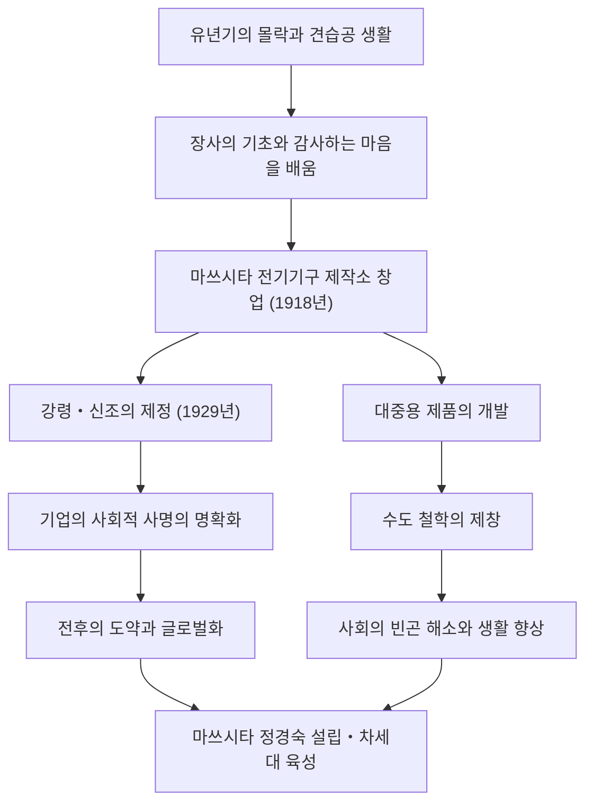

일본 산업사에서 '경영의 신'으로 불리며 오늘날까지도 많은 비즈니스맨에게 영향을 미치고 있는 인물, 마쓰시타 고노스케. 파나소닉(구 마쓰시타 전기산업)의 창업자인 그는 '수도 철학', '중지를 모은다' 등의 독자적인 경영 철학으로 유명합니다. 본 기사에서는 빈곤과 병마에 시달렸던 유년기부터 세계적인 기업을 일구기까지의 궤적, 그리고 후세에 맡긴 뜨거운 열정을 깊이 파헤쳐 봅니다.

## 역경에서 시작된 견습공 시대

마쓰시타 고노스케는 1894년(메이지 27년), 와카야마현의 유복한 농가에서 태어났습니다. 하지만 아버지의 쌀 투기 실패로 집안은 몰락하고 맙니다. 불과 9살의 나이에 부모님을 떠나 오사카로 견습공(뎃치보코)을 떠나게 됩니다. 화로 가게나 자전거 가게에서의 더부살이는 결코 편한 것이 아니었지만, 고노스케는 이 시기에 '장사의 기본'과 '고객 제일'의 정신을 피부로 배웠습니다.

특히 자전거 가게에서의 경험은 훗날 그의 경력에 큰 영향을 미칩니다. 당시 자전거는 값비싼 최첨단 기계였고, 수리와 판매를 통해 기술에 대한 관심을 높이는 동시에 장사에서 신뢰 관계의 중요성을 마음속 깊이 새긴 것입니다. 젊은 시절의 고생은 훗날 그가 제창하는 '감사하는 마음'의 원점이 되었습니다.

## 마쓰시타 전기의 창업과 도약

1918년(다이쇼 7년), 23세의 나이로 독립을 이룬 고노스케는 아내 무메노, 그리고 처남인 이우에 도시오(훗날 산요전기 창업자)와 함께 '마쓰시타 전기기구 제작소'를 설립합니다. 첫 제품인 '개량 어태치먼트 플러그'와 '2등용 쌍소켓'은 고품질이면서도 기존 제품보다 저렴했기 때문에 순식간에 큰 인기를 끌었습니다.

고노스케의 진면목은 단순히 좋은 물건을 만드는 것뿐만 아니라 사회의 니즈를 정확히 파악하고 혁신적인 판매 기법을 도입한 데 있습니다. 각형 램프나 내셔널 램프 등의 히트 상품을 연발하며 사업을 급속도로 확장했습니다. 1929년에는 '강령・신조'를 제정하여, 기업의 목적이 단순한 이윤 추구가 아니라 사회에 대한 공헌에 있음을 명확히 했습니다.

## 산업 보국과 '수도 철학'

쇼와 공황기나 제2차 세계대전이라는 전대미문의 위기 속에서도 고노스케의 신념은 흔들리지 않았습니다. 그가 주창한 '수도 철학'은 마쓰시타 전기의 사명을 가장 단적으로 보여줍니다. "수돗물처럼 양질의 물자를 무진장 저렴하게 제공함으로써 세상에서 빈곤을 없앤다"는 이 사상은 대량 생산・대량 소비 시대를 앞서가는 것이면서 동시에 깊은 인도주의에 뿌리를 두고 있었습니다.

전후 GHQ에 의한 공직 추방의 위기에 직면했을 때도, 노동조합과 거래처의 열렬한 탄원 운동에 힘입어 복귀에 성공합니다. 이는 그가 얼마나 직원이나 사회로부터 신뢰받고 사랑받았는지를 말해주는 일화입니다. 복귀 후 마쓰시타 전기는 가전 붐의 물결을 타고 세계적인 기업으로 급성장하게 됩니다.

## 인간・마쓰시타 고노스케와 그 유산

고노스케는 경영자인 동시에 뛰어난 사상가이기도 했습니다. "기업은 사람이다"라는 말로 대표되듯, 인재 육성에는 남다른 열정을 쏟았습니다. 또한 말년에는 마쓰시타 정경숙을 설립하여 차세대 리더 육성에 사재를 털었습니다.

그의 경영 철학은 복잡한 이론이 아니라 인간의 심리와 진리에 바탕을 둔 단순한 것입니다. "솔직한 마음이 되는 것", "날마다 새로운 활동을 하는 것" 등 저서 『길을 열다』에 수록된 수많은 말들은 현대 사회를 살아가는 우리에게도 깊은 통찰을 줍니다.

마쓰시타 고노스케가 남긴 최대의 유산은 눈에 보이는 제품이나 기업 규모만이 아닙니다. 사업을 통해 사회에 공헌하고 인간의 행복을 추구한다는 '경영의 마음' 그 자체에 있습니다. 변화가 극심한 현대 사회에서야말로 그의 인간 중심의 철학은 더욱 그 빛을 발하고 있다고 할 수 있을 것입니다.
