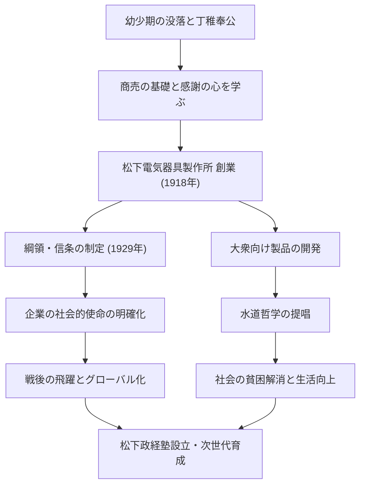

日本の産業史において「経営の神様」と称され、今なお多くのビジネスパーソンに影響を与え続ける人物、松下幸之助。パナソニック（旧・松下電器産業）の創業者であり、独自の経営哲学「水道哲学」や「衆知を集める」といった思想で知られています。本記事では、貧困と病に苦しんだ幼少期から、世界的企業を築き上げるまでの軌跡、そして後世に託した熱い思いを深掘りします。

## 逆境から始まった丁稚奉公の時代

松下幸之助は1894年（明治27年）、和歌山県の裕福な農家に生まれました。しかし、父の米相場での失敗により家は没落。わずか9歳で親元を離れ、大阪へ丁稚奉公に出ることになります。火鉢店や自転車店での住み込み生活は決して楽なものではありませんでしたが、幸之助はこの時期に「商売の基本」や「顧客第一」の精神を肌で学びました。

特に自転車店での経験は、後の彼のキャリアに大きな影響を与えます。当時、自転車は高価な最先端の機械であり、修理や販売を通じて技術への関心を高めると同時に、商売における信頼関係の重要性を深く刻み込んだのです。若き日の苦労は、後に彼が提唱する「感謝の心」の原点となりました。

## 松下電器の創業と飛躍

1918年（大正7年）、23歳で独立を果たした幸之助は、妻のむめの、そして義弟の井植歳男（後の三洋電機創業者）とともに「松下電気器具製作所」を立ち上げます。最初の製品である「改良アタッチメントプラグ」や「二灯用差込みプラグ」は、高品質でありながら従来品よりも安価であったため、瞬く間に大ヒットとなりました。

幸之助の真骨頂は、単に良いものを作るだけでなく、社会のニーズを的確に捉え、革新的な販売手法を取り入れた点にあります。角型ランプやナショナルランプなどのヒット商品を連発し、事業を急速に拡大。1929年には「綱領・信条」を制定し、企業の目的が単なる利益追求ではなく、社会への貢献にあることを明確にしました。

## 産業報国と「水道哲学」

昭和の恐慌期や第二次世界大戦という未曾有の危機にあっても、幸之助の信念は揺るぎませんでした。彼が唱えた「水道哲学」は、松下電器の使命を最も端的に表しています。「水道の水のように、良質な物資を無尽蔵に安価に提供することで、世の中から貧困をなくす」というこの思想は、大量生産・大量消費の時代を先取りするものでありながら、同時に深い人道主義に根ざしていました。

戦後、GHQによる公職追放の危機に直面した際も、労働組合や取引先からの熱烈な嘆願運動により復帰を果たします。これは、彼がいかに従業員や社会から信頼され、愛されていたかを物語るエピソードです。復帰後の松下電器は、家電ブームの波に乗り、世界的企業へと急成長を遂げることになります。

## 人間・松下幸之助とその遺産

幸之助は経営者であると同時に、優れた思想家でもありました。「企業は人なり」という言葉に代表されるように、人材育成には並々ならぬ情熱を注ぎました。また、晩年には松下政経塾を設立し、次世代のリーダー育成に私財を投じています。

彼の経営哲学は、複雑な理論ではなく、人間の心理や真理に基づいたシンプルなものです。「素直な心になること」「日に新たな活動をすること」など、著書『道をひらく』に収められた言葉の数々は、現代を生きる私たちにも深い洞察を与えてくれます。

松下幸之助が残した最大の遺産は、目に見える製品や企業規模だけではありません。事業を通じて社会に貢献し、人間の幸福を追求するという「経営の心」そのものにあります。変化の激しい現代においてこそ、彼の人間中心の哲学は、ますますその輝きを増していると言えるでしょう。
