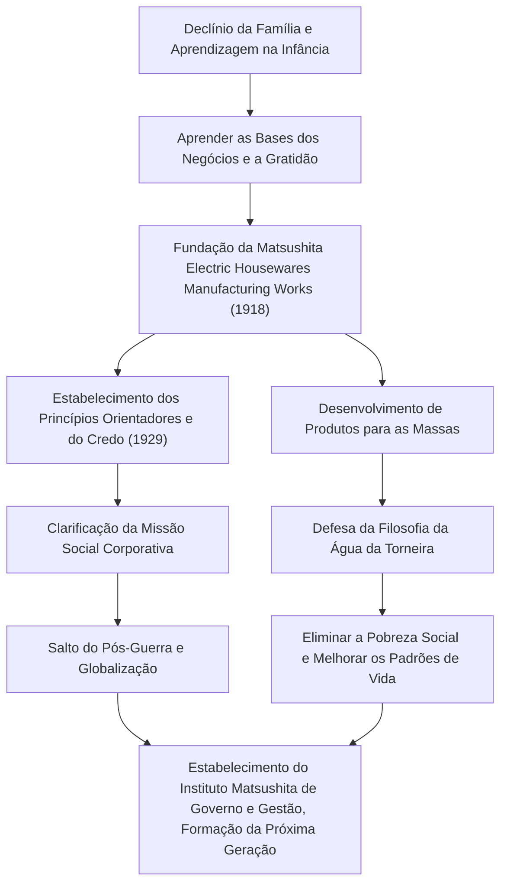

Konosuke Matsushita, conhecido como o "Deus da Gestão" na história industrial japonesa, continua a influenciar muitos profissionais de negócios hoje em dia. Como fundador da Panasonic (anteriormente Matsushita Electric Industrial), ele é conhecido pelas suas filosofias de gestão únicas, como a "Filosofia da Água da Torneira" e "Reunir a Sabedoria Coletiva". Este artigo aprofunda-se no seu percurso, desde uma infância marcada pela pobreza e doença até à construção de uma corporação global, e o legado apaixonado que deixou para as gerações futuras.

## A Era da Aprendizagem Nascida da Adversidade

Konosuke Matsushita nasceu em 1894 (Meiji 27) numa rica família de agricultores na província de Wakayama. No entanto, a família arruinou-se devido ao fracasso do seu pai na especulação do arroz. Com a tenra idade de 9 anos, ele deixou os pais e foi para Osaka como aprendiz. Viver e trabalhar numa loja de braseiros e mais tarde numa loja de bicicletas não foi de forma alguma fácil, mas foi durante este período que Matsushita aprendeu em primeira mão as "bases do negócio" e o espírito "o cliente em primeiro lugar".

A sua experiência na loja de bicicletas, em particular, teve um impacto profundo na sua carreira posterior. Naquela altura, as bicicletas eram máquinas caras e de ponta. Através da sua reparação e venda, ele não só desenvolveu um interesse pela tecnologia, mas também gravou profundamente na sua mente a importância das relações de confiança nos negócios. As dificuldades da sua juventude tornaram-se a origem do "espírito de gratidão" que ele viria a defender mais tarde.

## A Fundação e o Salto da Matsushita Electric

Em 1918 (Taisho 7), com 23 anos de idade, Matsushita alcançou a independência e fundou a "Matsushita Electric Housewares Manufacturing Works" com a sua esposa, Mumeno, e o seu cunhado, Toshio Iue (que mais tarde fundou a Sanyo Electric). Os seus primeiros produtos, a "ficha de fixação melhorada" e a "tomada de duas vias", eram de alta qualidade, mas mais baratos do que os produtos convencionais, o que fez deles instantaneamente sucessos estrondosos.

A verdadeira essência de Matsushita não residia apenas em fazer bons produtos, mas em compreender com precisão as necessidades da sociedade e incorporar técnicas de vendas inovadoras. Ele produziu uma série de produtos de sucesso, como as lâmpadas quadradas e as lâmpadas National, expandindo rapidamente o negócio. Em 1929, estabeleceu o "Objetivo Básico de Gestão e o Credo da Empresa", clarificando que o propósito da empresa não era meramente a procura do lucro, mas a contribuição para a sociedade.

## Patriotismo Industrial e a "Filosofia da Água da Torneira"

Mesmo perante crises sem precedentes como a Depressão de Showa e a Segunda Guerra Mundial, as crenças de Matsushita permaneceram inabaláveis. A "Filosofia da Água da Torneira" que ele defendia expressa de forma mais direta a missão da Matsushita Electric. A filosofia de que "ao fornecer um fornecimento ilimitado de bens de alta qualidade a preços baixos, como a água da torneira, eliminaremos a pobreza do mundo" antecipou a era da produção e consumo em massa, ao mesmo tempo que estava enraizada num profundo humanitarismo.

Após a guerra, quando enfrentou a crise de ser expurgado do cargo público pelo GHQ, conseguiu regressar graças a uma apaixonada campanha de petições de sindicatos e parceiros de negócios. Este episódio diz muito sobre o quão confiável e amado ele era pelos seus funcionários e pela sociedade. A Matsushita Electric reintegrada surfou a onda do boom dos eletrodomésticos, crescendo rapidamente para uma corporação global.

## Konosuke Matsushita o Humano e o Seu Legado

Matsushita não foi apenas um líder empresarial, mas também um pensador excecional. Tal como representado pelo seu ditado "Uma empresa são as suas pessoas", ele dedicou uma paixão extraordinária ao desenvolvimento dos recursos humanos. Nos seus últimos anos, fundou o Instituto Matsushita de Governo e Gestão, investindo a sua fortuna pessoal para formar a próxima geração de líderes.

A sua filosofia de gestão não é uma teoria complexa, mas simples, baseada na psicologia humana e na verdade. As numerosas palavras recolhidas no seu livro "O Caminho" (Michi wo Hiraku), como "ter um coração puro" e "envolver-se em novas atividades diárias", oferecem conhecimentos profundos mesmo para nós que vivemos no mundo moderno.

O maior legado deixado por Konosuke Matsushita não são apenas produtos tangíveis ou a escala da sua empresa. Reside no próprio "coração da gestão": contribuir para a sociedade através dos negócios e procurar a felicidade humana. No mundo em rápida mudança de hoje, a sua filosofia centrada no ser humano brilha mais do que nunca.
