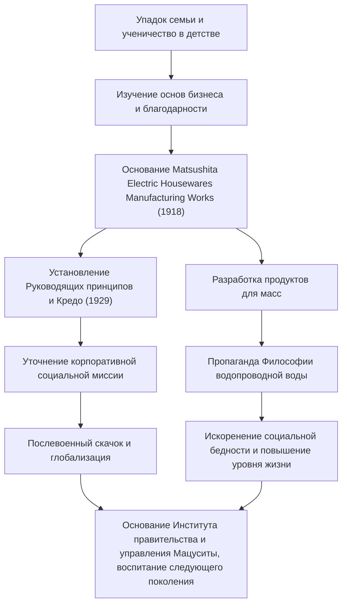

Коносуке Мацусита, известный как «Бог менеджмента» в истории японской промышленности, по сей день продолжает оказывать влияние на многих профессионалов бизнеса. Как основатель Panasonic (ранее Matsushita Electric Industrial), он известен своими уникальными философиями управления, такими как «Философия водопроводной воды» и «Сбор коллективной мудрости». В этой статье рассказывается о его пути от детства, омраченного бедностью и болезнями, к созданию глобальной корпорации, и о страстном наследии, которое он оставил будущим поколениям.

## Эпоха ученичества, рожденная из невзгод

Коносуке Мацусита родился в 1894 году (27 год эпохи Мэйдзи) в богатой фермерской семье в префектуре Вакаяма. Однако семья разорилась из-за неудач отца в спекуляциях рисом. В нежном 9-летнем возрасте он покинул родителей и отправился в Осаку в качестве подмастерья. Жизнь и работа в магазине жаровен, а затем в магазине велосипедов были отнюдь не легкими, но именно в это время Мацусита на собственном опыте познал «основы бизнеса» и дух «клиент прежде всего».

Его опыт работы в велосипедном магазине, в частности, оказал глубокое влияние на его дальнейшую карьеру. В то время велосипеды были дорогими, передовыми машинами. Ремонтируя и продавая их, он не только развил интерес к технологиям, но и глубоко запечатлел в своем уме важность доверительных отношений в бизнесе. Трудности его юности стали источником «духа благодарности», который он будет отстаивать позже.

## Основание и скачок Matsushita Electric

В 1918 году (7 год эпохи Тайсё), в возрасте 23 лет, Мацусита обрел независимость и основал «Matsushita Electric Housewares Manufacturing Works» вместе со своей женой Мумено и зятем Тошио Иуэ (который позже основал Sanyo Electric). Их первые продукты, «улучшенная штепсельная вилка» и «двухсторонняя розетка», отличались высоким качеством и в то же время были дешевле обычных продуктов, что мгновенно сделало их массовыми хитами.

Истинная сущность Мацуситы заключалась не только в создании хороших продуктов, но и в точном понимании потребностей общества и внедрении инновационных методов продаж. Он произвел серию хитовых продуктов, таких как квадратные лампы и лампы National, быстро расширяя бизнес. В 1929 году он установил «Основную цель управления и кредо компании», пояснив, что целью предприятия является не просто стремление к прибыли, а вклад в общество.

## Индустриальный патриотизм и «Философия водопроводной воды»

Даже перед лицом беспрецедентных кризисов, таких как депрессия Сёва и Вторая мировая война, убеждения Мацуситы оставались непоколебимыми. «Философия водопроводной воды», которую он отстаивал, наиболее прямо выражает миссию Matsushita Electric. Философия, согласно которой «предоставляя безграничные запасы высококачественных товаров по низким ценам, как водопроводная вода, мы искореним бедность в мире», предвосхитила эпоху массового производства и массового потребления, в то же время уходя корнями в глубокий гуманизм.

После войны, когда он столкнулся с кризисом отстранения от государственной должности со стороны GHQ, он вернулся благодаря страстной кампании петиций от профсоюзов и деловых партнеров. Этот эпизод красноречиво говорит о том, насколько ему доверяли и любили его сотрудники и общество. Восстановленная Matsushita Electric оседлала волну бума бытовой техники, быстро превратившись в глобальную корпорацию.

## Человек Коносуке Мацусита и его наследие

Мацусита был не только бизнес-лидером, но и выдающимся мыслителем. Как показывает его изречение «Компания — это ее люди», он вложил необычайную страсть в развитие человеческих ресурсов. В свои последние годы он основал Институт правительства и управления Мацуситы, инвестировав свое личное состояние в воспитание следующего поколения лидеров.

Его философия управления — это не сложная теория, а простая, основанная на человеческой психологии и истине. Многочисленные слова, собранные в его книге «Путь» (Michi wo Hiraku), такие как «иметь чистое сердце» и «участвовать в новых ежедневных делах», предлагают глубокие идеи даже нам, живущим в современном мире.

Величайшее наследие, оставленное Коносуке Мацуситой, — это не просто осязаемые продукты или масштабы его предприятия. Оно заключается в самом «сердце управления»: внесении вклада в общество через бизнес и стремлении к человеческому счастью. В сегодняшнем быстро меняющемся мире его человекоцентричная философия сияет ярче, чем когда-либо.
