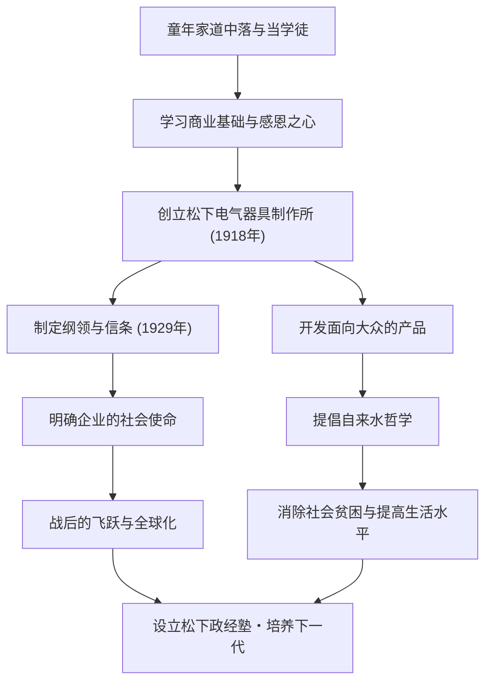

在日本产业史上被誉为“经营之神”，至今仍对许多商业人士产生深远影响的人物——松下幸之助。他是松下电器（旧称松下电器产业）的创始人，以“自来水哲学”和“集思广益”等独到的经营哲学而闻名。本文将深入探讨他从饱受贫困与疾病折磨的童年，到建立世界级企业的历程，以及他托付给后世的热切期望。

## 从逆境开始的学徒时代

松下幸之助1894年（明治27年）出生于和歌山县一个富裕的农民家庭。然而，由于父亲在米市投机失败，家道中落。年仅9岁的他就离开父母，前往大阪当学徒。在火盆店和自行车店寄宿工作的生活绝不轻松，但正是在这段时期，幸之助亲身体验并学习到了“做生意的基本”和“顾客第一”的精神。

特别是在自行车店的经历，对他日后的职业生涯产生了重大影响。当时，自行车是昂贵的最尖端机械，通过修理和销售，他不仅提高了对技术的兴趣，同时也深深铭记了商业中信任关系的重要性。年轻时的艰辛，成为了他后来提倡“感恩之心”的起点。

## 松下电器的创立与飞跃

1918年（大正7年），23岁的幸之助实现独立，与妻子梅乃以及内弟井植岁男（后来的三洋电机创始人）共同创立了“松下电气器具制作所”。他们最初的产品“改良插座”和“双灯用插座”，品质优良且价格低于传统产品，因此瞬间大获成功。

幸之助的真本事在于，他不仅能制造出好产品，还能准确把握社会需求，并引入创新的销售手法。方形灯和National灯等畅销产品接连问世，事业迅速扩大。1929年，他制定了“纲领与信条”，明确企业的目的不仅仅是追求利润，而是为社会做贡献。

## 产业报国与“自来水哲学”

即使在昭和经济大萧条和第二次世界大战这样史无前例的危机中，幸之助的信念也未曾动摇。他所提倡的“自来水哲学”最直接地表达了松下电器的使命。“像自来水一样，源源不断地以低廉的价格提供优质物资，从而消除世界的贫困”，这一思想虽然预示了大规模生产和大规模消费时代的到来，但同时植根于深刻的人道主义。

战后，当他面临被GHQ（驻日盟军总司令部）剥夺公职的危机时，在工会和商业伙伴热烈的请愿运动下，他得以复职。这段插曲充分说明了他是多么受员工和社会的信任与爱戴。复职后的松下电器乘着家电热潮的东风，迅速成长为一家世界级企业。

## 作为人的松下幸之助及其遗产

幸之助不仅是一位经营者，也是一位杰出的思想家。正如“企业即人”这句话所代表的那样，他对人才培养倾注了非凡的热情。此外，在晚年，他自掏腰包创立了松下政经塾，致力于培养下一代领导人。

他的经营哲学不是复杂的理论，而是基于人类心理和真理的简单法则。“保持坦诚的心”、“每天开展新的活动”等，收录在他的著作《开路》中的众多话语，也给生活在现代的我们带来了深刻的启示。

松下幸之助留下的最大遗产，不仅仅是看得见的产品或企业规模。而是通过事业为社会做贡献、追求人类幸福的“经营之心”本身。正是在变化剧烈的现代，他以人为本的哲学才愈发闪耀光芒。
