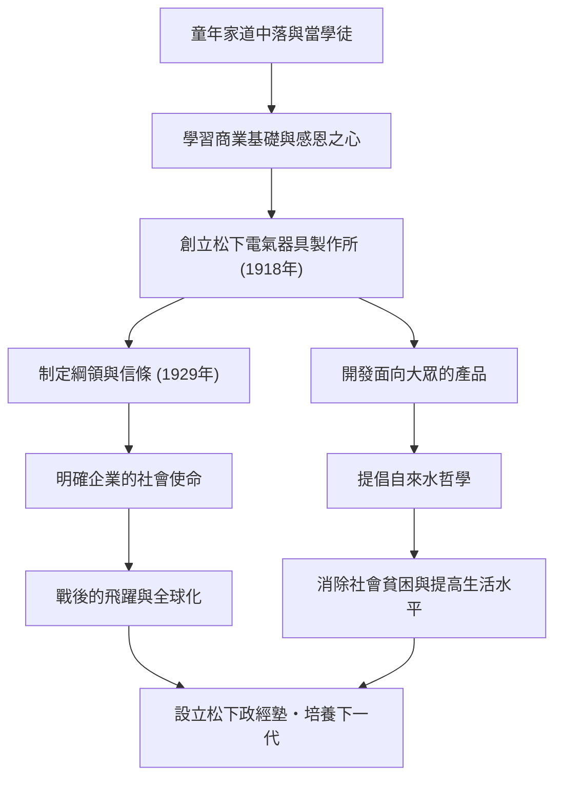

在日本產業史上被譽為「經營之神」，至今仍對許多商業人士產生深遠影響的人物——松下幸之助。他是松下電器（舊稱松下電器產業）的創辦人，以「自來水哲學」和「集思廣益」等獨到的經營哲學而聞名。本文將深入探討他從飽受貧困與疾病折磨的童年，到建立世界級企業的歷程，以及他託付給後世的熱切期望。

## 從逆境開始的學徒時代

松下幸之助1894年（明治27年）出生於和歌山縣一個富裕的農民家庭。然而，由於父親在米市投機失敗，家道中落。年僅9歲的他就離開父母，前往大阪當學徒。在火盆店和自行車店寄宿工作的生活絕不輕鬆，但正是在這段時期，幸之助親身體驗並學習到了「做生意的基本」和「顧客第一」的精神。

特別是在自行車店的經歷，對他日後的職業生涯產生了重大影響。當時，自行車是昂貴的最尖端機械，透過修理和銷售，他不僅提高了對技術的興趣，同時也深深銘記了商業中信任關係的重要性。年輕時的艱辛，成為了他後來提倡「感恩之心」的起點。

## 松下電器的創立與飛躍

1918年（大正7年），23歲的幸之助實現獨立，與妻子梅乃以及內弟井植歲男（後來的三洋電機創辦人）共同創立了「松下電氣器具製作所」。他們最初的產品「改良插座」和「雙燈用插座」，品質優良且價格低於傳統產品，因此瞬間大獲成功。

幸之助的真本事在於，他不僅能製造出好產品，還能準確把握社會需求，並引入創新的銷售手法。方形燈和National燈等暢銷產品接連問世，事業迅速擴大。1929年，他制定了「綱領與信條」，明確企業的目的不僅僅是追求利潤，而是為社會做貢獻。

## 產業報國與「自來水哲學」

即使在昭和經濟大蕭條和第二次世界大戰這樣史無前例的危機中，幸之助的信念也未曾動搖。他所提倡的「自來水哲學」最直接地表達了松下電器的使命。「像自來水一樣，源源不斷地以低廉的價格提供優質物資，從而消除世界的貧困」，這一思想雖然預示了大規模生產和大規模消費時代的到來，但同時植根於深刻的人道主義。

戰後，當他面臨被GHQ（駐日盟軍總司令部）剝奪公職的危機時，在工會和商業夥伴熱烈的請願運動下，他得以復職。這段插曲充分說明了他是多麼受員工和社會的信任與愛戴。復職後的松下電器乘著家電熱潮的東風，迅速成長為一家世界級企業。

## 作為人的松下幸之助及其遺產

幸之助不僅是一位經營者，也是一位傑出的思想家。正如「企業即人」這句話所代表的那樣，他對人才培養傾注了非凡的熱情。此外，在晚年，他自掏腰包創立了松下政經塾，致力於培養下一代領導人。

他的經營哲學不是複雜的理論，而是基於人類心理和真理的簡單法則。「保持坦誠的心」、「每天開展新的活動」等，收錄在他的著作《開路》中的眾多話語，也給生活在現代的我們帶來了深刻的啟示。

松下幸之助留下的最大遺產，不僅僅是看得見的產品或企業規模。而是透過事業為社會做貢獻、追求人類幸福的「經營之心」本身。正是在變化劇烈的現代，他以人為本的哲學才愈發閃耀光芒。
