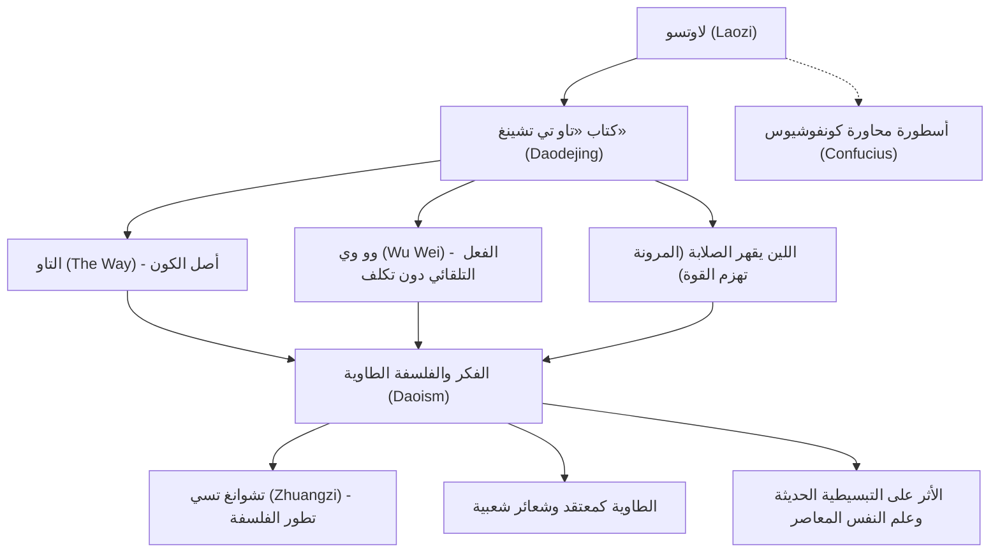

يُعدّ «لاوتسو» (Laozi) مفكراً وفيلسوفاً في الصين القديمة، ومؤسس الفلسفة الطاوية. ورغم مرور أكثر من ألفي عام، لا يزال كتابه الخالد «تاو تي تشينغ» (داوديجينغ) يُقرأ في جميع أنحاء العالم، ملهماً أجيالاً متتالية من البشر. وبينما دعا كونفوشيوس، مؤسس الكونفوشيوسية، إلى الأخلاق المصطنعة والضوابط الاجتماعية مثل «اللي» (الطقوس واللياقة) و«الرين» (الإنسانية والإحسان)، دعا لاوتسو إلى الانقياد لـ «التاو» (المسار أو الطريق) الذي يمثّل الأصل والجوهر الأساسي للكون، وإلى العيش وفق مبدأ «وو وي» (الفعل بلا تكلف أو العفوية الطبيعية).

في هذا المقال، نتعمق في سيرة لاوتسو حيث يلتقي التاريخ بالفلسفة، مستكشفين جوهر أفكاره، وأثره الهائل الذي لا يزال صداه يتردد حتى العصر الحاضر.

## حياة تكتنفها الأسرار: من كان لاوتسو حقاً؟

تكتنف سيرة لاوتسو هالةٌ كثيفة من الغموض. وفقاً لـ «سجلات المؤرخ الكبير» (شيجي) التي ألّفها سيما تشيان، أقدم كتاب تاريخي في الصين، وُلد لاوتسو في محافظة كو بولاية تشو (مقاطعة خنان حالياً)، وكان لقبه «لي»، واسمه الأول «إير»، واسمه الشرفي «دان». وتشير السجلات إلى أنه عمل أميناً لسجلات الأرشيف الملكي والمكتبة الوطنية في عهد أسرة تشو.

وتحكي الأساطير أن كونفوشيوس، في شبابه، قصد لاوتسو ليسترشد به ويطلب علمه حول قواعد الطقوس والآداب، غير أن لاوتسو نبّهه وحذّره من النزعة الشكلية والاصطناع. وتُعد هذه الحادثة من أشهر القصص التي ترمز إلى التباين الفكري العميق بين الكونفوشيوسية والطاوية.

وعندما رأى لاوتسو انحدار قوة أسرة تشو وتفشي الفوضى في المجتمع، قرر مغادرة العاصمة. وعند وصوله إلى ممر «هانغو» على الحدود الغربية، توسل إليه حارس الممر «يين شي» بأن يدون حكمته، فكتب كتاباً يتألف من جزأين ويحتوي على قرابة خمسة آلاف مقطع صيني؛ وهذا الكتاب هو ما يُعرف اليوم باسم «تاو تي تشينغ». بعد ذلك، واصل لاوتسو مسيره نحو الغرب على ظهر ثوره، ولم يَعلم أحدٌ مصيره بعد ذلك.

ومن الناحية التاريخية والنقدية، لا يزال الجدل قائماً حول ما إذا كان لاوتسو شخصية تاريخية واحدة وحقيقية؛ إذ يرجح بعض الباحثين أن النصوص جُمعت ودُوّنت على مدى أجيال من أقوال عدة حكماء، ثم نُسبت إلى الشخصية الأسطورية المسماة «لاوتسو». ومع ذلك، فإن الترابط الفكري المذهل والعمق الفلسفي لهذه التعاليم يجعلان من الصعب عدم تصور وجود عبقرية فذة وراء هذا الفكر الفريد.

## الفلسفة الجوهرية: «تاو تي تشينغ» ومبدأ «وو وي» (العفوية والتلقائية)

يرتكز جوهر فلسفة لاوتسو على مفهوم «التاو» (الطريق/المسار). يفتتح لاوتسو كتابه «تاو تي تشينغ» بالعبارة الشهيرة: «التاو الذي يمكن التعبير عنه بالكلمات ليس هو التاو الأبدي المطلق». فـ «التاو» هو الطاقة الأزلية والمبدأ الكوني الأسمى الذي ينبثق منه كل ما في الوجود ويسيّره، وهو حقيقة مطلقة تتعالى على حدود اللغة البشرية والمنطق الضيق.

ولتحقيق التناغم والاتحاد مع هذا «التاو»، دعا لاوتسو إلى منهج في الحياة يُعرف بـ «وو وي تسي تشان» (اللاتكلف أو الفعل التلقائي وفق الطبيعة).
إن مفهوم «وو وي» (Wu Wei) لا يعني الخمول أو الكسل والقعود عن العمل، بل يعني التخلي عن التدخل القسري والاصطناع الناتج عن الأنانية ومحدودية الفكر البشري. أما «تسي تشان» (Ziran)، فتعني التلقائية والعفوية، أي جريان الأشياء وفق طبيعتها الفطرية الخالصة.

وقد جعل لاوتسو من «الماء» المثل الأعلى للحياة الإنسانية، قائلاً إن «أسمى الفضائل كالماء» (Shang Shan Ruo Shui). فالماء يغذي الكائنات جمعاء دون أن ينازع أحداً، وينساب دائماً بتواضع نحو المنخفضات التي ينفر منها الناس. ومن خلال هذه المرونة والتواضع، يمتلك الماء قوة خارقة لا تُقهر، كما علّم لاوتسو.

كما يُعد مبدأ «اللين يغلب الصلب» (المرونة تقهر القوة) ركناً أساسياً في فكره. ففي خضم العواصف الهوجاء، قد تتحطم الأشجار العاتية الصلبة، بينما تنحني أغصان الصفصاف اللينة مع الرياح بمرونة لتنجو من الكسر. وبالمثل في مسار الحياة البشرية، يؤكد لاوتسو على أهمية التخلي عن التصلب والتشبث الأعمى، والتحلي بالمرونة والتكيف.

## رسم تخطيطي: شبكة أفكار لاوتسو وتأثيراتها

يوضح المخطط التالي المنظومة الفكرية للاوتسو وأثرها الممتد عبر التاريخ:

## الأثر عبر التاريخ: من مئة مدرسة فكرية إلى العصر الحديث

شكّل فكر لاوتسو الينبوع الأساسي للفلسفة الطاوية، التي وقفت جنباً إلى جنب مع الكونفوشيوسية كأحد أهم قطبي الفكر الصيني القديم. وفي حقبة الممالك المتحاربة، برز الفيلسوف «تشوانغ تسي» (Zhuangzi) متبنياً تعاليم لاوتسو ومطوّراً إياها نحو تحرير الروح الفردية والسعي وراء الحرية المطلقة (ما عُرف لاحقاً بفكر لاو-تشوانغ).

وعلاوة على ذلك، ومنذ عهد سلالة هان، أُضفي الطابع الإلهي على شخصية لاوتسو؛ حيث بُجِّل بوصفه إلهاً أعلى يُدعى «تاي شانغ لاو جون» (سيد الطريق الأسمى) في الديانة الطاوية الشعبية. ورغم أن المؤرخين يفرقون عادة بين «الطاوية كفلسفة» (داوجيا) و«الطاوية كديانة» (داوجياو)، فإن شخصية لاوتسو وفكره يشكلان حجر الزاوية الذي قامت عليه كلتاهما دون أدنى شك.

ولم يتوقف تأثير لاوتسو داخل حدود الصين، بل كان لفكر الطاوية أثر عميق في نشأة وتطور بوذية الزن (تشان). وحين انتقلت هذه المفاهيم إلى اليابان، صاغت الكثير من ملامح الجماليات والروحانية اليابانية، مثل مفاهيم «الوابي-سابي» (تقدير البساطة ونقص الكمال) وحالة «موشين» (صفاء الذهن والخلو من الشواغل) في تقاليد البوشيدو وفنون القتال.

وفي عصرنا الحالي، لا تزال حكمة لاوتسو تحتفظ ببريقها وعمقها؛ فبالنسبة للإنسان المعاصر المرهق من تسارع المدنية المادية، وتدفق المعلومات الجارف، والضغوط التنافسية المحمومة، تمثّل تعاليم «وو وي» (العفوية) و«القناعة والاكتفاء الذاتي» ترياقاً فعالاً لاستعادة السكينة وسلام الروح الداخلي. ويتجلى الخلود الإنساني لفكره في انتشار حركات التبسيطية الحديثة (المينيماليزم)، واليقظة الذهنية (المايندفلنس)، فضلاً عن اهتمام علماء الفيزياء المعاصرين وعلماء النفس بتناغم النظريات العلمية مع فلسفة لاوتسو الشرقية.

## خاتمة

هل كان لاوتسو شخصاً حقيقياً عاش على هذه الأرض، أم كان تجسيداً رمزياً لحكمة حكماء متعددين؟ تظل الإجابة طي أسرار التاريخ. لكن الكلمات الخالدة التي خُطت في «تاو تي تشينغ» لا تزال تخترق حواجز الزمان والمكان، مخاطبةً أعماق قلوبنا ووجداننا حتى اليوم.

«من يقف على أطراف أصابعه لا يثبت طويلاً، ومن يخطو خطوات واسعة متكلفة لا يبلغ بعيداً.»

عوضاً عن التكلف والتظاهر بالقوة والضخامة، يدعونا لاوتسو إلى الانغماس في مجرى «التاو» الكوني والعيش بمرونة وعفوية كالماء. إن هذه الرسالة الهادئة والقوية التي أورثنا إياها لاوتسو هي في الواقع البوصلة التي نحن في أمسّ الحاجة إليها لنبحر في خضم عالمنا المعاصر المتسارع.
