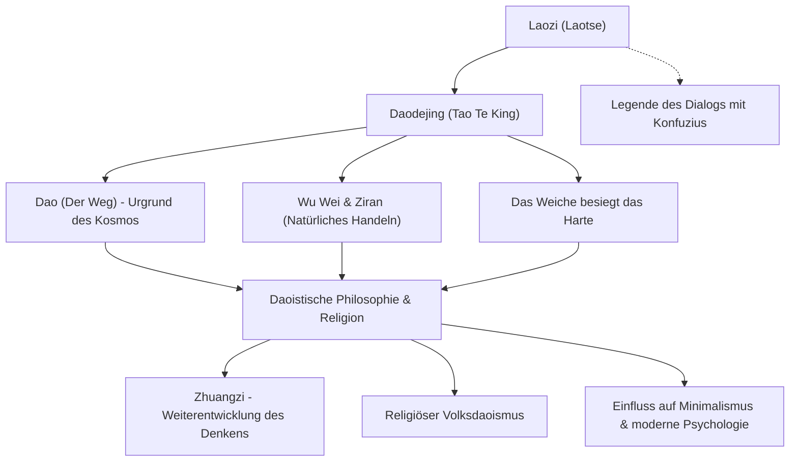

Laozi (Laotse) gilt als einer der bedeutendsten Denker des antiken Chinas und als Begründer des philosophischen und religiösen Daoismus (Taoismus). Sein Werk, das *Daodejing* (Tao Te King), wird auch nach mehr als zweitausend Jahren weltweit gelesen und inspiriert bis heute unzählige Menschen. Während Konfuzius, der Begründer des Konfuzianismus, von Menschen geschaffene moralische Tugenden wie »Li« (Sittlichkeit/Ritus) und »Ren« (Menschlichkeit/Güte) lehrte, predigte Laozi das Leben im Einklang mit dem »Dao« (dem Weg) – dem Urgrund allen Seins – und formulierte das Prinzip des »Wu Wei« (Handeln durch Nichthandeln bzw. natürliches Geschehenlassen).

In diesem Artikel werfen wir einen eingehenden Blick auf das an der Schnittstelle von Geschichte und Philosophie liegende Leben von Laozi, beleuchten die Kernideen seiner Philosophie und erkunden den immensen Einfluss, den sein Denken auf die Nachwelt ausgeübt hat.

## Ein Leben voller Rätsel: Wer war Laozi?

Das Leben von Laozi liegt weitgehend im Dunkeln der Geschichte. Laut dem *Shiji* (Aufzeichnungen der Großen Historiker) von Sima Qian, dem frühesten umfassenden Geschichtswerk Chinas, wurde Laozi im Staat Chu im Bezirk Ku (im heutigen Henan) geboren. Sein Familienname soll Li gewesen sein, sein Vorname Er und sein Beiname Dan. Überlieferungen zufolge diente er am königlichen Hof der Zhou-Dynastie als Archivar und Hüter der heiligen Schriften und königlichen Bibliotheken.

Einer berühmten Legende zufolge suchte der junge Konfuzius Laozi auf, um ihn über die Riten und Sitten zu befragen. Bei dieser Begegnung soll Laozi den Hang des Konfuzius zu Formalismus und Konventionen getadelt haben. Diese Anekdote wird oft als symbolischer Ursprung der philosophischen Kontroverse zwischen Konfuzianismus und Daoismus verstanden.

Als die Macht der Zhou-Dynastie verfiel und das Reich in Chaos versank, beschloss Laozi, die Hauptstadt zu verlassen. Als er den Hangu-Pass an der westlichen Reichsgrenze erreichte, bat ihn der dortige Grenzbeamte Yin Xi inständig, seine Lehren schriftlich festzuhalten. Laozi verfasste daraufhin ein Werk in zwei Abschnitten mit rund fünftausend Schriftzeichen – das Werk, das wir heute als *Daodejing* kennen. Anschließend zog er weiter nach Westen, und niemand weiß, was danach aus ihm geworden ist.

Aus historisch-kritischer Sicht ist bis heute umstritten, ob Laozi tatsächlich als historische Einzelperson existierte. Eine verbreitete wissenschaftliche Hypothese besagt, dass das *Daodejing* über Generationen hinweg die Weisheit verschiedener Denker vereinte und nachträglich der legendären Figur »Laozi« zugeschrieben wurde. Dennoch lässt die bemerkenswerte Kohärenz und Tiefe des Textes immer wieder an die Handschrift eines außergewöhnlichen philosophischen Geistes denken.

## Die Kernphilosophie: Das »Daodejing« und das »Wu Wei«

Im Zentrum von Laozis Philosophie steht das Konzept des »Dao« (Tao). Gleich zu Beginn des *Daodejing* heißt es: »Das Dao, das sich mit Worten beschreiben lässt, ist nicht das ewige Dao.« Das Dao ist das formlose, allumfassende Urprinzip, aus dem das gesamte Universum und alle zehntausend Dinge hervorgehen und das alle Wandlungen lenkt. Es entzieht sich menschlicher Sprache, Kategorisierung und logischer Begrifflichkeit.

Um in Harmonie mit diesem Dao zu leben, lehrte Laozi das Prinzip von »Wu Wei« (無為) und »Ziran« (自然, Natürlichkeit / Selbstso-Sein).
»Wu Wei« bedeutet keineswegs träge Tatenlosigkeit oder Passivität. Vielmehr bezeichnet es das Handeln im Einklang mit der Natur – ein Handeln ohne künstliche Eingriffe, ohne egoistisches Streben oder erzwungenen Willen. »Ziran« beschreibt das, was »von selbst so ist«: die unberührte, spontane Ordnung und Wesensart aller Dinge.

Als vollkommenes Sinnbild für dieses Ideal sah Laozi das Wasser (»Das höchste Gut ist wie das Wasser«). Wasser nährt alle Dinge, ohne mit ihnen zu streiten, und verweilt bereitwillig an den tiefsten Orten, die die Menschen meiden. Gerade in seiner unaufdringlichen Nachgiebigkeit und Demut birgt das Wasser eine unbezwingbare Kraft.

Eng damit verknüpft ist der Grundsatz: »Das Weiche und Schwache besiegt das Harte und Starke.« In einem verheerenden Sturm bricht die starre, harte Eiche entzwei, während sich der elastische Weidenzweig im Wind beugt und unversehrt fortbesteht. Auch im menschlichen Leben fordert Laozi dazu auf, Starrsinn, Scheinstärke und Verbissenheit abzulegen und stattdessen geistige Flexibilität und Nachgiebigkeit zu kultivieren.

## Schaubild: Gedankenwelt und Wirkung von Laozi

Das folgende Diagramm fasst das philosophische System von Laozi und seine weitreichenden Wirkungen zusammen:

## Einfluss auf die Nachwelt: Von den Hundert Schulen bis zur Gegenwart

Laozis Gedankengut bildete das Fundament des philosophischen Daoismus (*Daojia*), der neben dem Konfuzianismus die bedeutendste Strömung der chinesischen Geistesgeschichte darstellt. In der Zeit der Streitenden Reiche entwickelte Zhuangzi (Dschuang Dsi) dieses Denken weiter und legte den Akzent auf die individuelle geistige Freiheit und die Überwindung gesellschaftlicher Fesseln – eine Synthese, die heute als »Lao-Zhuang-Philosophie« bekannt ist.

Ab der Han-Dynastie wurde Laozi zunehmend vergöttlicht und als »Taishang Laojun« (Höchster Herr Lao) zu einer der höchsten Gottheiten des religiösen Daoismus (*Daojiao*) erhoben. Obwohl in der Sinologie oft klar zwischen der Philosophie (*Daojia*) und der religiösen Praxis (*Daojiao*) unterschieden wird, bildet Laozis Gestalt das unbestrittene Fundament beider Traditionen.

Laozis Wirken reichte weit über China hinaus. Die Entstehung des Chan- und Zen-Buddhismus war maßgeblich durch daoistische Ideen geprägt. Über diesen Kanal prägte das Werk auch die traditionelle japanische Ästhetik und Geisteskultur nachhaltig – von den Idealen des *Wabi-Sabi* bis hin zur Haltung des »Nicht-Geistes« (*Mushin*) in der Kampfkunst des Bushido.

Auch in der modernen Gesellschaft hat Laozis Denken nichts von seiner Strahlkraft eingebüßt. Für Menschen, die unter dem Druck von Konsumgesellschaft, Informationsüberflutung und unaufhörlicher Leistungskonkurrenz leiden, erweisen sich Lehren wie »Wu Wei« und »Genügsamkeit« (zu wissen, wann man genug hat) als heilsames Gegengift zur Wiedererlangung innerer Ruhe. Der heutige Trend zu Minimalismus und Achtsamkeit sowie das wachsende Interesse von Psychologen und Physikern an östlicher Philosophie belegen die zeitlose Relevanz seiner Botschaften.

## Fazit

Ob Laozi eine reale historische Persönlichkeit war oder eine personifizierte Synthese mehrerer Weiser, bleibt im Dunkel der Geschichte verborgen. Doch die überlieferten Worte des *Daodejing* überschreiten Zeiten und Grenzen und sprechen auch heute noch unmittelbar zu uns.

> »Wer auf den Zehenspitzen steht, steht nicht fest. Wer mit weiten Schritten eilt, kommt nicht weit.«

Statt sich krampfhaft größer zu machen, als man ist, gilt es, sich dem großen Strom des »Dao« anzuvertrauen und wie das Wasser biegsam und lebendig durchs Dasein zu fließen. Laozis leise, aber ungemein kraftvolle Botschaft ist gerade für uns, die wir in einer rastlosen, schnelllebigen Gegenwart leben, ein unschätzbarer innerer Kompass.
