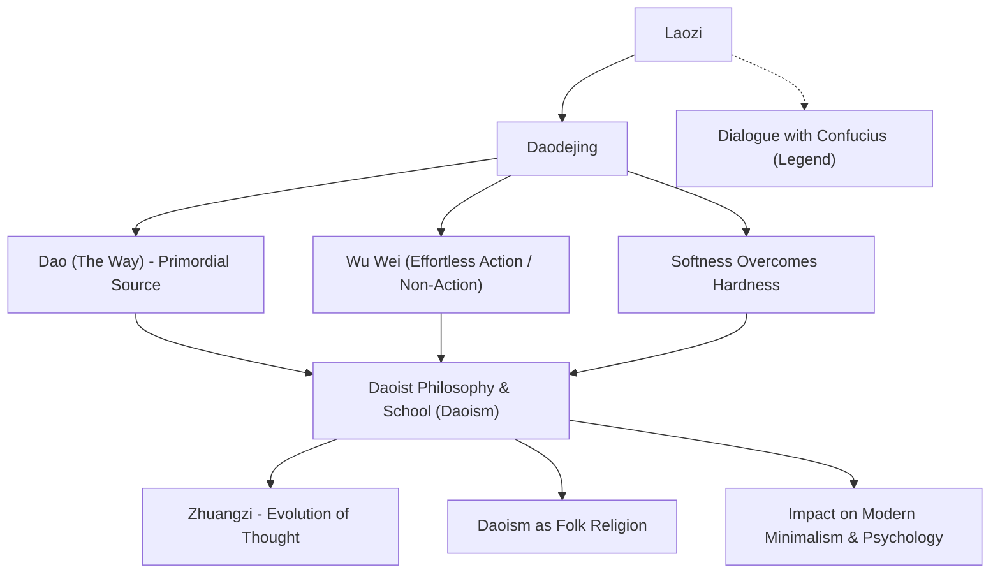

Laozi is revered as an ancient Chinese philosopher and the founder of Daoism. His enduring work, the *Daodejing* (Tao Te Ching), continues to be read across the globe more than two millennia later, inspiring countless minds. While Confucius, the father of Confucianism, advocated for artificial moral virtues such as *Li* (propriety/ritual) and *Ren* (benevolence), Laozi espoused following the *Dao* (the Way)—the primordial order and essence of the universe—and living in harmony with spontaneity and effortless action, known as *Wu Wei* (non-action).

In this article, we delve deeply into Laozi's life where history and philosophy intersect, explore the core concepts of his thought, and examine the profound and enduring influence he left on subsequent generations.

## An Enigmatic Life: Who Was Laozi?

Laozi's life remains shrouded in deep mystery. According to the *Records of the Grand Historian* (*Shiji*) by Sima Qian, China's earliest comprehensive historical record, Laozi was born in the state of Chu in Ku County (present-day Henan Province). His surname was Li, his given name was Er, and his courtesy name was Dan. Historical accounts indicate that he served as a keeper of the archives (historian of the imperial library) for the royal court of the Zhou dynasty.

According to legend, when a young Confucius visited Laozi to seek guidance on ritual propriety, Laozi cautioned him against his overly formalistic attitude. This encounter has long symbolized the profound ideological dialogue and tension between Confucian and Daoist traditions.

Witnessing the decline of the Zhou dynasty and the mounting chaos of society, Laozi resolved to leave the capital behind. As he reached the western border at Hangu Pass, the gatekeeper Yinxi pleaded with him to write down his wisdom. Laozi agreed and composed a work in two parts comprising approximately five thousand Chinese characters. This masterpiece has been handed down through the centuries as the *Daodejing*. Afterwards, Laozi departed toward the west, and tradition holds that no one ever knew what became of him.

From a modern historiographical perspective, scholars continue to debate whether Laozi was a single historical individual. A widely held view suggests that aphorisms from multiple thinkers were compiled over generations into the legendary figure of "Laozi." Nevertheless, the extraordinary philosophical coherence and depth of the text inevitably evoke the presence of a singular, genius philosopher.

## Core Philosophy: The *Daodejing* and "Wu Wei"

At the heart of Laozi's philosophy lies the concept of the *Dao* (the Way). In the opening line of the *Daodejing*, Laozi declares: "The Dao that can be told of is not the eternal Dao." The *Dao* represents the primordial energy and cosmic principle that generates and sustains all ten thousand things—an absolute reality transcending human words and analytical logic.

To align oneself with the *Dao*, Laozi advocated the way of *Wu Wei Ziran* (effortless action and natural spontaneity).
*Wu Wei* does not mean passive inaction or laziness. Rather, it signifies relinquishing superficial human contrivance, meddlesomeness, and forced actions rooted in selfish desire. *Ziran* means "of itself so"—the authentic, unforced state of nature that all things inherently possess.

Laozi held up water as the supreme metaphor for ideal living ("The highest good is like water"). Water nourishes all things without contending with them, and flows effortlessly toward the lowest places that humanity disdains. Laozi taught that this soft, unassuming nature harbors the greatest strength of all.

Equally central is the teaching that "the soft and yielding overcomes the hard and rigid." During a violent tempest, hard, rigid trees snap, whereas pliable willow branches bend with the wind and survive. In human life as well, Laozi stresses the vital importance of discarding stubborn pride and rigid attachments, cultivating strength through flexibility and gentleness.

## Diagram: Laozi's Philosophy and Sphere of Influence

The following diagram illustrates Laozi's philosophical system and its subsequent influences:

## Enduring Influence: From the Hundred Schools of Thought to Modern Times

Laozi's philosophy became the fountainhead of Daoism, standing alongside Confucianism as one of the two pillars of Chinese thought. During the Warring States period, Zhuangzi emerged to carry forward Laozi's ideas, advocating for the liberation of the individual spirit and unfettered freedom (a philosophical lineage known as Lao-Zhuang thought).

From the Han dynasty onward, Laozi was deified as *Taishang Laojun* (The Grand Supreme Elderly Lord) and revered as one of the highest deities in religious Daoism. While scholars frequently distinguish between philosophical Daoism (*Daojia*) and religious Daoism (*Daojiao*), Laozi without question serves as the foundational root of both.

Laozi's influence was by no means limited to China. Lao-Zhuang thought played an instrumental role in the emergence of Chan (Zen) Buddhism, which eventually spread to Japan and profoundly molded Japanese aesthetics and spirituality—from the concept of *wabi-sabi* to the state of *mushin* (no-mind) in Bushido.

In contemporary society, Laozi's philosophy shines as brightly as ever. For modern people exhausted by material consumerism, information overload, and hyper-competitive environments, teachings like *Wu Wei* and "knowing contentment" (*knowing when enough is enough*) offer a powerful antidote to restore inner peace. The worldwide surge of interest in minimalism, mindfulness, and the parallels discovered by modern physicists and psychologists all bear witness to the universal and timeless resonance of Laozi's wisdom.

## Conclusion

Was Laozi a single historical person, or an aggregate of ancient sages? The answer may remain lost in the mists of history. Yet the words inscribed in the *Daodejing* continue to speak intimately across ages and borders, touching the core of our humanity.

> "He who stands on tiptoe cannot stand firm; he who takes long strides cannot keep walking."

Rather than straining to make ourselves appear grander than we are, Laozi urges us to yield to the great *Dao* and live with the fluid grace of water. In our turbulent and fast-changing modern era, this serene yet powerful insight may well be the indispensable compass we need most.
