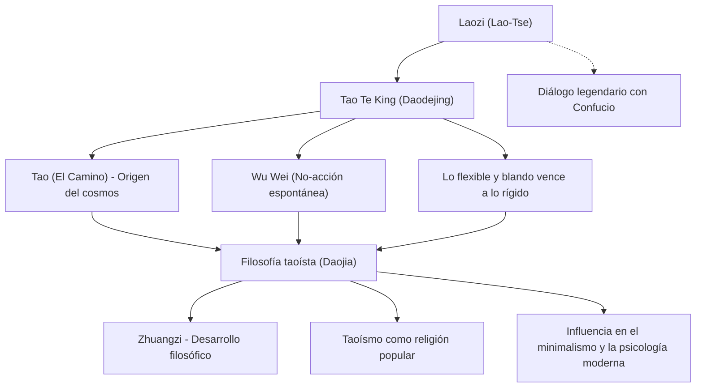

Laozi (Lao-Tse), antiguo pensador chino considerado el fundador del taoísmo, legó a la humanidad el *Tao Te King* (*Dào Dé Jīng*), una obra que, más de dos mil años después, sigue leyéndose en todo el mundo e inspirando a incontables personas. Mientras que Confucio, padre del confucianismo, predicaba una moral humana basada en los «ritos» y la «benevolencia», Laozi defendía seguir el «Tao» (el Camino), el principio cósmico fundamental de todas las cosas, y vivir en armonía con él a través del «wu wei» o la acción sin artificio.

En este artículo, exploraremos en profundidad la vida de Laozi en la encrucijada de la historia y el mito, los conceptos clave de su filosofía y el inmenso impacto que ha dejado en la posteridad.

## Una vida envuelta en el misterio: ¿quién fue realmente Laozi?

La vida de Laozi está envuelta en un denso halo de misterio. Según las *Memorias históricas* (*Shiji*) de Sima Qian, la crónica más antigua de China, nació en el distrito de Ku del estado de Chu (actual provincia de Henan). Su apellido era Li, su nombre de pila Er y su nombre de cortesía Dan. Se cuenta que sirvió como bibliotecario o archivero en la corte de la dinastía Zhou, custodiando los archivos reales.

Según la leyenda, un joven Confucio visitó a Laozi para consultarle sobre las normas de los ritos y ceremonias. En aquella ocasión, Laozi le reprochó su actitud formalista y artificial, exhortándolo a abandonar la arrogancia y los deseos vanos. Este encuentro es célebre por simbolizar el contraste intelectual entre el confucianismo y el taoísmo.

Al presenciar el declive de la dinastía Zhou y el consiguiente caos social, Laozi decidió abandonar la capital y retirarse. Al llegar al paso de Hangu, en la frontera occidental, el guardián del paso, Yin Xi, le suplicó que no se marchara sin dejar un registro de su sabiduría. Accediendo a su ruego, Laozi redactó un breve tratado en dos partes de aproximadamente cinco mil caracteres chinos: el *Tao Te King*. Tras ello, partió hacia el oeste y jamás se volvió a saber de su paradero.

Desde una perspectiva historiográfica moderna, se debate si Laozi fue un personaje histórico individual. Muchos especialistas sostienen que el *Tao Te King* es una antología de sentencias y reflexiones de diversos pensadores compilada a lo largo del tiempo bajo la figura legendaria de «Laozi» (literalmente, «el Viejo Maestro»). No obstante, la coherencia interna y la asombrosa profundidad de su filosofía siguen evocando la presencia de una mente genial y unificadora.

## Pensamiento central: el «Tao Te King» y el «Wu Wei»

En el corazón de la filosofía de Laozi se halla el concepto del «Tao» (el Camino). Laozi inaugura el *Tao Te King* con una célebre máxima: «El Tao que puede ser expresado con palabras no es el Tao eterno». El Tao es el principio primordial e inefable que da origen a todo el universo y rige su curso natural, una realidad trascendente que escapa a las limitaciones del lenguaje y la lógica humana.

Para armonizarse y fundirse con este Tao, Laozi propuso el ideal del «wu wei» (la acción sin artificio o no-acción espontánea):
El «wu wei» no debe entenderse como holgazanería o pasividad absoluta. Significa renunciar a la artificialidad, a los cálculos mezquinos del intelecto y a las acciones forzadas impulsadas por deseos egoístas. «Ziran» (la espontaneidad natural) alude a aquello que es tal cual por sí mismo, es decir, el orden y fluir orgánico intrínseco a todas las cosas.

Laozi consideraba el agua como el modelo supremo de vida («La virtud más elevada es semejante al agua»). El agua beneficia a todos los seres sin competir jamás con ellos, y fluye humildemente hacia los lugares más bajos que los seres humanos suelen desdeñar. Precisamente en esa naturaleza flexible, adaptable y modesta reside, según Laozi, la fuerza más invencible.

Otro principio fundamental es que «lo flexible y blando vence a lo duro y rígido». Durante una tormenta feroz, un árbol robusto e inflexible termina partiéndose, mientras que las ramas dóciles del sauce se doblan con el viento y sobreviven. En la vida humana, Laozi subraya la importancia de renunciar a la arrogancia, la confrontación y los apegos rígidos para cultivar la flexibilidad interior y la serenidad.

## Diagrama: El pensamiento de Laozi y sus ramificaciones

El siguiente diagrama resume el sistema de pensamiento de Laozi y su posterior influencia:

## Legado histórico: de las Cien Escuelas del Pensamiento a la actualidad

El pensamiento de Laozi constituyó el origen de la escuela taoísta (*Daojia*), la cual, junto al confucianismo, formó uno de los dos grandes pilares del pensamiento clásico chino. Durante el periodo de los Reinos Combatientes, surgió Zhuangzi, quien continuó la senda de Laozi orientándola hacia una profunda emancipación espiritual y una libertad personal absoluta, corriente conocida conjuntamente como «Lao-Zhuang».

A partir de la dinastía Han, Laozi fue deificado y adorado como Taishang Laojun («El Señor Supremo Lao»), convirtiéndose en una de las divinidades supremas del taoísmo religioso popular (*Daojiao*). Aunque suele distinguirse entre el taoísmo filosófico y el taoísmo religioso, no cabe duda de que la figura de Laozi sirvió de cimiento para ambos.

La influencia de Laozi trascendió con creces las fronteras chinas. El taoísmo influyó decisivamente en la gestación del budismo chan (zen). Al extenderse a Japón, impregnó profundamente la estética y la espiritualidad niponas, desde nociones como el *wabi-sabi* hasta el estado de «no-mente» (*mushin*) cultivado en el bushido y las artes marciales.

En nuestro mundo contemporáneo, la sabiduría de Laozi conserva intacta su vigencia. Para el ser humano de hoy, agotado por el materialismo desenfrenado, la sobrecarga informativa y la feroz competitividad, conceptos como el «wu wei» o «saber contentarse con lo suficiente» ofrecen un poderoso antídoto para recobrar la serenidad interior. El auge del minimalismo, la práctica del mindfulness y el interés de destacados físicos y psicólogos occidentales por el taoísmo atestiguan el carácter atemporal y universal de su mensaje.

## Conclusión

¿Fue Laozi un individuo histórico real o la condensación mítica de varios sabios antiguos? La respuesta definitiva permanece oculta en las brumas del pasado. No obstante, las palabras imperecederas del *Tao Te King* continúan hablándonos al corazón con pasmosa lucidez, superando eras y fronteras:

> «Quien se empina sobre la punta de sus pies no puede permanecer mucho tiempo erguido. Quien da zancadas excesivas no puede llegar muy lejos».

En vez de desgastarnos intentando aparentar grandeza o forzar las cosas, confiar en el inmenso fluir del Tao y vivir con la ductilidad y serenidad del agua. Este mensaje sosegado y penetrante de Laozi se erige, hoy más que nunca, en una brújula indispensable para navegar la vorágine de nuestro tiempo.
