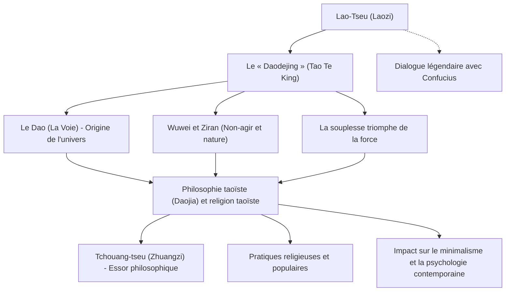

Penseur éminent de la Chine antique et figure fondatrice du taoïsme, **Lao-Tseu** (Laozi) a laissé derrière lui le *Daodejing* (ou *Tao Te King*), une œuvre magistrale qui continue d'inspirer des lecteurs à travers le monde entier, plus de deux millénaires après sa rédaction. Alors que Confucius, père du confucianisme, prônait des vertus morales et des règles sociétales artificielles telles que les « rites » (*Li*) et la « bienveillance » (*Ren*), Lao-Tseu enseignait plutôt la conformité avec le **Dao** (la Voie) — principe fondamental et source de tout l'univers — invitant l'être humain à embrasser le **Wuwei**, le « non-agir » et la spontanéité naturelle.

Dans cet article, nous explorerons en profondeur la vie énigmatique de Lao-Tseu au confluent de l'histoire et du mythe, les piliers de sa doctrine philosophique, ainsi que l'impact incommensurable de sa pensée à travers les âges.

## Une vie enveloppée de mystère : qui était véritablement Lao-Tseu ?

La vie de Lao-Tseu demeure plongée dans le mystère. D'après les *Mémoires historiques* (*Shiji*) de Sima Qian, premier grand ouvrage historiographique de Chine, Lao-Tseu serait né dans le district de Ku, au sein de l'État de Chu (dans l'actuelle province du Henan). Son nom de famille était Li, son prénom Er, et son prénom social (*zi*) Dan. Il aurait exercé la fonction d'archiviste et conservateur des collections impériales à la cour de la dynastie des Zhou.

Selon la légende, un jeune Confucius lui aurait rendu visite afin de solliciter son enseignement au sujet des rites traditionnels. À cette occasion, Lao-Tseu aurait mis en garde Confucius contre les dérives du formalisme et des conventions artificielles. Cet épisode célèbre symbolise à merveille le dialogue et l'opposition intellectuelle entre confucianisme et taoïsme.

Témoin du déclin de la dynastie des Zhou et de l'effondrement de l'ordre social, Lao-Tseu décida de renoncer à sa charge et de quitter la capitale. Lorsqu'il atteignit la passe de Hangu, frontière occidentale du pays, le gardien de la passe, Yin Xi, le pria avec insistance de consigner sa sagesse par écrit avant de disparaître. Lao-Tseu rédigea alors un texte en deux parties d'environ cinq mille caractères chinois : le *Daodejing*. Une fois son œuvre achevée, il poursuivit sa route vers l'ouest et nul ne sut jamais ce qu'il advint de lui.

D'un point de vue historique et philologique, l'existence de Lao-Tseu en tant qu'individu historique unique fait l'objet de débats séculaires. Beaucoup d'historiens avancent que le texte pourrait être une compilation d'aphorismes et d'enseignements oraux formulés par plusieurs maîtres au fil des générations, réunis ultérieurement sous la figure emblématique de « Lao-Tseu » (littéralement « le Vieux Maître »). Néanmoins, la remarquable cohérence et la profondeur visionnaire de cette pensée continuent de suggérer l'empreinte intellectuelle d'un génie d'exception.

## La pensée fondamentale : le « Daodejing » et le « Wuwei Ziran »

Au cœur de la philosophie de Lao-Tseu se trouve la notion de **Dao** (le Tao ou la Voie). Lao-Tseu ouvre le *Daodejing* par cette célèbre sentence : « La voie qui peut être exprimée par la parole n'est pas la Voie éternelle ». Le Dao représente l'énergie primordiale et le principe fondamental qui engendre l'ensemble des dix mille êtres de l'univers et régit leur cours. C'est une réalité absolue qui transcende le langage, les catégories conceptuelles et la logique humaine.

Pour s'harmoniser avec ce Dao, Lao-Tseu préconise un art de vivre fondé sur le **Wuwei Ziran** (le non-agir et la spontanéité naturelle).
Le « Wuwei » (non-agir) ne désigne nullement l'inaction passive, la paresse ou la résignation. Il s'agit plutôt de renoncer aux artifices nés des calculs étroits de l'ego et aux actions forcées motivées par le désir et l'ambition démesurée. Le « Ziran » (spontanéité naturelle), quant à lui, renvoie à ce qui est « ainsi de soi-même », c'est-à-dire l'état originel et authentique de chaque être.

Lao-Tseu érige l'eau en modèle suprême de vertu (« La bonté suprême est comme l'eau »). L'eau nourrit et fait prospérer tous les êtres sans jamais rivaliser avec eux, et s'écoule naturellement vers les lieux les plus humbles que les hommes dédaignent. C'est précisément dans cette souplesse et cette modestie que réside, selon Lao-Tseu, la plus invincible des forces.

Un autre précepte capital est celui de « la souplesse qui triomphe de la dureté » (*rou ruo sheng gang qiang*). Lors d'une violente tempête, l'arbre robuste et rigide se brise, tandis que le saule flexible ploie sous la tourmente et s'en sort indemne. Dans l'existence humaine, Lao-Tseu invite ainsi à abandonner l'entêtement, la prétention et les attachements rigides pour cultiver une résilience fluide et adaptable.

## Diagramme : système de pensée et rayonnement de Lao-Tseu

Le schéma suivant résume la structure de la pensée de Lao-Tseu et son rayonnement ultérieur :

## Influence historique : des Cent Écoles de pensée à l'époque moderne

Dans l'histoire intellectuelle chinoise, la pensée de Lao-Tseu a donné naissance au courant taoïste (*Daojia*), pilier équilibrant le confucianisme. À l'époque des Royaumes combattants, Tchouang-tseu (Zhuangzi) reprit et enrichit cette doctrine pour promouvoir une libération spirituelle encore plus libre et individualiste, donnant naissance au courant philosophique « Lao-Zhuang ».

À partir de la dynastie Han, Lao-Tseu fut déifié sous le nom de *Taishang Laojun* (« Très Haut Seigneur Lao »), devenant l'une des divinités suprêmes du taoïsme religieux populaire (*Daojiao*). Bien que l'on distingue fréquemment le taoïsme philosophique du taoïsme religieux institutionnel, nul ne doute que la stature de Lao-Tseu constitue le socle fondamental de ces deux expressions de la tradition chinoise.

L'influence de Lao-Tseu dépasse largement les frontières de la Chine. La pensée taoïste a profondément marqué l'émergence du bouddhisme Chan (qui deviendra le Zen au Japon), imprégnant ensuite l'esthétique et la spiritualité japonaises — qu'il s'agisse des notions de *wabi-sabi* ou de l'état de vacuité de l'esprit (*mushin*) prisé dans le bushido.

Dans le monde contemporain, la pensée de Lao-Tseu conserve une remarquable vitalité. Face aux dérives du matérialisme effréné, à la surcharge informationnelle et à l'épuisement induit par la compétition perpétuelle, les préceptes du « non-agir » (*wuwei*) et du « savoir se contenter de ce que l'on a » (*zhizu*) offrent un antidote précieux pour retrouver la sérénité intérieure. L'essor du minimalisme, la pratique de la pleine conscience, ainsi que l'intérêt de physiciens et de psychologues contemporains pour la vision systémique et fluide du taoïsme témoignent de son universalité intemporelle.

## Conclusion

Lao-Tseu fut-il un personnage historique unique ou la personnification collective d'une lignée de sages ? La réponse demeure enfouie dans les brumes de l'histoire. Pourtant, les paroles intemporelles du *Daodejing* continuent d'interpeller notre conscience avec une acuité saisissante, transcendant les époques et les civilisations.

> « Qui se hisse sur la pointe des pieds ne tient pas debout ; qui avance à trop grands pas ne peut marcher longtemps. »

Plutôt que de chercher fébrilement à paraître ou à forcer le cours des choses, faire confiance au grand cours du Dao et vivre avec la fluidité et l'humilité de l'eau : ce message serein et puissant que nous a légué Lao-Tseu constitue, aujourd'hui plus que jamais, une boussole indispensable dans un monde en perpétuelle turbulence.
