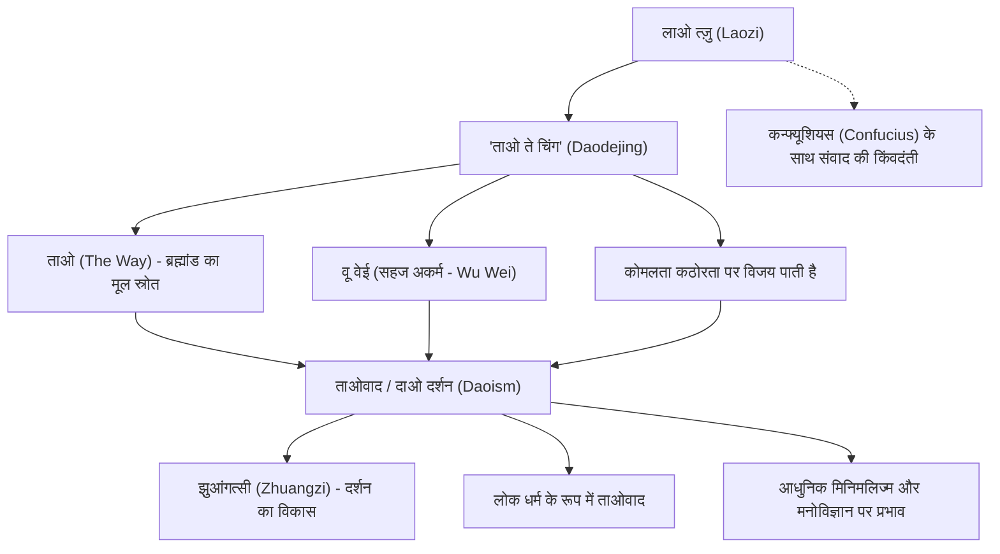

प्राचीन चीनी विचारक और ताओवाद के संस्थापक माने जाने वाले "लाओ त्ज़ु" (Laozi)। उनके द्वारा रचित ग्रन्थ 'ताओ ते चिंग' (दाओदेजिंग) दो हज़ार से अधिक वर्ष बीत जाने के बाद आज भी दुनिया भर में पढ़ा जाता है और अनगिनत लोगों को प्रेरित करता आ रहा है। जहाँ कन्फ्यूशियसवाद के संस्थापक कन्फ्यूशियस ने "शिष्टाचार" (ली) और "सद्भावना" (रेन) जैसी मानवीय नैतिकताओं का उपदेश दिया, वहीं लाओ त्ज़ु ने ब्रह्मांड के मूलभूत स्वरूप यानी "ताओ" (मार्ग) का अनुसरण करते हुए सहज भाव से जीने के सिद्धांत "वू वेई" (प्रकृति के साथ सहज जीवन/अकर्म) की शिक्षा दी।

इस लेख में, हम इतिहास और दर्शन के संगम पर स्थित लाओ त्ज़ु के जीवन, उनके मूल विचारों और आने वाली पीढ़ियों पर उनके द्वारा छोड़े गए गहरे प्रभाव की विस्तार से पड़ताल करेंगे।

## रहस्यमय जीवन: कौन थे लाओ त्ज़ु?

लाओ त्ज़ु का जीवन गहरे रहस्यों के पर्दे में लिपटा हुआ है। चीन के सबसे प्राचीन ऐतिहासिक ग्रंथ, सीमा कियान के 'शिजी' (ऐतिहासिक अभिलेख) के अनुसार, लाओ त्ज़ु का जन्म चू राज्य के कू काउंटी (वर्तमान हेनान प्रांत) में हुआ था। उनका कुलनाम ली, व्यक्तिगत नाम एर और आदरसूचक नाम डैन (Dan) था। यह भी उल्लेख मिलता है कि उन्होंने झोउ राजवंश में शाही अभिलेखागार के रक्षक (पुस्तकालयाध्यक्ष) के रूप में कार्य किया था।

एक प्रसिद्ध किंवदंती के अनुसार, जब युवा कन्फ्यूशियस शिष्टाचार और संस्कारों के विषय में ज्ञान प्राप्त करने के लिए लाओ त्ज़ु से मिलने गए, तब लाओ त्ज़ु ने कन्फ्यूशियस की औपचारिकता और आडंबरपूर्ण दृष्टिकोण की आलोचना की थी। यह प्रसंग कन्फ्यूशियसवाद और ताओवाद के दार्शनिक मतभेदों को दर्शाने वाले एक प्रतीकात्मक घटनाक्रम के रूप में विख्यात है।

जब झोउ राजवंश का पतन होने लगा और समाज में अराजकता फैल गई, तो लाओ त्ज़ु ने राजधानी छोड़ने का निर्णय किया। जब वे पश्चिमी सीमा पर स्थित हांगू दर्रे (Hangu Pass) पर पहुँचे, तो सीमा-चौकी के अधिकारी यिन शी (Yin Xi) के विशेष आग्रह पर उन्होंने दो भागों और लगभग पाँच हज़ार अक्षरों में एक ग्रंथ लिखा। यही ग्रंथ आज 'ताओ ते चिंग' के नाम से जाना जाता है। इसके बाद, लाओ त्ज़ु पश्चिम की ओर चले गए, और फिर किसी को भी उनके बारे में कुछ पता नहीं चला।

ऐतिहासिक दृष्टिकोण से, इस बात पर निरंतर बहस रही है कि क्या लाओ त्ज़ु वास्तव में कोई एक ऐतिहासिक व्यक्ति थे। यह विचार भी काफी प्रबल है कि सदियों के दौरान कई विचारकों की सीखों को संकलित करके "लाओ त्ज़ु" नाम के एक पौराणिक व्यक्तित्व में समाहित कर दिया गया। फिर भी, इन विचारों की असाधारण सुसंगति और गहराई किसी एक युगांतरकारी दार्शनिक की उपस्थिति का आभास अवश्य कराती है।

## मूल दर्शन: 'ताओ ते चिंग' और "वू वेई" (सहज अकर्म)

लाओ त्ज़ु के दर्शन के केंद्र में "ताओ" (दाओ) की अवधारणा है। लाओ त्ज़ु ने 'ताओ ते चिंग' के आरंभ में ही कहा है: "जिस मार्ग (ताओ) को शब्दों में व्यक्त किया जा सकता है, वह शाश्वत मार्ग नहीं है।" ताओ वह मूलभूत ऊर्जा और शक्ति है जो ब्रह्मांड की सभी वस्तुओं को उत्पन्न करती है और उनका संचालन करती है; यह मानव भाषा और तर्क से परे एक परम यथार्थ है।

इस "ताओ" के साथ एकाकार होने के लिए लाओ त्ज़ु ने जिस जीवन शैली का प्रतिपादन किया, वह है "वू वेई" (Wu Wei - अकर्म या सहजता) और प्रकृति के अनुकूल जीवन।
यहाँ "अकर्म" (वू वेई) का अर्थ आलस्य या हाथ पर हाथ धरकर बैठना नहीं है। इसका अर्थ है मानव की संकीर्ण बुद्धि द्वारा गढ़े गए आडंबरों और स्वार्थी इच्छाओं से प्रेरित जबरन किए जाने वाले कार्यों को त्याग देना। "प्रकृति" (ज़ीरान - Ziran) का अर्थ है सहजता, यानी प्रत्येक वस्तु का अपने स्वाभाविक रूप में विद्यमान होना।

लाओ त्ज़ु ने जल के समान जीवन जीने को सर्वोच्च आदर्श माना ("सर्वोच्च अच्छाई जल की भाँति है")। जल सभी प्राणियों को जीवन और पोषण देता है, फिर भी किसी से प्रतिस्पर्धा नहीं करता और विनम्रता से उन निचले स्थानों में बहता है जिन्हें लोग नापसंद करते हैं। लाओ त्ज़ु का मानना था कि जल की यही लचीली और विनम्र प्रकृति वास्तव में दुनिया की सबसे बड़ी शक्ति है।

इसके अलावा, उनकी यह शिक्षा भी अत्यंत महत्वपूर्ण है कि "कोमलता और दुर्बलता कठोरता और बल को पराजित कर देती हैं।" एक भयंकर तूफ़ान में, कठोर और विशाल वृक्ष टूटकर गिर जाता है, जबकि विलो की लचीली शाखा हवा के रुख़ के साथ झुक जाती है और सुरक्षित बच जाती है। मानव जीवन के संदर्भ में भी, यह शिक्षा अहंकार, हठ और आसक्ति को त्यागकर लचीलापन और सहजता बनाए रखने के महत्व पर बल देती है।

## आरेख: लाओ त्ज़ु के विचारों और उनके प्रभाव का रेखाचित्र

निम्नलिखित आरेख लाओ त्ज़ु की वैचारिक प्रणाली और उसके बाद के प्रभावों को दर्शाता है:

## आने वाली पीढ़ियों पर प्रभाव: सौ दार्शनिक विचारधाराओं से आधुनिक युग तक

लाओ त्ज़ु के विचार चीनी विचार परंपरा में कन्फ्यूशियसवाद के समकक्ष खड़े "ताओवादी दर्शन" (दाओजिया) का मूल स्रोत बने। युद्धरत राज्यों के काल (Warring States period) में, लाओ त्ज़ु के दर्शन को आगे बढ़ाने वाले "झुआंगत्सी" (Zhuangzi) का प्रादुर्भाव हुआ, जिन्होंने अधिक व्यक्तिगत और उन्मुक्त आध्यात्मिक मुक्ति का उपदेश दिया (जिसे लाओ-झुआंग दर्शन के रूप में जाना जाता है)।

इसके अतिरिक्त, हान राजवंश के बाद लाओ त्ज़ु को ईश्वरतुल्य दर्जा दिया गया और वे लोक धर्म "ताओवाद" (दाओजिआओ) के सर्वोच्च देवताओं में से एक, "ताइशांग लाओजुन" के रूप में पूजे जाने लगे। यद्यपि दर्शन के रूप में ताओवाद और धर्म के रूप में ताओवाद के बीच अक्सर अंतर किया जाता है, किंतु इसमें कोई संदेह नहीं कि दोनों की नींव में लाओ त्ज़ु ही विद्यमान हैं।

लाओ त्ज़ु का प्रभाव केवल चीन तक ही सीमित नहीं रहा। ज़ेन बौद्ध धर्म के उद्भव में लाओ-झुआंग दर्शन की अत्यंत महत्वपूर्ण भूमिका रही, और जब यह जापान पहुँचा, तो इसने जापानी सौंदर्यशास्त्र और आध्यात्मिकता (जैसे वाबी-साबी, और बुशिडो में "मुशिन" यानी विचारशून्य चित्त की अवस्था) को गहराई से प्रभावित किया।

आधुनिक समाज में भी लाओ त्ज़ु के विचारों की प्रासंगिकता और चमक कम नहीं हुई है। अत्यधिक भौतिकवादी सभ्यता, सूचनाओं की भरमार और गलाकाट प्रतिस्पर्धा से थके-हारे आधुनिक मानव के लिए, "वू वेई" (सहज जीवन) और "संतोष" (जो प्राप्त है उसमें संतुष्ट रहना) की शिक्षाएँ मानसिक शांति पुनः प्राप्त करने की एक अचूक औषधि बन चुकी हैं। मिनिमलिज्म का बढ़ता चलन, माइंडफुलनेस, और यहाँ तक कि आधुनिक भौतिकविदों और मनोवैज्ञानिकों द्वारा पूर्वी दर्शन के साथ तालमेल बिठाना—ये सब लाओ त्ज़ु के विचारों के सार्वभौमिक मूल्य को सिद्ध करते हैं।

## निष्कर्ष

क्या लाओ त्ज़ु एक वास्तविक ऐतिहासिक व्यक्ति थे, या फिर वे कई संतों और विचारकों का एक सामूहिक रूप थे? इसका यथार्थ इतिहास के धुंधलके में छिपा हुआ है। फिर भी, 'ताओ ते चिंग' के रूप में छोड़े गए उनके अमर शब्द समय और सीमाओं के पार आज भी हमारे दिलों को गहराई से छूते हैं।

"जो पंजों के बल खड़ा होता है, वह अधिक देर तक खड़ा नहीं रह सकता; जो बहुत लंबे डग भरकर चलता है, वह दूर तक नहीं चल सकता।"

दिखावे और अहंकार के वशीभूत होकर स्वयं को बड़ा सिद्ध करने के बजाय, परम "ताओ" को समर्पित होकर जल के समान सहज और लचीला जीवन जीना—लाओ त्ज़ु का यह शांत परंतु शक्तिशाली संदेश, तीव्र गति से बदलते आधुनिक युग में हम सभी के लिए एक अत्यंत आवश्यक दिशा-निर्देशक कम्पास के समान है।
