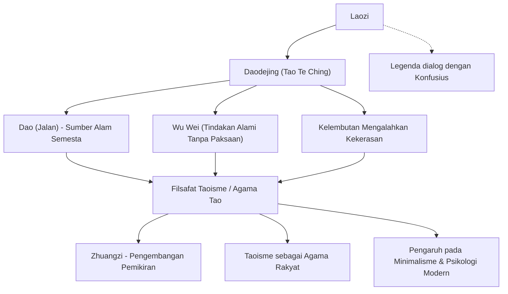

"Laozi" adalah seorang pemikir Tiongkok kuno yang diakui sebagai pendiri Taoisme. Karyanya yang abadi, *Daodejing* (*Laozi Daodejing* atau *Tao Te Ching*), terus dibaca di seluruh dunia dan memberi inspirasi kepada banyak orang bahkan hingga saat ini, lebih dari dua ribu tahun kemudian. Berbeda dengan Konfusius, pendiri Konfusianisme, yang mengajarkan moralitas buatan manusia seperti "kesopanan" (*li*) dan "kebajikan" (*ren*), Laozi justru mengajarkan "Wu Wei Zi Ran" (tindakan alami tanpa paksaan), yaitu hidup apa adanya dengan mengikuti "Dao" (Tao), hakikat mendasar dari alam semesta.

Artikel ini akan mengupas secara mendalam kehidupan Laozi di persimpangan antara sejarah dan filsafat, pemikiran intinya, serta pengaruh luar biasa yang ia wariskan kepada generasi mendatang.

## Kehidupan yang Penuh Misteri: Siapakah Sebenarnya Laozi?

Kehidupan Laozi diselimuti misteri yang mendalam. Menurut *Catatan Sejarawan Agung* (*Shiji*) karya Sima Qian, buku sejarah paling awal di Tiongkok, Laozi lahir di Prefektur Ku, Negara Chu (sekarang Provinsi Henan). Nama keluarganya adalah Li, nama aslinya Er, dan nama kehormatannya adalah Dan. Tercatat pula bahwa ia pernah menjabat sebagai penjaga arsip perpustakaan kerajaan pada masa Dinasti Zhou.

Menurut legenda, ketika Konfusius muda mengunjungi Laozi untuk meminta bimbingan mengenai tata krama dan etiket ritual, Laozi memperingatkannya agar tidak bersikap kaku dan formalistik. Episode ini sangat terkenal sebagai peristiwa yang melambangkan perbedaan pandangan filosofis antara Konfusianisme dan Taoisme.

Melihat memudarnya kekuatan Dinasti Zhou dan masyarakat yang kian terjerumus dalam kekacauan, Laozi memutuskan untuk meninggalkan ibu kota. Saat tiba di Celah Hangu, pos perbatasan di sebelah barat, atas permohonan Yin Xi, sang penjaga perbatasan, Laozi menulis sebuah risalah yang terdiri dari dua bagian dengan sekitar lima ribu aksara. Tulisan inilah yang diwariskan hingga hari ini sebagai *Daodejing*. Konon setelah itu, Laozi melanjutkan perjalanannya ke barat, dan tak seorang pun mengetahui ke mana ia pergi atau bagaimana akhir kisahnya.

Dari sudut pandang historis, masih terdapat perdebatan mengenai apakah Laozi adalah seorang tokoh sejarah tunggal. Teori yang cukup kuat menyebutkan bahwa ucapan sejumlah pemikir dikumpulkan dan disusun selama kurun waktu yang panjang, lalu dikemas dalam sosok legendaris bernama "Laozi". Kendati demikian, konsistensi dan kedalaman pemikiran yang luar biasa di dalamnya membuat kita sulit untuk tidak membayangkan kehadiran seorang pemikir jenius di balik semua itu.

## Pemikiran Inti: *Daodejing* dan "Wu Wei Zi Ran"

Pusat dari filsafat Laozi adalah konsep "Dao" (Tao). Di awal *Daodejing*, Laozi menyatakan: "Dao yang dapat diungkapkan dengan kata-kata bukanlah Dao yang abadi." "Dao" adalah energi fundamental yang melahirkan dan menggerakkan segala sesuatu di alam semesta, sebuah realitas mutlak yang melampaui bahasa dan logika manusia.

Sebagai cara hidup untuk menyatu dengan "Dao" ini, Laozi mengajarkan konsep "Wu Wei Zi Ran".
"Wu Wei" bukanlah berarti kemalasan atau tidak melakukan apa pun tanpa bertindak sama sekali. Melainkan, hal ini berarti melepaskan kepura-puraan yang lahir dari akal sempit manusia serta tindakan yang dipaksakan atas dasar keinginan egois. Sementara itu, "Zi Ran" berarti "dengan sendirinya begitu", yaitu keadaan alami dan apa adanya dari segala sesuatu sebagaimana mestinya.

Laozi menganggap cara hidup seperti air sebagai teladan yang paling ideal ("Kebaikan tertinggi adalah seperti air"). Air memberi manfaat dan menghidupi segala sesuatu tanpa pernah bersaing atau bertikai, dan senantiasa mengalir ke tempat-tempat rendah yang dihindari manusia. Laozi mengajarkan bahwa sifat yang lentur, fleksibel, dan rendah hati inilah yang justru memiliki kekuatan paling dahsyat.

Selain itu, ajaran "kelenturan dan kelembutan mengalahkan kekerasan dan kekuatan" juga sangat penting. Dalam badai yang hebat, pohon besar yang keras dan kaku dapat patah terhempas angin, sedangkan dahan pohon willow yang lentur mampu meliuk mengikuti tiupan angin dan tetap bertahan hidup. Dalam kehidupan manusia, prinsip ini menekankan pentingnya menanggalkan sikap sok kuat serta keterikatan yang kaku, dan menjaga kelenturan batin.

## Diagram: Bagan Hubungan Pemikiran Laozi dan Pengaruhnya

Diagram berikut menggambarkan sistem pemikiran Laozi serta pengaruh yang ditimbulkannya di kemudian hari.

## Pengaruh bagi Generasi Mendatang: Dari Ratusan Aliran Pemikiran hingga Zaman Modern

Pemikiran Laozi menjadi hulu dari aliran pemikiran Taois, yang berdiri berdampingan sebagai salah satu dari dua pilar utama dalam sejarah pemikiran Tiongkok bersama Konfusianisme. Pada Periode Negara-Negara Berperang, muncullah Zhuangzi yang meneruskan ajaran Laozi dan mengadvokasikan kebebasan serta pembebasan spiritual individu yang lebih luas dan tanpa batas (dikenal sebagai pemikiran Lao-Zhuang).

Selain itu, sejak Dinasti Han, Laozi dideifikasi dan dihormati sebagai "Taishang Laojun", salah satu dewa tertinggi dalam agama rakyat "Taoisme". Walaupun aliran pemikiran filsafat Taois dan Taoisme keagamaan sering kali dibedakan, tidak diragukan lagi bahwa Laozi menjadi fondasi bagi keduanya.

Pengaruh Laozi tidak hanya terbatas di wilayah Tiongkok. Pemikiran Lao-Zhuang memiliki andil mendalam dalam terbentuknya Buddhisme Zen. Ajaran ini kemudian menyebar ke Jepang, memberikan pengaruh yang mendalam terhadap estetika dan spiritualitas Jepang (seperti konsep *wabi-sabi* dan keadaan pikiran kosong tanpa pamrih dalam Bushido).

Dalam masyarakat modern pun, pemikiran Laozi tidak pernah kehilangan relevansinya. Bagi manusia modern yang merasa lelah oleh peradaban materialistis yang serbacepat, limpahan informasi yang berlebihan, dan masyarakat yang penuh persaingan, ajaran seperti "Wu Wei Zi Ran" dan "tahu kapan harus merasa cukup" menjadi penawar ampuh untuk memulihkan kedamaian batin. Popularitas gaya hidup minimalis, *mindfulness*, bahkan keterikatan sejumlah fisikawan dan psikolog dengan filsafat timur Laozi, membuktikan nilai universal yang dikandungnya.

## Penutup

Apakah Laozi benar-benar seorang tokoh nyata dalam sejarah, ataukah perwujudan gabungan dari sejumlah orang bijak? Kebenarannya masih tersimpan di dalam selubung kabut sejarah. Namun, kata-kata yang ditinggalkan dalam *Daodejing* melampaui batas zaman dan bangsa, serta masih terus berbicara menyentuh lubuk hati kita hingga saat ini.

"Siapa yang berjinjit tidak dapat berdiri tegak lama; siapa yang melangkah terlalu lebar tidak dapat berjalan jauh."

Alih-alih memaksakan diri agar terlihat hebat, berserahlah pada keagungan "Dao" dan hiduplah dengan luwes bagaikan air. Pesan hening namun kuat yang ditinggalkan oleh Laozi ini mungkin justru merupakan kompas penuntun yang sangat kita butuhkan untuk mengarungi dunia modern yang serbacepat berubah ini.
