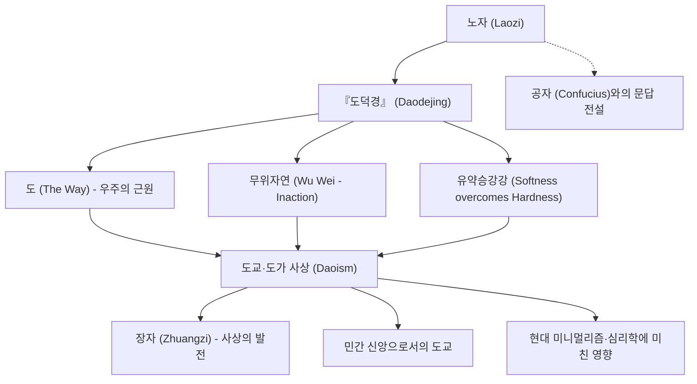

고대 중국의 사상가이자 도교의 창시자로 일컬어지는 '노자(老子)'. 그가 남긴 『도덕경』(노자도덕경)은 2천 년 이상이 지난 오늘날에도 전 세계에서 꾸준히 읽히며 수많은 이들에게 깊은 영감을 주고 있습니다. 유교의 시조인 공자가 '예(禮)'와 '인(仁)'이라는 인위적인 도덕을 역설했던 것에 반해, 노자는 우주의 근원적인 섭리인 '도(道, 타오)'를 따르며 있는 그대로 살아가는 '무위자연(無為自然)'을 설파했습니다.

본 글에서는 역사와 철학이 교차하는 노자의 생애, 그 핵심 사상, 그리고 후대에 미친 헤아릴 수 없는 영향에 대해 깊이 있게 탐구해 봅니다.

## 베일에 싸인 생애: 노자는 누구였는가

노자의 생애는 깊은 베일에 싸여 있습니다. 중국 최초의 기전체 역사서인 사마천의 『사기(史記)』에 따르면, 노자는 초나라 고현(苦縣, 현재의 허난성)에서 태어났으며 성은 이(李), 이름은 이(耳), 자는 담(聃)이었다고 전해집니다. 또한 주나라 왕실에서 왕립 도서관의 기록관 격인 '수장실의 사(守藏室之史)'를 지냈다는 기록이 남아 있습니다.

전설에 따르면 젊은 시절의 공자가 예에 관한 가르침을 청하고자 노자를 찾아갔을 때, 노자는 공자의 형식주의적인 태도를 경계하고 훈계했다고 합니다. 이 일화는 유가와 도가의 사상적 대립을 상징하는 대표적인 사건으로 널리 알려져 있습니다.

주나라의 국력이 쇠퇴하고 사회가 혼란해지는 것을 목격한 노자는 도읍을 떠나기로 결심합니다. 서쪽 국경인 함곡관(函谷關)에 이르렀을 때, 관문의 관리였던 윤희(尹喜)의 간곡한 청을 받아 상하 2편, 약 5천 자로 이루어진 글을 써서 남겼습니다. 이것이 바로 오늘날까지 전해지는 『도덕경』입니다. 그 후 노자는 서쪽으로 떠나갔으며, 이후 그의 행방을 아는 사람은 아무도 없었다고 전해집니다.

역사학적인 관점에서는 노자가 실존한 단일 인물이었는가에 대해 여러 논쟁이 있습니다. 오랜 세월에 걸쳐 여러 사상가들의 어록이 집대성되어 '노자'라는 전설적인 인물의 이름 아래 묶였다는 설도 유력합니다. 그러나 그 사상이 지닌 압도적인 일관성과 깊이는 한 천재 사상가의 존재를 상상하지 않을 수 없게 만듭니다.

## 핵심 사상: 『도덕경』과 '무위자연'

노자 철학의 중심에는 '도(道, 타오)'라는 개념이 있습니다. 노자는 『도덕경』 첫머리에서 "도가도 비상도(道可道 非常道: 말로 표현할 수 있는 도는 영원불변의 참된 도가 아니다)"라고 선언합니다. '도'란 우주 만물을 낳고 운행시키는 근원적인 에너지이며, 인간의 언어와 논리를 초월한 절대적인 존재입니다.

이러한 '도'와 하나가 되기 위한 삶의 방식으로 노자가 제시한 것이 바로 '무위자연(無爲自然)'입니다.
'무위'란 아무것도 하지 않는 나태함을 뜻하는 것이 아닙니다. 인간의 얕은 지혜에 의한 인위적인 작위나, 자기중심적인 욕망에 기인한 무리한 행동을 버리는 것을 뜻합니다. '자연'이란 '스스로 그러하다', 즉 만물이 본래 지니고 있는 있는 그대로의 모습을 가리킵니다.

노자는 물과 같은 삶을 이상으로 삼았습니다(상선약수, 上善若水). 물은 만물을 이롭게 하면서도 다투지 않으며, 사람들이 싫어하는 낮은 곳으로 흘러갑니다. 노자는 바로 그 유연하고 겸허한 성질이야말로 가장 강력한 힘을 지니고 있다고 설파했습니다.

또한 "유약승강강(柔弱勝剛強: 부드럽고 유약한 것이 단단하고 강한 것을 이긴다)"이라는 가르침 역시 중요합니다. 거센 비바람 속에서 굳은 거목은 부러지기 쉽지만, 부드러운 버드나무 가지는 유연하게 바람을 흘려보내며 살아남습니다. 인간의 삶에서도 허세와 집착을 버리고 유연함을 지키는 것이 얼마나 중요한지를 역설한 것입니다.

## 도해: 노자의 사상과 영향 상관도

다음 다이어그램은 노자의 사상 체계와 그로 인한 후대의 영향을 정리한 것입니다.

## 후대에 미친 영향: 제자백가에서 현대까지

노자의 사상은 중국 사상사에서 유교와 쌍벽을 이루는 '도가(道家)' 사상의 원류가 되었습니다. 전국시대에는 노자의 사상을 계승한 '장자(莊子)'가 등장하여 더욱 개인적이고 자유분방한 정신의 해방을 설파했습니다(노장사상).

또한 한나라 이후 노자는 신격화되어 '태상노군(太上老君)'으로서 민간 신앙인 '도교(道敎)'의 최고신 중 하나로 추앙받게 되었습니다. 철학으로서의 도가와 종교로서의 도교는 구분되는 경우가 많지만, 두 흐름의 토대에 모두 노자가 자리 잡고 있다는 사실은 분명합니다.

노자의 영향력은 중국 국내에만 머무르지 않았습니다. 선종(禪宗) 불교의 성립에 노장사상이 깊이 관여하였고, 이는 일본으로도 건너가 일본 고유의 미의식과 정신성(와비·사비, 무사도의 무심 경지 등)에 지대한 영향을 미쳤습니다.

현대 사회에서도 노자의 사상은 그 빛을 잃지 않고 있습니다. 고도화된 물질문명과 정보 과잉, 치열한 경쟁 사회에 지친 현대인들에게 '무위자연'과 '지족(知足, 만족할 줄 앎)'이라는 가르침은 마음의 평온을 되찾아주는 강력한 해독제가 되어 줍니다. 미니멀리즘의 유행, 마음챙김(마인드풀니스), 나아가 일부 현대 물리학자나 심리학자들이 노자의 동양 철학에 깊이 공명하고 있는 현상 역시 그 보편적인 가치를 증명해 줍니다.

## 맺음말

노자는 과연 실존 인물이었을까요, 아니면 여러 현자들의 지혜가 모인 집합체였을까요? 그 진실은 역사의 안개 속에 감추어져 있습니다. 하지만 그가 남긴 『도덕경』의 언어는 시대와 국경을 뛰어넘어 지금도 우리의 마음에 깊은 울림을 전해줍니다.

"발끝으로 서 있는 자는 오래 서 있지 못하고, 큰 걸음으로 걷는 자는 멀리 가지 못한다." (企者不立, 跨者不行)

억지로 자신을 크게 보이려 애쓰기보다, 거대한 '도'의 흐름에 몸을 맡기고 물처럼 유연하게 살아가는 것. 노자가 남긴 이 고요하고도 강인한 메시지는 급변하는 시대를 살아가는 우리에게야말로 꼭 필요한 나침반이 아닐까요.
