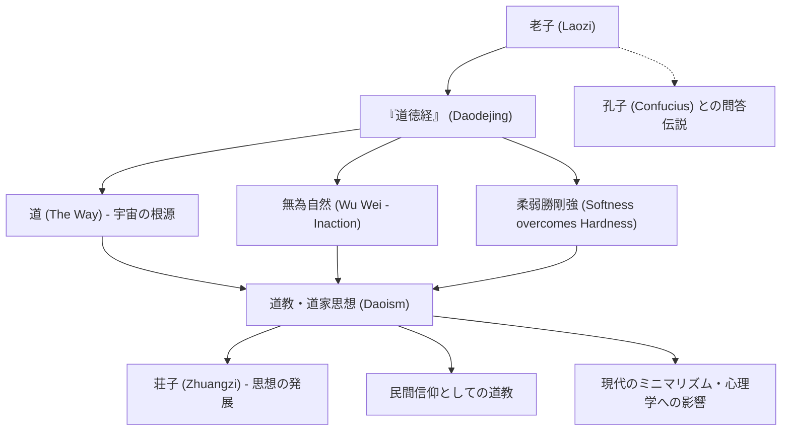

中国古代の思想家であり、道教の創始者とされる「老子」。彼の残した『道徳経』（老子道徳経）は、二千年以上が経過した現代においても、世界中で読み継がれ、多くの人々にインスピレーションを与え続けています。儒教の祖である孔子が「礼」や「仁」といった人為的な道徳を説いたのに対し、老子は宇宙の根源的なあり方である「道（タオ）」に従い、あるがままに生きる「無為自然」を説きました。

本記事では、歴史と哲学が交差する老子の生涯、その核心となる思想、そして後世に与えた計り知れない影響について、深く掘り下げていきます。

## 謎に包まれた生涯：老子とは何者だったのか

老子の生涯は、深い謎に包まれています。中国最古の歴史書である司馬遷の『史記』によれば、老子は楚の国の苦県（現在の河南省）に生まれ、姓は李、名は耳、字は聃（たん）であったとされています。周の王朝で国立図書館の記録係（守蔵室の史）を務めていたという記録が残されています。

伝説によれば、若き日の孔子が礼について教えを乞うために老子を訪ねた際、老子は孔子の形式主義的な態度を戒めたと言われています。このエピソードは、儒家と道家の思想的対立を象徴する出来事として有名です。

周の国力が衰退し、社会が混乱していくのを見た老子は、都を去る決意をします。西の国境である函谷関（かんこくかん）に差し掛かった時、関所の役人である尹喜（いんき）に懇願され、上下二篇、約五千文字からなる書物を書き残しました。これが、今日に伝わる『道徳経』です。その後、老子は西へと去り、その後の消息を知る者は誰もいなかったと伝えられています。

歴史学的な観点からは、老子が単一の歴史的人物であったかどうかには議論があります。複数の思想家の言葉が長い年月をかけて編纂され、「老子」という伝説的パッケージに収められたという説も有力です。しかし、その思想の圧倒的な一貫性と深みは、一人の天才的な思想家の存在を想像させずにはいられません。

## 核心思想：『道徳経』と「無為自然」

老子の哲学の中心にあるのは「道（タオ）」という概念です。老子は『道徳経』の冒頭で、「道の道とすべきは、常の道にあらず（言葉で表現できる道は、永遠不変の真実の道ではない）」と述べています。「道」とは、宇宙の万物を生み出し、それを運行させる根源的なエネルギーであり、人間の言語や論理を超越した絶対的な存在です。

この「道」と一体化するための生き方として老子が提唱したのが、「無為自然（むいしぜん）」です。
「無為」とは、何もしないという怠惰を意味するものではありません。人間の浅知恵による作為や、自己中心的な欲望に基づく無理な行動を捨てることを意味します。「自然」とは、自ずから然り、つまり万物が本来持っているありのままの姿を指します。

老子は、水のような生き方を理想としました（上善は水の若し）。水は万物を潤しながらも争わず、人々が嫌がる低い場所へと流れていきます。その柔軟で控えめな性質こそが、最も強い力を持っていると老子は説いたのです。

また、「柔弱は剛強に勝つ（柔らかく弱いものは、硬く強いものに勝つ）」という教えも重要です。暴風雨の中で、硬い大木は折れてしまいますが、柔らかい柳の枝はしなやかに風を受け流し、生き残ります。人間の生き方においても、強がりや執着を捨て、しなやかさを保つことの重要性を強調しています。

## 図解：老子の思想と影響の相関図

以下の図は、老子の思想体系とその後の影響を整理したものです。

## 後世への影響：諸子百家から現代まで

老子の思想は、中国思想史において儒教と双璧をなす「道家」思想の源流となりました。戦国時代には、老子の思想を受け継いだ「荘子」が登場し、より個人的で自由奔放な精神の解放を説きました（老荘思想）。

また、漢代以降には、老子は神格化され、「太上老君」として民間信仰である「道教」の最高神の一柱となりました。哲学としての道家と、宗教としての道教は区別されることが多いですが、その両方の土台に老子が存在していることは間違いありません。

老子の影響は中国国内に留まりません。禅宗の成立には老荘思想が深く関わっており、それが日本へと伝わり、日本の美意識や精神性（わび・さび、武士道における無心の境地など）に多大な影響を与えました。

現代社会においても、老子の思想は輝きを失っていません。高度な物質文明や情報過多、競争社会に疲弊した現代人にとって、「無為自然」や「足るを知る」という教えは、心の平穏を取り戻すための強力な解毒剤となっています。ミニマリズムの流行や、マインドフルネス、さらには一部の物理学者や心理学者が老子の東洋哲学に共鳴していることからも、その普遍的な価値が証明されています。

## おわりに

老子とは、実在の人物であったのか、それとも複数の賢者たちの集合体であったのか。その真実は歴史の闇の中にあります。しかし、残された『道徳経』の言葉は、時代や国境を超えて、今もなお私たちの心に深く語りかけてきます。

「つま先立ちする者は長く立っていられない。大股で歩く者は遠くまで歩けない。」

無理をして自分を大きく見せようとするのではなく、大いなる「道」に身を委ね、水のようにしなやかに生きる。老子の残したこの静かで力強いメッセージは、変化の激しい現代を生きる私たちにこそ、必要な羅針盤と言えるのではないでしょうか。
