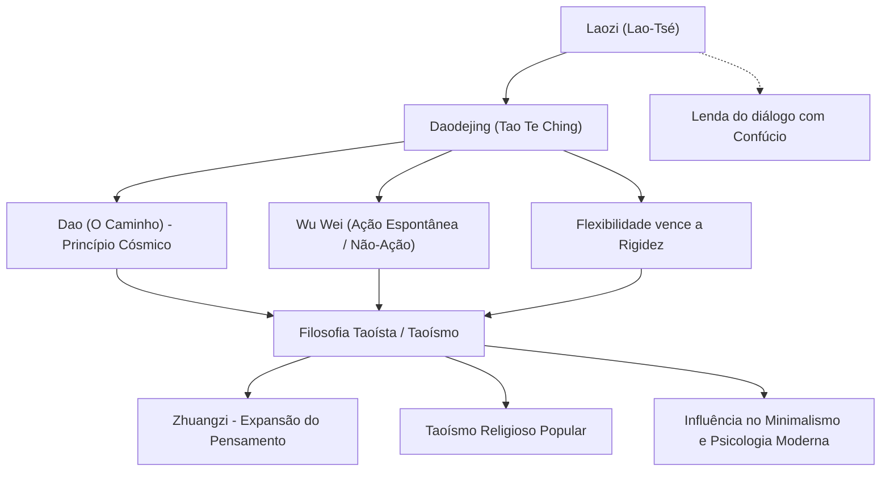

Laozi (Lao-Tsé), proeminente filósofo da China Antiga, é reverenciado como o fundador do taoísmo. Sua principal obra, o *Daodejing* (Tao Te Ching), continua sendo lida e relida em todo o mundo após mais de dois mil anos, inspirando inúmeras gerações. Enquanto Confúcio, pai do confucionismo, pregava virtudes morais estruturadas pela ação humana, como o rito (*Li*) e a benevolência (*Ren*), Laozi defendia a harmonia com o *Dao* (o Caminho) — o princípio primordial do cosmos — e a prática do *Wu Wei* (não-ação ou ação natural), vivendo em conformidade espontânea com as leis da natureza.

Neste artigo, aprofundamos a fascinante interseção entre história e filosofia ao explorar a enigmática trajetória de Laozi, os pilares fundamentais do seu pensamento e o legado incomensurável que deixou para a posteridade.

## Uma Vida Envolta em Mistério: Quem Foi Laozi?

A biografia de Laozi é repleta de mistérios e ambiguidades. De acordo com os *Registros do Historiador* (*Shiji*), a monumental obra de Sima Qian, Laozi nasceu no distrito de Ku, no estado de Chu (na atual província de Henan). Seu sobrenome teria sido Li, seu primeiro nome Er, e seu nome de cortesia Dan. Os registros indicam que ele atuou como arquivista ou historiador da biblioteca real imperial durante a Dinastia Zhou.

Reza a lenda que, quando jovem, Confúcio visitou Laozi para pedir instruções sobre os ritos ancestrais. Na ocasião, Laozi teria advertido Confúcio contra o apego a formalismos rígidos e convenções artificiais. Esse encontro lendário tornou-se emblemático na história chinesa, simbolizando o contraste filosófico entre o confucionismo e o taoísmo.

Ao presenciar o declínio inevitável da Dinastia Zhou e a crescente desordem social, Laozi decidiu abandonar a corte e partir para o exílio. Ao chegar ao Passo de Hangu, na fronteira ocidental, o guardião do posto, Yin Xi, suplicou-lhe que deixasse registrados os seus ensinamentos antes de partir. Laozi acedeu ao pedido e escreveu uma obra em duas partes, composta por cerca de cinco mil ideogramas. Tratava-se do texto que hoje conhecemos como o *Daodejing*. Diz a tradição que, após entregar o manuscrito, Laozi cavalgou em direção ao oeste sobre um búfalo e nunca mais foi visto.

Do ponto de vista historiográfico moderno, ainda se debate amplamente se Laozi existiu de fato como um indivíduo histórico único. Há fortes indícios de que o *Daodejing* possa ser uma compilação de aforismos e ensinamentos acumulados ao longo dos séculos por vários pensadores, sintetizados sob a figura mítica de "Laozi" (que significa literalmente "Velho Mestre"). No entanto, a notável coerência estrutural e a profundidade transcendental da obra continuam a evocar a presença de uma mente genial extraordinária.

## Princípios Fundamentais: O *Daodejing* e o *Wu Wei*

O cerne da filosofia de Laozi reside no conceito de *Dao* (ou Tao). Logo no primeiro verso do *Daodejing*, ele afirma: *"O Dao que pode ser expresso em palavras não é o Dao eterno e absoluto"*. O Dao é a fonte inefável e primordial que dá origem e sustento a tudo o que existe no universo; uma força transcendental que ultrapassa qualquer tentativa de limitação pela linguagem humana ou pela razão lógica.

Para harmonizar a existência humana com esse fluxo primordial, Laozi propôs o princípio de *Wu Wei Ziran* (agir pela não-ação e espontaneidade natural).
O conceito de *Wu Wei* (não-ação) não deve ser confundido com apatia ou passividade inerte. Significa, na verdade, abster-se da interferência artificial, de manipulações forçadas e de ações motivadas pelo egoísmo ou por noções superficiais de controle. Já *Ziran* designa a espontaneidade pura: as coisas existindo e desdobrando-se exatamente como são por natureza.

Laozi exaltava a água como a maior metáfora de conduta de vida (*"A suprema bondade é como a água"*). A água nutre todos os seres sem jamais competir com eles e acomoda-se voluntariamente nos lugares mais baixos e rejeitados pelos homens. Laozi ensinava que é justamente essa natureza maleável, humilde e desprovida de resistência que constitui o poder mais formidável do universo.

Outro ensinamento basilar é a máxima: *"A fraqueza e a flexibilidade vencem a rigidez e a força"*. Em meio a uma tempestade violenta, uma árvore rígida e frondosa se parte, ao passo que os ramos flexíveis de um salgueiro vergam-se com o vento e sobrevivem intactos. Na conduta humana, Laozi ressalta o valor de abrir mão da arrogância e dos apegos obstinados, preservando a maleabilidade interior.

## Diagrama: O Sistema de Pensamento e o Impacto de Laozi

O diagrama a seguir sintetiza a estrutura filosófica de Laozi e sua reverberação histórica.

## Legado Histórico: Dos Cem Filósofos à Idade Contemporânea

Na história do pensamento chinês, a doutrina de Laozi deu origem ao taoísmo filosófico (*Daojia*), formando com o confucionismo os dois grandes pilares da civilização oriental. Durante o Período dos Reinos Combatentes, Zhuangzi deu continuidade a essas ideias, desenvolvendo uma visão voltada para a emancipação individual da mente e a liberdade irrestrita do espírito (filosofia conhecida como *Lao-Zhuang*).

A partir da Dinastia Han, Laozi foi progressivamente deificado sob o título de *Taishang Laojun* (Supremo Senhor Lao), tornando-se uma das divindades primordiais do taoísmo religioso (*Daojiao*). Embora os estudiosos façam uma distinção criteriosa entre o taoísmo como corrente filosófica e o taoísmo como religião institucionalizada, ambos compartilham a figura venerável de Laozi como alicerce indispensável.

O alcance de sua influência transpôs as fronteiras chinesas. A emergência do Budismo Chan (que mais tarde floresceu no Japão como Zen) foi profundamente fertilizada pelas noções taoístas de vazio e espontaneidade. Essa herança moldou decisivamente a estética e a espiritualidade japonesas, manifestando-se em conceitos como *wabi-sabi* e no ideal do *mushin* (mente vazia, desprovida de apego) nas artes marciais e no Caminho do Samurai (*Bushido*).

No mundo contemporâneo, a sabedoria de Laozi permanece mais vívida do que nunca. Para os indivíduos exaustos pelo consumismo desenfreado, pela sobrecarga de informações e pela competitividade implacável, preceitos como o *Wu Wei* e a sabedoria de "saber contentar-se com o suficiente" (*zhizu*) representam um poderoso antídoto contra a ansiedade. O fascínio atual pelo minimalismo, o cultivo da atenção plena (*mindfulness*) e o interesse convergente demonstrado por físicos quânticos e psicólogos modernos evidenciam o valor universal e perene de suas intuições.

## Considerações Finais

Teria sido Laozi uma figura histórica tangível ou uma síntese personificada de múltiplos sábios ancestrais? A verdade definitiva permanece velada pela bruma dos milênios. Não obstante, os versos lapidados no *Daodejing* superam quaisquer barreiras temporais ou geográficas, continuando a ressoar com clareza em nossa consciência.

*"Aquele que se apoia na ponta dos pés não consegue manter-se firme; aquele que dá passos largos demais não consegue ir longe."*

Em vez de nos esforçarmos em excesso para aparentar grandeza perante os outros, somos convidados a nos entregar ao ritmo do grande Dao e a fluir com a maleabilidade da água. Esta mensagem serena e poderosa deixada por Laozi permanece, sem dúvida, como uma bússola essencial para navegarmos pelas incertezas de nosso próprio tempo.
