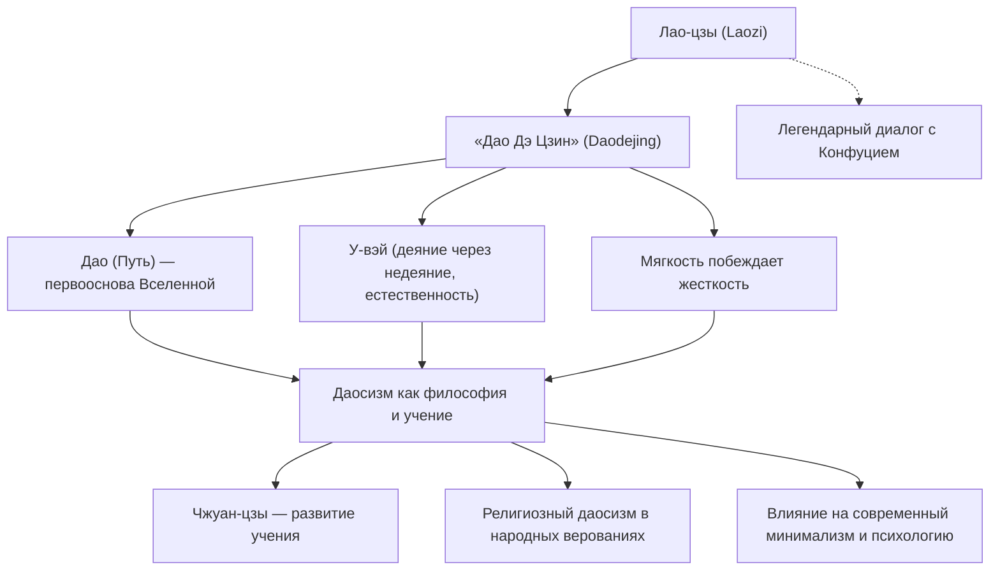

Древнекитайский мыслитель Лао-цзы считается основателем даосизма. Оставленный им трактат «Дао Дэ Цзин» спустя более двух тысячелетий продолжают читать во всем мире, и он по-прежнему вдохновляет множество людей. В то время как основоположник конфуцианства Конфуций проповедовал искусственные этические нормы, такие как «ли» (ритуал, благопристойность) и «жэнь» (человеколюбие), Лао-цзы учил следованию «Дао» (Пути) — первооснове мироздания — и принципу «у-вэй» (деянию через недеяние, естественности), призывая жить в гармонии с природой вещей.

В этой статье мы подробно рассмотрим жизнь Лао-цзы на стыке истории и мифа, ключевые положения его философии, а также то колоссальное влияние, которое он оказал на последующие поколения.

## Жизнь, окутанная тайной: кем на самом деле был Лао-цзы

Жизнь Лао-цзы полна загадок. Согласно первому фундаментальному историческому труду Китая — «Ши цзи» («Исторические записки») Сыма Цяня, Лао-цзы родился в царстве Чу, в уезде Ку (на территории современной провинции Хэнань). Его фамилия была Ли, имя — Эр, а второе имя — Дань. Сохранились свидетельства о том, что он служил хранителем архива (историографом библиотеки) при царском дворе династии Чжоу.

Согласно преданию, когда молодой Конфуций посетил Лао-цзы, чтобы спросить о ритуалах («ли»), Лао-цзы предостерег его от чрезмерного формализма и жесткости. Этот эпизод стал хрестоматийным символом философского противостояния и диалога между конфуцианством и даосизмом.

Видя упадок могущества Чжоу и нарастающий хаос в обществе, Лао-цзы решил покинуть столицу. Достигнув западной границы у заставы Ханьгу, он по просьбе начальника заставы Инь Си написал труд, состоящий из двух частей и примерно пяти тысяч иероглифов. Так на свет появился дошедший до наших дней «Дао Дэ Цзин». После этого Лао-цзы отправился дальше на запад, и никто больше о нем ничего не слышал.

С исторической точки зрения до сих пор ведутся споры о том, был ли Лао-цзы реальной исторической личностью. Весьма распространена теория, что высказывания нескольких мыслителей на протяжении долгого времени компилировались и в итоге были объединены под легендарным именем «Лао-цзы». Однако поразительная внутренняя цельность и глубина этого учения заставляют многих верить, что за ним стоял единый гениальный философ.

## Ключевые идеи: «Дао Дэ Цзин» и «у-вэй» (естественность)

В центре философии Лао-цзы лежит концепция «Дао» (Пути). Лао-цзы открывает «Дао Дэ Цзин» знаменитыми словами: «Дао, которое может быть выражено словами, не есть постоянное Дао». «Дао» — это первооснова и фундаментальная энергия, порождающая все сущее во Вселенной и управляющая ее движением; абсолютная реальность, превосходящая человеческий язык и логику.

В качестве способа гармонизации и слияния с «Дао» Лао-цзы предложил принцип «у-вэй цзы-жань» (деяние через недеяние и естественность).
«У-вэй» (недеяние) вовсе не означает пассивность или лень. Оно подразумевает отказ от искусственных, надуманных действий, продиктованных поверхностным умом или эгоистическими желаниями, и отказ от насилия над природой вещей. «Цзы-жань» (естественность) означает спонтанность, самобытность и пребывание вещей в их первозданном виде.

Лао-цзы считал высшим идеалом уподобление воде («высшая добродетель подобна воде»). Вода приносит пользу всему сущему и ни с кем не соперничает, спокойно стекая в самые низкие места, которыми пренебрегают люди. Именно в этой мягкости, гибкости и скромности кроется величайшая сила.

Еще одним важным уроком является принцип «слабое и мягкое побеждает твердое и крепкое». Во время бури жесткое могучее дерево ломается, тогда как гибкая ива склоняется под порывами ветра и выживает. В жизни человека этот принцип подчеркивает необходимость отбросить показную силу, эгоцентричную жесткость и привязанности, сохраняя внутреннюю гибкость и податливость.

## Схема: система идей Лао-цзы и их влияние

На следующей схеме представлена система идей Лао-цзы и их историческое влияние:

## Влияние на потомков: от «Ста школ» до наших дней

Учение Лао-цзы стало истоком философского направления «дао цзя» (даосизма), которое наряду с конфуцианством сформировало фундамент китайской мысли. В эпоху Воюющих царств появился Чжуан-цзы, развивший идеи Лао-цзы в сторону еще большего раскрепощения духа, индивидуальной свободы и трансцендентности (традиция Лао-Чжуан).

Начиная с эпохи Хань, Лао-цзы был обожествлен и под именем Тайшан Лаоцзюнь («Верховный владыка Лао») стал одним из верховных божеств религиозного даосизма («дао цзяо»). Хотя философский даосизм и народную религию часто разделяют, несомненно одно: фигура Лао-цзы лежит в основе обоих направлений.

Влияние Лао-цзы вышло далеко за пределы Китая. Философия Лао-цзы и Чжуан-цзы сыграла решающую роль в формировании дзэн-буддизма (чань), который затем проник в Японию и оказал глубокое воздействие на японскую эстетику и мировоззрение (принципы ваби-саби, состояние «мусин» — свободы разума в бусидо и т. д.).

В современном обществе идеи Лао-цзы ничуть не утратили своей актуальности. Для людей XXI века, изнуренных безудержным материализмом, информационной перегрузкой и жестокой конкуренцией, концепции «у-вэй» и умения «довольствоваться малым» («знающий меру доволен») служат мощным исцеляющим средством для обретения душевного покоя. Популярность минимализма, практик осознанности (майндфулнесс), а также интерес физиков и психологов к восточной философии лишь подтверждают вневременную ценность наследия Лао-цзы.

## Заключение

Был ли Лао-цзы реальным человеком или собирательным образом древних мудрецов? Истина скрыта за завесой веков. Однако строки «Дао Дэ Цзин» сквозь эпохи и границы продолжают трогать струны человеческой души.

«Кто поднялся на цыпочки, не сможет долго стоять. Кто делает большие шаги, не сможет долго идти».

Не пытаться казаться сильнее и значительнее ценой надрыва, а довериться великому Дао и жить подобно текучей воде — мягко, гибко и естественно. Это тихое, но исполненное колоссальной силы послание Лао-цзы служит надежным компасом для каждого из нас в стремительно меняющемся современном мире.
