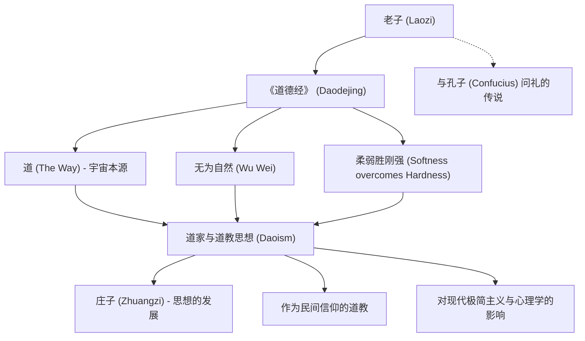

老子是中国古代杰出的思想家，被尊为道家学派的创立者与道教之祖。他所留下的《道德经》（又称《老子》），历经两千多年的岁月洗礼，至今仍在世界各地被广泛研读，源源不断地带给人们启示。儒家鼻祖孔子主张以“礼”和“仁”等为人为构建的道德规范，而老子则倡导顺应宇宙万物的本源存在——“道”，主张顺其自然、遵从本真的“无为自然”。

本文将深入探讨历史与哲学交织的老子生平、其思想的核心精髓，以及他对后世所产生的难以估量的深远影响。

## 笼罩在谜团中的生平：老子究竟是何方神圣

老子的生平充满了未解的谜团。根据中国古代著名史学家司马迁所著的《史记》记载，老子出生于楚国苦县（今河南省鹿邑县一带），姓李，名耳，字聃。曾长期在周朝王室担任负责典籍管理的官职——“守藏室之史”。

相传，年轻时的孔子曾前往拜访老子，向他请教关于“礼”的学问。老子在交流中告诫孔子摒弃形式主义与浮躁的心态。这一著名典故被称为“孔子问礼”，被后人视作儒道两家思想交锋与对话的标志性事件。

眼见周朝国力衰微、社会动荡加剧，老子决心离开王都西行。当他行至西部边境的函谷关时，关令尹喜恳请他著书立说。老子于是留下了分为上下两篇、约五千言的著作，这便是流传千古的《道德经》。据传，此后老子骑青牛出关西去，不知所终，后世无人知晓其最终下落。

从历史学的角度来看，老子是否为单一的历史人物至今仍存有争议。学术界也有有力观点认为，《道德经》可能是多位思想家的言论经过漫长岁月编纂汇聚而成，并归于“老子”这一传奇形象名下。然而，其思想所展现出的极强连贯性与深邃洞见，又令人不得不信服其背后必有一位卓越天才思想家的存在。

## 核心思想：《道德经》与“无为自然”

老子哲学的核心概念是“道”。在《道德经》开篇，老子便提出了“道可道，非常道”（凡是可以用言语表达的道，就不是永恒不变的根本之道）。“道”是化育宇宙万物并推动其运行的根本力量，是超越了人类语言与逻辑边界的绝对存在。

为了与这种“道”融为一体，老子提出了“无为自然”的生存智慧。
“无为”并非指什么都不做的消极懒惰，而是指放下出于浅薄智巧的妄为，摒弃基于自私欲望的强求行径。“自然”意指“自己如此”，即万物遵循本真法则、自然而然的呈现状态。

老子将水般的品性视为最理想的人格境界，即“上善若水”。水善于滋润养育万物而不与万物相争，甘居众人所不愿停留的低下之处。老子阐明，正是这种柔韧、谦逊且不争的特质，反而蕴含着最为强大的力量。

此外，“柔弱胜刚强”也是老子极为重要的教诲。在狂风暴雨中，坚硬粗壮的大树往往会被吹折，而柔软低垂的柳枝却能顺应风势轻盈摆动，安然无恙。老子以此强调，在立身处世中，放下虚妄的强硬与偏执、保持内心的柔韧与包容，具有不可替代的重要性。

## 图解：老子的思想与影响关联图

下图梳理了老子的思想体系及其对后世的影响脉络：

## 对后世的影响：从诸子百家到现代社会

在中国的思想史上，老子的学说成为了与儒家并驾齐驱的“道家”思想源流。到了战国时代，继承老子思想的“庄子”横空出世，进一步倡导超越世俗拘束、追求心灵绝对自由的境界，合称为“老庄思想”。

汉代以后，老子逐渐被神格化，被尊称为“太上老君”，成为中国本土宗教——道教的三清最高尊神之一。虽然学术界通常将作为哲学流派的道家与作为宗教实体的道教加以区分，但不可否认的是，老子均构成了两者不可动摇的思想基石。

老子的影响并未止步于中国本土。在佛教禅宗的孕育与形成过程中，老庄思想产生了极其深远的影响；随着禅宗东渡日本，又深刻地塑造了日本的美学品格与精神追求（如侘寂美学以及武士道中强调的“无心”之境等）。

即便在步入21世纪的今天，老子的思想依然闪烁着智慧的光芒。面对高度发达的物质文明、信息过载以及竞争激烈的现代社会，许多感到疲惫不堪的人们从“无为自然”与“知足常乐”（知足者富）的教诲中汲取力量，找到了重获内心宁静的解药。当下极简主义的生活方式、正念冥想的兴起，乃至部分量子物理学家与心理学家对东方道家哲学的强烈共鸣，都无一不印证了其思想跨越时空的普遍价值。

## 结语

老子究竟是一位真实存在的先哲，抑或是多位智者的化身与集合？历史的真相或许早已隐入岁月的迷雾之中。然而，他所留下的《道德经》字句，却跨越了时代与国界，至今依然在人们的心头回响、发人深省。

“企者不立，跨者不行。”（踮起脚尖想站得更高的人，反而站立不稳；迈大步想走得更快的人，反而走不长远。）

与其强撑逞能、刻意彰显自我，不如顺应大道自然的节律，如流水般柔韧通达地生活。老子留给世人的这份深沉而有力的智慧叮咛，在身处瞬息万变的现代社会的我们看来，不正是一盏不可或缺的心灵罗盘吗？
