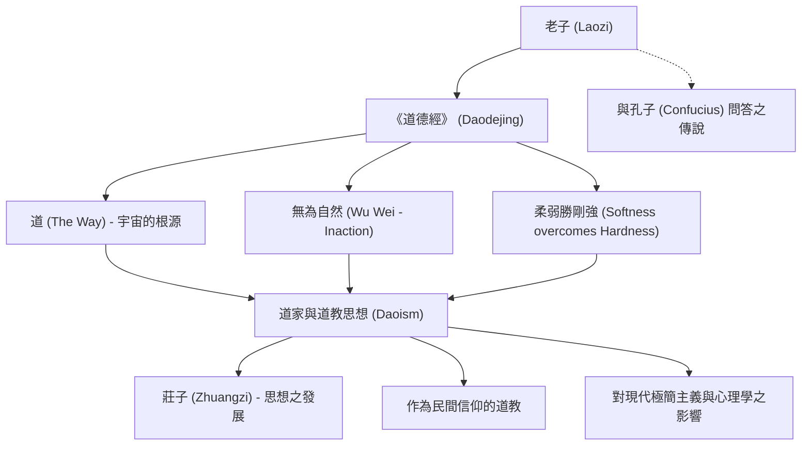

身為中國古代的思想家、被視為道教創始者的「老子」，他所留下的《道德經》（老子道德經），歷經兩千多年的歲月，在當代依然被世界各地的人們世代傳讀，並持續啟發著無數心靈。相對於儒家先祖孔子提倡「禮」與「仁」等人為道德，老子則主張順應宇宙根本規律的「道」，提倡順應自然而生的「無為自然」。

在本文中，我們將深入探討歷史與哲學交織下的老子生平、其核心思想，以及對後世所產生的深遠影響。

## 籠罩於謎團中的生平：老子究竟是何方神聖？

老子的生平充滿了謎團。根據中國古代司馬遷所著的《史記》記載，老子出生於楚國苦縣（今河南省），姓李，名耳，字聃。史料記載他曾在周王室擔任典籍管理官（守藏室之史）。

傳說中，年輕時的孔子為了求教「禮」而拜訪老子，老子告誡孔子不可過於執著於形式主義。這段軼事成為象徵儒家與道家思想交鋒的著名公案。

眼見周王朝國力衰退、社會動盪不安，老子決心離開都城。當他抵達西方邊境的函谷關時，守關長官尹喜懇求他留下教導，於是老子著述了上下兩篇、約五千言的著作，這便是流傳至今的《道德經》。據傳老子隨後西行出關，從此不知所蹤。

從歷史學的角度來看，老子是否為單一的歷史人物一直存在爭論。亦有強而有力的學說認為，《道德經》是歷經漫長歲月彙編多位思想家言論後，歸於「老子」這一傳奇人物之名下。然而，其思想展現出壓倒性的一貫性與深厚底蘊，仍讓人不禁聯想背後必然有一位卓越天才思想家的存在。

## 核心思想：《道德經》與「無為自然」

老子哲學的核心在於「道」的概念。老子在《道德經》開篇即言：「道可道，非常道」（能用言語表達的道，便不是恆久不變的常道）。「道」是孕育宇宙萬物並推動其運行的根源能量，是超越人類語言與邏輯的絕對存在。

為了與此「道」合而為一，老子提倡的生活哲學便是「無為自然」。
「無為」並非消極怠惰或什麼都不做，而是摒棄人為的淺薄私智，以及放下出於自我中心慾望的妄為。「自然」意指「自自然然、本來如此」，亦即萬物天然原本的狀態。

老子將如水般的生存姿態視為理想境界（「上善若水」）。水滋養萬物而不與萬物相爭，並且安居於眾人所厭惡的低下之處。老子指出，正是這種柔和謙遜的本質，蘊含著最為強大的力量。

此外，「柔弱勝剛強」的教誨同樣至關重要。在暴風雨中，堅硬的大樹往往容易折斷，而柔軟的柳枝卻能順風擺動、化解衝擊並得以保全。在人生處世上，老子同樣強調放下逞強與執念、保持柔韌的重要性。

## 圖解：老子思想與其影響之關聯

下圖梳理了老子的思想體系及其對後世的影響。

## 對後世的影響：從諸子百家到當代

老子的思想成為中國思想史上與儒家並駕齊驅的「道家」思想源頭。戰國時期，繼承老子思想的「莊子」問世，倡導更加注重個體且自由奔放的精神解放（合稱「老莊思想」）。

此外，自漢代以降，老子被神格化為「太上老君」，成為民間信仰「道教」中的三清最高神之一。儘管作為哲學的道家與作為宗教的道教常被加以區分，但毫無疑問，老子皆是這兩者的根本基石。

老子的影響力更超越了中國國界。禪宗的確立與老莊思想有著深刻的交融，隨後傳入日本，對日本的傳統美學與精神內涵（如侘寂、武士道中的「無心」境界等）產生了深遠的影響。

在現代社會中，老子的思想依舊歷久彌新。對於在高度物質文明、資訊爆炸與激烈競爭社會中疲憊不堪的現代人而言，「無為自然」與「知足」的智慧，無疑是重尋內心寧靜的強大良方。從極簡主義的盛行、正念冥想的普及，到部分物理學家與心理學家對老子東方哲學的共鳴，都印證了其跨越時空的普世價值。

## 結語

老子究竟是一位真實存在的歷史人物，還是多位智者的集體象徵？真相依然沉睡在歷史的長河之中。然而，他所留下的《道德經》箴言，超越了時代與國界，至今仍深切觸動著我們的心靈。

「企者不立，跨者不行。」（踮起腳尖的人站不久，邁大步前行的人走不遠。）

與其勉強誇大自我，不如順應博大包容的「道」，如流水般柔韌從容地生活。老子留給世人的這份平靜而強大的訊息，正是在瞬息萬變的當代生活中，我們最需要的一座心靈指南針。
