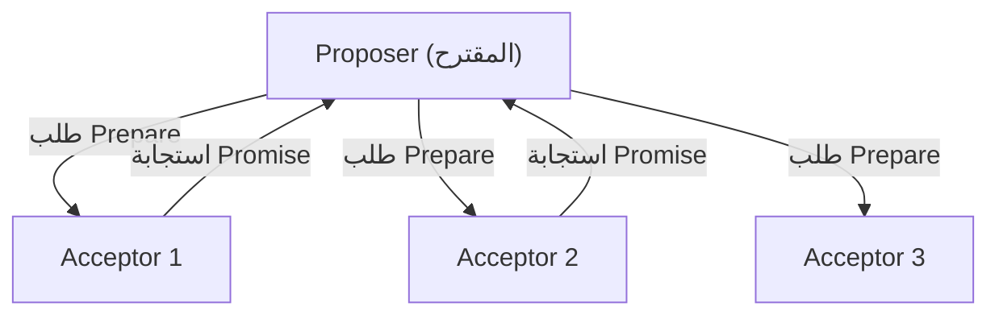
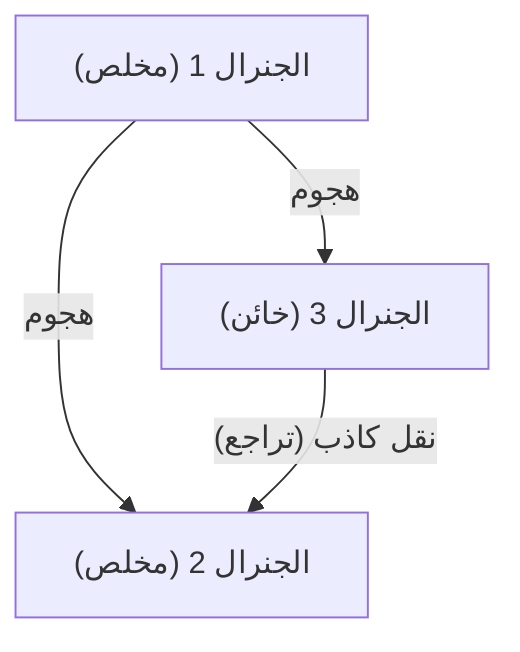

## الرجل الذي أعطى "الوقت" و"الإجماع" للأنظمة الموزعة: ليزلي لامبورت

الأنظمة الموزعة، ممثلة بالإنترنت الحديث، الحوسبة السحابية، والبلوكتشين. وراء تشغيل هذه الأنظمة بشكل طبيعي واستفادتنا منها في حياتنا اليومية، يوجد عالم حاسوب عبقري: ليزلي لامبورت (Leslie Lamport).

لامبورت، الذي فاز بجائزة تورينج في عام 2013، أرسى أسس الحوسبة الموزعة وحل العديد من المشاكل المعقدة بصرامة رياضية. في هذا المقال، سنتعمق في إنجازاته العظيمة مثل "ساعة لامبورت (Lamport Clock)"، "خوارزمية باكسوس (Paxos Algorithm)"، "مشكلة الجنرالات البيزنطيين (Byzantine Generals Problem)"، وكذلك دوره كأب لنظام "LaTeX" الذي لا غنى عنه في الأوساط الأكاديمية.

### 1. "ساعة لامبورت" المستوحاة من نظرية النسبية لأينشتاين

واحدة من أكثر المشاكل تعقيداً في الأنظمة الموزعة هي "الوقت". في بيئة تتواصل فيها أجهزة كمبيوتر متعددة (عُقد) عبر الشبكة، يحدث دائماً انحراف (Clock Drift) في الساعات المادية لكل منها. من المستحيل تحديد بدقة باستخدام الساعات المادية فقط أيهما حدث أولاً: حدث وقع في الخادم A عند "12:00:00" أم حدث وقع في الخادم B عند "12:00:01".

استجابة لهذه المشكلة، قدم لامبورت حلاً مبتكراً في ورقته البحثية عام 1978 بعنوان "الوقت، الساعات، وترتيب الأحداث في نظام موزع (Time, Clocks, and the Ordering of Events in a Distributed System)". استلهم من مفهوم النظرية النسبية الخاصة الذي ينص على أنه "لا يوجد وقت مطلق، والوقت يمر بشكل مختلف باختلاف المراقبين"، لابتكار مفهوم "الساعة المنطقية (Logical Clock)".

#### العلاقة السببية للأحداث (Happens-Before)

ركز لامبورت على "العلاقة السببية" بين الأحداث بدلاً من الوقت المادي. إذا كان الحدث a سبباً للحدث b، أو إذا كان b يحدث بالتأكيد بعد a، فقد عرّف هذا بـ a -> b (a يحدث قبل b).

"ساعة لامبورت" القائمة على هذه القاعدة البسيطة تعني أن كل عقدة تحتفظ بعدادها الخاص وتقوم بتحديثه ومزامنته في كل مرة ترسل أو تستقبل فيها رسالة. هذا جعل من الممكن تحديد ترتيب الأحداث دون تناقضات عبر النظام بأكمله. أصبحت هذه الورقة واحدة من أكثر الأوراق اقتباساً في تاريخ علوم الحاسوب، وهي تشكل أساس التحكم في المعاملات في قواعد البيانات الموزعة الحالية.

### 2. قمة الإجماع الموزع "خوارزمية باكسوس"

العائق الضخم الآخر في الأنظمة الموزعة هو "الإجماع (Consensus)". كيف يمكن الاتفاق على حالة واحدة متسقة ككل عند حدوث أعطال مثل تأخير الشبكة أو تعطل بعض الخوادم؟

في عام 1989، كتب لامبورت ورقة بحثية بعنوان "The Part-Time Parliament (البرلمان بدوام جزئي)"، مستخدماً برلمان جزيرة يونانية خيالية تُدعى "باكسوس" كاستعارة لشرح خوارزمية الإجماع الموزع هذه.

#### آلية باكسوس وصعوبتها

تُعرّف خوارزمية باكسوس أدوار المقترح (Proposer)، والموافق (Acceptor)، والمتعلم (Learner)، ومن خلال الحصول على موافقة الأغلبية (Quorum)، تشكل إجماعاً بأمان مع تحمل الأعطال.

في البداية، كانت هذه الورقة التي تستخدم الاستعارة اليونانية معقدة وغريبة للغاية، لدرجة أن مراجعي المجلة طلبوا منه "إزالة الاستعارة وإعادة الكتابة". رفض لامبورت ذلك، واستغرق الأمر حوالي 10 سنوات حتى تُنشر الورقة رسمياً. ومع ذلك، لاحقاً، تم تبني باكسوس (ومشتقاتها) في أنظمة المهام الحرجة في العالم الحقيقي، مثل Chubby من جوجل وبروتوكول ZAB الخاص بـ Apache ZooKeeper، مما أثبت قيمتها الحقيقية.

### 3. "مشكلة الجنرالات البيزنطيين" التي صاغت تحمل الأخطاء

الأعطال التي تواجهها الأنظمة الموزعة ليست مجرد توقف بسيط للآلات (Crash Faults). هناك احتمال أن تتسلل "الأكاذيب" أو "التناقضات" إلى النظام، مثل اختراق عقدة بواسطة نية خبيثة، أو إرسال بيانات شاذة غير متوقعة بسبب خطأ برمجي.

في عام 1982، صاغ لامبورت بالتعاون مع روبرت شوستاك ومارشال بيس هذه المشكلة باسم "مشكلة الجنرالات البيزنطيين (Byzantine Generals Problem)".

#### جنرالات محاطون بالأعداء

يحاصر جنرالات الإمبراطورية البيزنطية مدينة معادية. يجب أن يتفقوا جميعاً على "الهجوم" أو "التراجع"، لكن وسيلة الاتصال الوحيدة هي الرسل، علاوة على ذلك، هناك "خونة" بين الجنرالات. يرسل الخائن رسائل كاذبة "للهجوم" لبعض الجنرالات و"للتراجع" لآخرين.

أثبت لامبورت وزملاؤه رياضياً أنه إذا كان العدد الإجمالي للعقد هو N وعدد الخونة هو f، فإذا كان N >= 3f + 1، فإن الجنرالات الصادقين يمكنهم الوصول بشكل صحيح إلى الإجماع (التسامح مع الأخطاء البيزنطية: BFT).

تمت دراسة هذا المفهوم لفترة طويلة في المجالات التي تتطلب موثوقية عالية جداً مثل أنظمة التحكم في الطائرات، ولكنه برز في السنوات الأخيرة كجوهر لتكنولوجيا "البلوكتشين". إثبات العمل (Proof of Work) الخاص بالبيتكوين هو أيضاً حل احتمالي لمشكلة الجنرالات البيزنطيين بالمعنى الواسع.

### 4. أب "LaTeX" البنية التحتية للأوساط الأكاديمية

لم تقتصر مساهمات لامبورت على الأنظمة الموزعة فقط. فقد قام بتطوير نظام التنضيد "LaTeX"، الذي أصبح المعيار الفعلي عالمياً لكتابة الأبحاث في الرياضيات وعلوم الحاسوب.

بنى لامبورت حزم ماكرو فوق نظام "TeX" القوي ولكن المعقد الذي طوره دونالد كنوث (Donald Knuth)، مما أدى إلى ظهور "LaTeX" الذي يتيح للمستخدمين التركيز على البنية المنطقية للمستند (فصول، أقسام، أشكال، معادلات، إلخ). فكرة "فصل المحتوى عن التصميم" هي أيضاً مبدأ أساسي في تصميم الويب الحديث المتجسد في HTML/CSS.

### الخاتمة: القيمة الأبدية الناتجة عن الصرامة المنطقية

بالنظر إلى إنجازات ليزلي لامبورت، يمكننا أن نرى مدى أهمية تركيزه على "القضاء على الغموض وتعريف المشاكل بصرامة رياضية". كما أن تطوير لغة وصف مواصفات النظام TLA+ (المنطق الزمني للأفعال) هو تتويج لنهجه في القضاء المنطقي على الأخطاء من الأنظمة المعقدة.

المفاهيم التي ابتكرها، مثل "ساعة لامبورت"، "باكسوس"، و"مشكلة الجنرالات البيزنطيين"، تمتلك حقيقة عالمية لا تعتمد على أجهزة معينة أو تقنيات عابرة. ولهذا السبب، تعيش نظرياته كما هي في البنية التحتية السحابية والبلوكتشين اليوم بعد مرور عدة عقود.

لا شك أن ليزلي لامبورت يمكن اعتباره عملاقاً أعاد تعريف مفهوم "الوقت" و"الإجماع" في العصر الرقمي.
