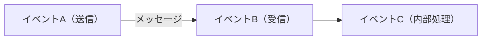
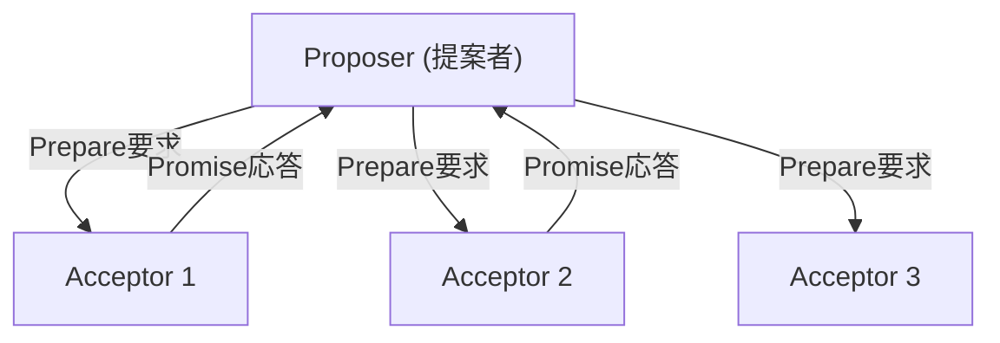
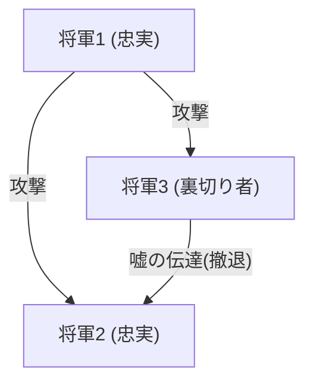

## Der Mann, der verteilten Systemen „Zeit“ und „Konsens“ gab: Leslie Lamport

Verteilte Systeme wie das moderne Internet, Cloud-Computing und Blockchains. Dass diese wie selbstverständlich funktionieren und wir in unserem Alltag von ihnen profitieren, verdanken wir der Existenz eines genialen Informatikers: Leslie Lamport.

Lamport, der 2013 den Turing-Preis erhielt, legte den Grundstein für das verteilte Rechnen und löste viele komplexe Probleme mit mathematischer Strenge. In diesem Artikel tauchen wir tief in seine großartigen Errungenschaften ein: die „Lamport-Uhren“, den „Paxos-Algorithmus“, das „Problem der byzantinischen Generäle“ und seine Rolle als Vater von „LaTeX“, das in der akademischen Welt unverzichtbar ist.

### 1. „Lamport-Uhren“: Inspiriert durch Einsteins Relativitätstheorie

Eines der kniffligsten Probleme in verteilten Systemen ist die „Zeit“. In einer Umgebung, in der mehrere Computer (Knoten) über ein Netzwerk kommunizieren, weichen ihre physischen Uhren zwangsläufig voneinander ab (Clock Drift). Es ist unmöglich, allein anhand physischer Uhren genau zu bestimmen, ob ein Ereignis, das auf Server A um „12:00:00“ auftrat, wirklich vor einem Ereignis auf Server B um „12:00:01“ stattgefunden hat.

Auf dieses Problem lieferte Lamport 1978 in seiner Arbeit *Time, Clocks, and the Ordering of Events in a Distributed System* eine bahnbrechende Antwort. Inspiriert von dem Konzept der speziellen Relativitätstheorie, dass „es keine absolute Zeit gibt und die Zeit für verschiedene Beobachter unterschiedlich vergeht“, entwickelte er das Konzept der „logischen Uhr“ (Logical Clock).

#### Kausalität von Ereignissen (Happens-Before)

Lamport konzentrierte sich nicht auf die physische Uhrzeit, sondern auf die „kausalen Beziehungen“ zwischen Ereignissen. Wenn ein Ereignis a die Ursache für ein Ereignis b ist oder wenn b sicher nach a auftritt, definierte er dies als a -> b (a happens-before b).

Die auf dieser einfachen Regel basierende „Lamport-Uhr“ funktioniert so, dass jeder Knoten seinen eigenen Zähler hat, der bei jedem Senden oder Empfangen einer Nachricht aktualisiert und synchronisiert wird. Dadurch wurde es möglich, die Reihenfolge von Ereignissen im gesamten System widerspruchsfrei zu bestimmen. Dieses Paper wurde zu einem der meistzitierten in der Geschichte der Informatik und bildet die Grundlage für die Transaktionssteuerung in heutigen verteilten Datenbanken.

### 2. Der Meilenstein des verteilten Konsenses: Der „Paxos-Algorithmus“

Eine weitere große Hürde bei verteilten Systemen ist der „Konsens“ (Consensus). Wie kann das Gesamtsystem einen konsistenten Zustand (Wert) vereinbaren, während Netzwerkverzögerungen, Serverausfälle oder andere Störungen auftreten?

1989 verfasste Lamport das Paper *The Part-Time Parliament* (Das Teilzeit-Parlament) und erklärte diesen verteilten Konsensalgorithmus mithilfe der Metapher eines Parlaments auf der fiktiven griechischen Insel „Paxos“.

#### Die Funktionsweise und Komplexität von Paxos

Der Paxos-Algorithmus definiert die Rollen des Vorschlagenden (Proposer), des Akzeptierenden (Acceptor) und des Lernenden (Learner). Indem die Zustimmung einer Mehrheit (Quorum) erzielt wird, kann auch bei Ausfällen sicher ein Konsens gebildet werden.

Da das Paper mit dieser griechischen Metapher anfangs zu komplex und exzentrisch war, forderten die Gutachter der Fachzeitschrift Lamport auf, „die Metapher zu entfernen und es neu zu schreiben“. Lamport weigerte sich, und es dauerte etwa 10 Jahre, bis das Paper offiziell veröffentlicht wurde. Später jedoch wurde Paxos (sowie seine Derivate) in realen, geschäftskritischen Systemen wie Googles Chubby oder dem ZAB-Protokoll von Apache ZooKeeper übernommen, was seinen wahren Wert bewies.

### 3. Die Formalisierung der Fehlertoleranz: Das „Problem der byzantinischen Generäle“

Verteilte Systeme stehen nicht nur vor dem Problem einfacher Maschinenausfälle (Crash Faults). Es besteht auch die Gefahr, dass „Lügen“ oder „Widersprüche“ in das System gelangen, etwa durch das Hacken böswilliger Knoten oder das Senden unerwarteter, fehlerhafter Daten durch Bugs.

1982 formulierte Lamport dieses Problem zusammen mit Robert Shostak und Marshall Pease als das „Problem der byzantinischen Generäle“ (Byzantine Generals Problem).

#### Von Feinden umzingelte Generäle

Generäle des byzantinischen Reiches belagern eine feindliche Stadt. Sie müssen sich darauf einigen, ob sie alle gleichzeitig „angreifen“ oder sich „zurückziehen“, aber ihr einziges Kommunikationsmittel sind Boten. Zudem befinden sich unter den Generälen „Verräter“. Ein Verräter sendet gefälschte Nachrichten und sagt einigen Generälen, sie sollen „angreifen“, und anderen, sie sollen sich „zurückziehen“.

Lamport und seine Kollegen bewiesen mathematisch: Wenn N die Gesamtzahl der Knoten und f die Zahl der Verräter ist, können ehrliche Generäle korrekt zu einem Konsens gelangen, solange N >= 3f + 1 gilt (Byzantinische Fehlertoleranz: BFT).

Dieses Konzept wurde lange Zeit vor allem in Bereichen erforscht, die extrem hohe Zuverlässigkeit erfordern, wie etwa bei Steuerungssystemen von Flugzeugen. In den letzten Jahren rückte es jedoch als Herzstück der „Blockchain“-Technologie ins Rampenlicht. Der Proof of Work von Bitcoin kann im weitesten Sinne als probabilistische Lösung für das Problem der byzantinischen Generäle betrachtet werden.

### 4. Der Vater von „LaTeX“: Infrastruktur der akademischen Welt

Lamports Beiträge beschränken sich nicht auf verteilte Systeme. Das Satzsystem „LaTeX“, das weltweit zum De-facto-Standard für das Verfassen mathematischer und informatischer Arbeiten geworden ist, wurde von ihm entwickelt.

Aufbauend auf dem leistungsstarken, aber komplexen „TeX“-System, das von Donald Knuth entwickelt wurde, schuf Lamport ein Makropaket, das es den Benutzern ermöglicht, sich auf die logische Struktur des Dokuments (Kapitel, Abschnitte, Abbildungen, Formeln usw.) zu konzentrieren. Die Idee der „Trennung von Inhalt und Design“ ist auch ein Grundprinzip des modernen Webdesigns, das sich bis heute in HTML/CSS wiederfindet.

### Fazit: Ewiger Wert, geschaffen durch logische Strenge

Wenn man auf die Errungenschaften von Leslie Lamport zurückblickt, wird deutlich, wie viel Wert er darauf legte, „Mehrdeutigkeiten zu beseitigen und Probleme mit mathematischer Strenge zu definieren“. Die Entwicklung von TLA+ (Temporal Logic of Actions), einer Sprache zur Spezifikation von Systemen, ist die Krönung seines Ansatzes, Fehler (Bugs) durch logische Herangehensweisen aus komplexen Systemen zu eliminieren.

Die von ihm geschaffenen Konzepte der „Lamport-Uhren“, „Paxos“ und dem „Problem der byzantinischen Generäle“ besitzen eine universelle Wahrheit, die unabhängig von bestimmter Hardware oder technologischen Trends ist. Genau aus diesem Grund leben seine Theorien auch in den Cloud-Infrastrukturen und Blockchains der heutigen Zeit nach Jahrzehnten unverändert weiter.

Leslie Lamport kann zweifellos als ein Gigant bezeichnet werden, der die Konzepte von „Zeit“ und „Konsens“ im digitalen Zeitalter neu definiert hat.
