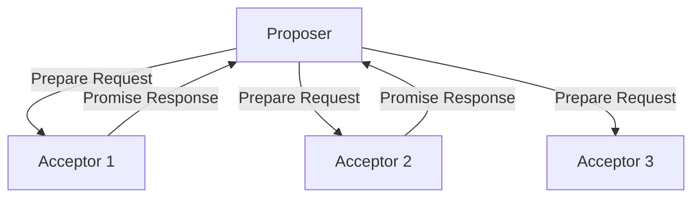
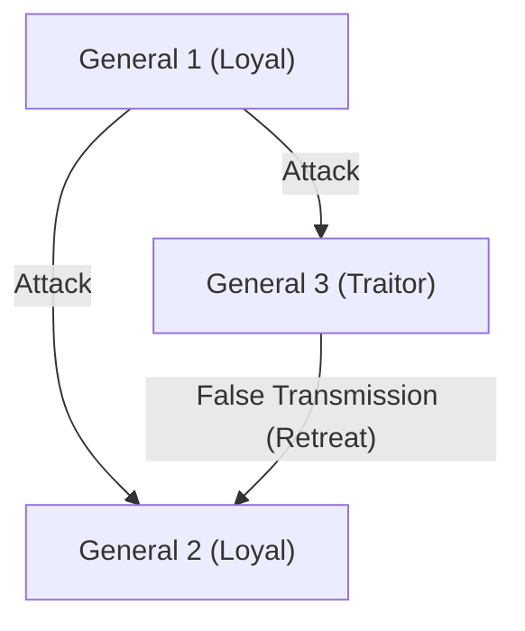

## The Man Who Gave 'Time' and 'Consensus' to Distributed Systems: Leslie Lamport

Distributed systems, represented by the modern Internet, cloud computing, and blockchain. Behind the fact that these operate as a matter of course and we can benefit from them in our daily lives, there is a genius computer scientist. His name is Leslie Lamport.

Lamport, who won the Turing Award in 2013, laid the foundations of distributed computing and solved many difficult problems with mathematical rigor. In this article, we delve deep into his great achievements: the "Lamport Clock," the "Paxos algorithm," the "Byzantine Generals Problem," and his side as the creator of "LaTeX," which is indispensable in the academic world.

### 1. The "Lamport Clock" Inspired by Einstein's Theory of Relativity

One of the most troublesome problems in distributed systems is "time." In an environment where multiple computers (nodes) communicate with each other over a network, the physical clocks they each possess will inevitably experience discrepancies (clock drift). It is impossible to accurately determine using physical clocks alone which event truly happened first: an event that occurred at "12:00:00" on Server A, or an event that occurred at "12:00:01" on Server B.

To address this problem, Lamport presented an innovative solution in his 1978 paper, "Time, Clocks, and the Ordering of Events in a Distributed System". Taking inspiration from the concept in the special theory of relativity that "absolute time does not exist, and the flow of time differs depending on the observer," he created the concept of the "Logical Clock."

#### Causal Relationship of Events (Happens-Before)

Lamport focused on the "causal relationship" between events rather than physical time. If event A is the cause of event B, or if B reliably occurs after A, he defined this as a -> b (a happens-before b).

The "Lamport Clock," based on this simple rule, requires each node to have its own counter and to update and synchronize the counter every time it sends or receives a message. This made it possible to determine the sequence of events across the entire system without contradiction. This paper became one of the most cited papers in the history of computer science and forms the basis of transaction control in modern distributed databases.

### 2. The Monument of Distributed Consensus: The "Paxos Algorithm"

Another massive wall in distributed systems is "Consensus." How can a consistent state (value) be agreed upon as a whole amidst obstacles such as network delays or some servers going down?

In 1989, Lamport wrote a paper titled "The Part-Time Parliament" and explained this distributed consensus algorithm using the parliament of a fictional Greek island, "Paxos," as a metaphor.

#### The Mechanism and Complexity of Paxos

The Paxos algorithm defines the roles of Proposer, Acceptor, and Learner, and by obtaining the agreement of a majority (Quorum), it safely forms a consensus while withstanding failures.

Initially, the paper using this Greek metaphor was so difficult and eccentric that reviewers of the journal asked him to "remove the metaphor and rewrite it." Lamport refused, and it took about 10 years before the paper was officially published. However, since then, Paxos (and its derivatives) came to be adopted in real-world mission-critical systems such as Google's Chubby and Apache ZooKeeper's ZAB protocol, proving its true value.

### 3. Formalizing Fault Tolerance: The "Byzantine Generals Problem"

The failures that distributed systems face are not just simple machine stops (crash faults). There is a possibility that "lies" and "contradictions" may be mixed into the system, such as hacking by malicious nodes or the sending of unexpected abnormal data due to bugs.

In 1982, Lamport, along with Robert Shostak and Marshall Pease, formalized this issue as the "Byzantine Generals Problem."

#### Generals Surrounded by Enemies

Generals of the Byzantine Empire are besieging an enemy city. They must agree whether to simultaneously "attack" or "retreat," but their only means of communication is through messengers, and moreover, there are "traitors" mixed among the generals. A traitor sends false messages, telling some generals to "attack" and others to "retreat."

Lamport and his colleagues mathematically proved that if the total number of nodes is N and the number of traitors is f, honest generals can correctly reach a consensus (Byzantine Fault Tolerance: BFT) as long as N >= 3f + 1.

This concept has long been studied in fields requiring extremely high reliability, such as aircraft control systems, but in recent years, it has stepped into the limelight as the core of "blockchain" technology. Bitcoin's Proof of Work can also be said to be a probabilistic solution to the Byzantine Generals Problem in a broad sense.

### 4. The Creator of "LaTeX", the Infrastructure of the Academic World

Lamport's contributions are not limited to distributed systems. "LaTeX," the typesetting system that has become the de facto standard worldwide for writing papers in mathematics and computer science, was developed by him.

Lamport built a macro package on top of the powerful but complex "TeX" system developed by Donald Knuth, allowing users to focus on the logical structure of a document (chapters, sections, figures, mathematical formulas, etc.); this is "LaTeX." The philosophy of "separation of content and design" is also a basic principle of web design that connects to modern HTML/CSS.

### Conclusion: The Eternal Value Created by Logical Rigor

Looking back at Leslie Lamport's achievements, one can see how much he emphasized "eliminating ambiguity and defining problems with mathematical rigor." The development of TLA+ (Temporal Logic of Actions), a system specification language, is also the culmination of his approach to logically eliminating bugs from complex systems.

The concepts he created, such as the "Lamport Clock," "Paxos," and the "Byzantine Generals Problem," possess a universal truth that does not depend on specific hardware or trendy technologies. That is why, even in modern cloud infrastructure and blockchains decades later, his theories remain fully alive.

Leslie Lamport can undoubtedly be called a giant who redefined the concepts of "time" and "consensus" in the digital age.
