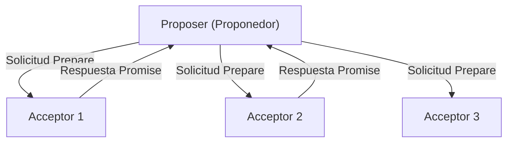
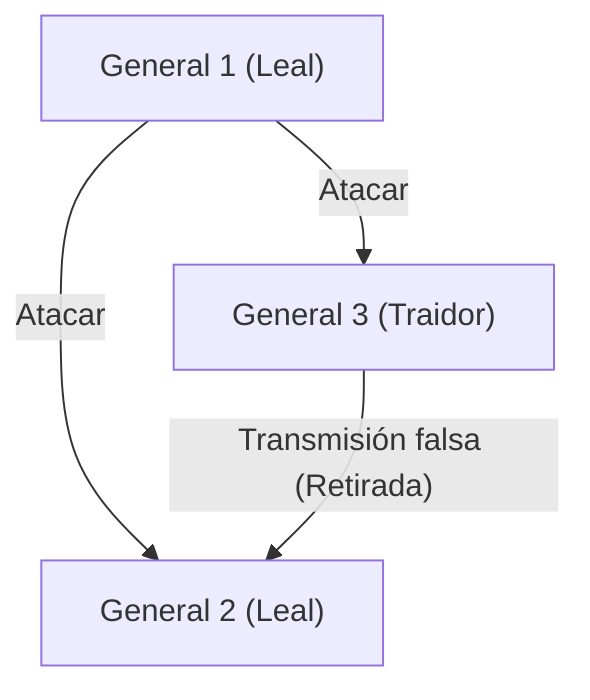

## Leslie Lamport: El hombre que dio "tiempo" y "consenso" a los sistemas distribuidos

Los sistemas distribuidos modernos, representados por internet, la computación en la nube y la cadena de bloques (blockchain), funcionan con total naturalidad y nos brindan beneficios en nuestra vida diaria. Detrás de esto se encuentra la figura de un científico de la computación brillante: Leslie Lamport.

Galardonado con el Premio Turing en 2013, Lamport sentó las bases de la computación distribuida y resolvió muchos problemas complejos con rigor matemático. En este artículo, profundizaremos en sus grandes logros: el "reloj de Lamport", el "algoritmo de Paxos", el "problema de los generales bizantinos" y su faceta como creador de "LaTeX", una herramienta indispensable en el mundo académico.

### 1. El "Reloj de Lamport", inspirado en la Teoría de la Relatividad de Einstein

Uno de los problemas más problemáticos en los sistemas distribuidos es el "tiempo". En un entorno donde múltiples computadoras (nodos) se comunican a través de una red, los relojes físicos de cada una de ellas siempre sufren desviaciones (clock drift). Es imposible determinar con precisión solo con relojes físicos cuál evento ocurrió realmente primero: un evento que ocurrió a las "12:00:00" en el servidor A o un evento que ocurrió a las "12:00:01" en el servidor B.

Para resolver este problema, Lamport propuso una solución innovadora en su artículo de 1978 "Time, Clocks, and the Ordering of Events in a Distributed System". Se inspiró en el concepto de la teoría de la relatividad especial de que "el tiempo absoluto no existe y el paso del tiempo difiere según el observador", y creó el concepto de "reloj lógico" (Logical Clock).

#### Relación de causalidad de los eventos (Happens-Before)

Lamport se centró en la "relación de causalidad" entre eventos en lugar del tiempo físico. Si un evento A es la causa de un evento B, o si B ocurre ciertamente después de A, lo definió como a -> b (a happens-before b).

El "reloj de Lamport", basado en esta regla simple, implica que cada nodo tiene su propio contador, y actualiza y sincroniza el contador cada vez que envía o recibe un mensaje. Esto hizo posible determinar el orden de los eventos en todo el sistema sin contradicciones. Este artículo se convirtió en uno de los más citados en la historia de las ciencias de la computación y sentó las bases para el control de transacciones en las bases de datos distribuidas actuales.

### 2. El "Algoritmo Paxos", el pilar del consenso distribuido

Otro gran obstáculo en los sistemas distribuidos es el "consenso" (Consensus). ¿Cómo acordar un estado consistente (valor) en todo el sistema cuando ocurren fallas como retrasos en la red o la caída de algunos servidores?

Lamport escribió un artículo en 1989 titulado "The Part-Time Parliament", donde utilizó el parlamento de la isla griega ficticia de "Paxos" como metáfora para explicar este algoritmo de consenso distribuido.

#### El mecanismo de Paxos y su dificultad

El algoritmo Paxos define los roles de proponedor (Proposer), aceptador (Acceptor) y aprendiz (Learner), y al obtener el acuerdo de la mayoría (Quorum), forma un consenso de manera segura mientras resiste a las fallas.

Inicialmente, este artículo con la metáfora griega era tan complejo y peculiar que los revisores de la revista le pidieron que "eliminara la metáfora y lo reescribiera". Lamport se negó, y tardó aproximadamente 10 años en publicar oficialmente el artículo. Sin embargo, más tarde, el verdadero valor de Paxos (y sus derivados) quedó demostrado cuando fue adoptado en sistemas de misión crítica en el mundo real, como Chubby de Google y el protocolo ZAB de Apache ZooKeeper.

### 3. El "Problema de los generales bizantinos", la formalización de la tolerancia a fallos

Las fallas que enfrentan los sistemas distribuidos no son solo las paradas de las máquinas (crash faults). Existe la posibilidad de que "mentiras" y "contradicciones" se introduzcan en el sistema, como el hackeo de nodos maliciosos o el envío de datos anómalos inesperados debido a errores (bugs).

En 1982, Lamport, junto con Robert Shostak y Marshall Pease, formalizó este problema como el "problema de los generales bizantinos" (Byzantine Generals Problem).

#### Generales rodeados de enemigos

Los generales del Imperio Bizantino están asediando una ciudad enemiga. Deben acordar todos juntos si "atacar" o "retirarse", pero el único medio de comunicación es mediante mensajeros, y además, hay "traidores" entre los generales. Los traidores envían mensajes falsos, diciendo "ataquen" a algunos generales y "retírense" a otros.

Lamport y sus colegas demostraron matemáticamente que si el número total de nodos es N y el número de traidores es f, y se cumple que N >= 3f + 1, los generales honestos pueden llegar a un consenso correctamente (Tolerancia a faltas bizantinas: BFT).

Este concepto se ha estudiado durante mucho tiempo en campos que requieren una confiabilidad extremadamente alta, como los sistemas de control de aeronaves, pero en los últimos años ha cobrado protagonismo como el núcleo de la tecnología "blockchain". El "Proof of Work" de Bitcoin también se puede considerar como una solución probabilística al problema de los generales bizantinos en un sentido amplio.

### 4. El creador de "LaTeX", la infraestructura del mundo académico

Las contribuciones de Lamport no se limitan a los sistemas distribuidos. El sistema de composición tipográfica "LaTeX", que se ha convertido en un estándar de facto en todo el mundo para la redacción de artículos de matemáticas y ciencias de la computación, fue desarrollado por él.

Sobre el potente pero complejo sistema "TeX" desarrollado por Donald Knuth, Lamport construyó un paquete de macros, permitiendo a los usuarios concentrarse en la estructura lógica del documento (capítulos, secciones, figuras, fórmulas, etc.), lo que dio lugar a "LaTeX". La filosofía de "separación de contenido y diseño" es también un principio fundamental del diseño web, aplicable al HTML/CSS moderno.

### Conclusión: El valor eterno creado por el rigor lógico

Al repasar los logros de Leslie Lamport, se puede ver cuánto valoraba "eliminar la ambigüedad y definir los problemas con rigor matemático". El desarrollo del lenguaje de especificación de sistemas TLA+ (Temporal Logic of Actions) es también la culminación de su enfoque para eliminar lógicamente los errores de los sistemas complejos.

Los conceptos que creó, como el "reloj de Lamport", "Paxos" y el "problema de los generales bizantinos", poseen verdades universales que no dependen de hardware específico o tecnologías de moda. Es por eso que, incluso décadas después, estas teorías siguen vivas en la infraestructura en la nube y el blockchain modernos.

Leslie Lamport es, sin duda, un gigante que redefinió los conceptos de "tiempo" y "consenso" en la era digital.
