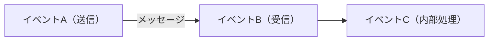
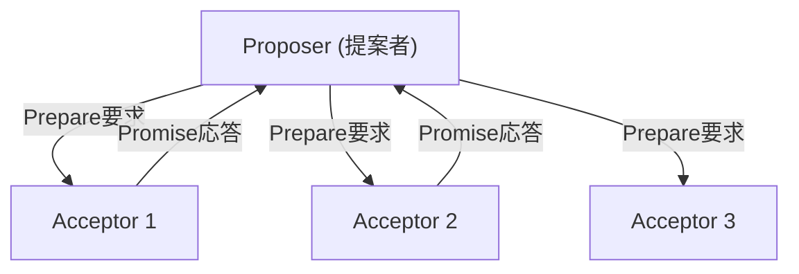
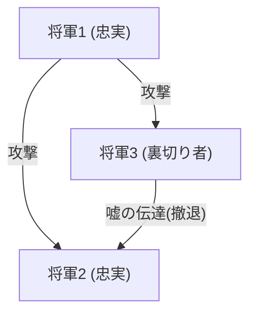

## L'homme qui a donné le « temps » et le « consensus » aux systèmes distribués : Leslie Lamport

Les systèmes distribués, tels que l'Internet moderne, le cloud computing et la blockchain. Derrière le fait qu'ils fonctionnent si naturellement et que nous en bénéficions dans notre vie quotidienne, il y a la présence d'un informaticien de génie : Leslie Lamport.

Lauréat du prix Turing en 2013, Lamport a jeté les bases de l'informatique distribuée et a résolu de nombreux problèmes complexes avec une rigueur mathématique. Dans cet article, nous explorerons en profondeur ses plus grandes réalisations : « l'horloge de Lamport », « l'algorithme Paxos », « le problème des généraux byzantins », ainsi que son rôle de créateur de « LaTeX », outil indispensable dans le monde académique.

### 1. L'« Horloge de Lamport » inspirée de la théorie de la relativité d'Einstein

L'un des problèmes les plus délicats dans les systèmes distribués est celui du « temps ». Dans un environnement où plusieurs ordinateurs (nœuds) communiquent via un réseau, leurs horloges physiques subissent inévitablement des décalages (dérive d'horloge). Entre un événement survenu à « 12:00:00 » sur le serveur A et un événement survenu à « 12:00:01 » sur le serveur B, il est impossible de déterminer avec certitude lequel s'est réellement produit en premier en se basant uniquement sur des horloges physiques.

Face à ce problème, Lamport a proposé une solution innovante dans son article de 1978 intitulé *Time, Clocks, and the Ordering of Events in a Distributed System*. S'inspirant du concept de la théorie de la relativité restreinte selon lequel « le temps absolu n'existe pas et l'écoulement du temps diffère selon l'observateur », il a créé le concept d'« horloge logique (Logical Clock) ».

#### La relation de causalité des événements (Happens-Before)

Lamport s'est concentré sur la « relation de causalité » entre les événements plutôt que sur l'heure physique. Si un événement a est la cause d'un événement b, ou si a se produit avant b de manière certaine, il a défini cela comme a -> b (a happens-before b).

Basée sur cette règle simple, « l'horloge de Lamport » implique que chaque nœud possède son propre compteur, qu'il met à jour et synchronise à chaque envoi et réception de message. Cela a permis de déterminer l'ordre des événements dans l'ensemble du système sans aucune contradiction. Cet article est devenu l'un des plus cités de l'histoire de l'informatique et constitue la base du contrôle des transactions dans les bases de données distribuées actuelles.

### 2. Le monument du consensus distribué : « l'algorithme Paxos »

Un autre mur colossal dans les systèmes distribués est le « consensus ». Comment parvenir à se mettre d'accord sur un état (ou une valeur) cohérent dans son ensemble, malgré les retards du réseau ou les pannes de certains serveurs ?

En 1989, Lamport a rédigé l'article *The Part-Time Parliament* (Le parlement à temps partiel), utilisant le parlement de l'île grecque fictive de « Paxos » comme métaphore pour expliquer cet algorithme de consensus distribué.

#### Le fonctionnement et la complexité de Paxos

L'algorithme Paxos définit les rôles de proposeur (Proposer), d'accepteur (Acceptor) et d'apprenant (Learner). En obtenant l'accord de la majorité (Quorum), il permet de former un consensus de manière sûre tout en tolérant les pannes.

Initialement, cet article utilisant la métaphore grecque était si complexe et excentrique que les relecteurs de la revue scientifique lui ont demandé de la supprimer et de réécrire l'article. Lamport a refusé, et il a fallu environ 10 ans avant que l'article ne soit officiellement publié. Cependant, la véritable valeur de Paxos (et de ses dérivés) a été prouvée par la suite lorsqu'il a été adopté dans des systèmes critiques du monde réel, tels que Chubby de Google et le protocole ZAB d'Apache ZooKeeper.

### 3. La formalisation de la tolérance aux pannes : « le problème des généraux byzantins »

Les défaillances auxquelles sont confrontés les systèmes distribués ne se limitent pas à de simples arrêts de machines (crash faults). Des « mensonges » ou des « contradictions » peuvent s'introduire dans le système à cause du piratage de nœuds malveillants ou de l'envoi inattendu de données anormales dû à des bugs.

En 1982, Lamport, avec Robert Shostak et Marshall Pease, a formalisé ce problème sous le nom de « problème des généraux byzantins (Byzantine Generals Problem) ».

#### Des généraux encerclés par l'ennemi

Des généraux de l'Empire byzantin encerclent une ville ennemie. Ils doivent convenir simultanément d'« attaquer » ou de « battre en retraite », mais leur seul moyen de communication est par messager, et des « traîtres » se cachent parmi les généraux. Les traîtres envoient de faux messages, disant à certains généraux d'« attaquer » et à d'autres de « battre en retraite ».

Lamport et ses collègues ont prouvé mathématiquement que, si N est le nombre total de nœuds et f le nombre de traîtres, alors si N >= 3f + 1, les généraux honnêtes peuvent parvenir correctement à un accord (Tolérance aux pannes byzantines : BFT).

Ce concept a longtemps été étudié dans des domaines exigeant une fiabilité extrêmement élevée, comme les systèmes de contrôle des avions, mais il a récemment été mis sous les feux de la rampe en tant que cœur de la technologie de la « blockchain ». La Proof of Work de Bitcoin peut également être considérée comme une solution probabiliste au problème des généraux byzantins au sens large.

### 4. Le père de « LaTeX », l'infrastructure du monde académique

Les contributions de Lamport ne se limitent pas aux systèmes distribués. Le système de composition « LaTeX », devenu la norme de facto dans le monde entier pour la rédaction d'articles en mathématiques et en informatique, a été développé par ses soins.

Sur la base du système puissant mais complexe « TeX » développé par Donald Knuth, Lamport a construit des packages de macros, créant ainsi « LaTeX » pour permettre aux utilisateurs de se concentrer sur la structure logique de leurs documents (chapitres, sections, figures, formules, etc.). L'idée de « séparation du contenu et du design » est également un principe fondamental de la conception web moderne, qui se retrouve dans HTML/CSS.

### Conclusion : La valeur intemporelle née de la rigueur logique

En regardant les réalisations de Leslie Lamport, on comprend à quel point il attachait de l'importance à « l'élimination de l'ambiguïté et à la définition des problèmes avec une rigueur mathématique ». Le développement du langage de spécification de systèmes TLA+ (Temporal Logic of Actions) est également l'aboutissement de son approche visant à éliminer logiquement les bugs des systèmes complexes.

Les concepts qu'il a créés, tels que « l'horloge de Lamport », « Paxos » et « le problème des généraux byzantins », possèdent une vérité universelle indépendante de tout matériel spécifique ou de technologies éphémères. C'est pourquoi, des décennies plus tard, ces théories sont toujours d'actualité dans l'infrastructure cloud et la blockchain modernes.

Leslie Lamport est sans aucun doute un géant qui a redéfini les concepts de « temps » et de « consensus » à l'ère du numérique.
