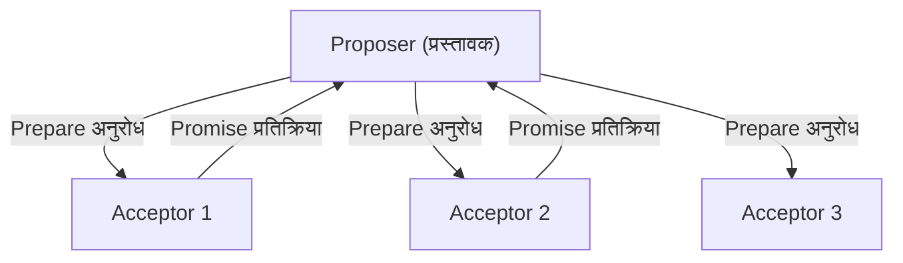
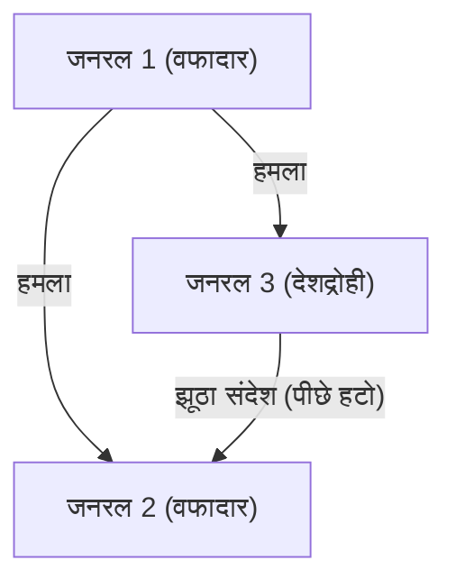

## डिस्ट्रिब्यूटेड सिस्टम्स को "समय" और "सहमति" देने वाले व्यक्ति: लेस्ली लैम्पोर्ट

आधुनिक इंटरनेट, क्लाउड कंप्यूटिंग, और ब्लॉकचेन जैसे डिस्ट्रिब्यूटेड सिस्टम्स (Distributed Systems) आज हमारे जीवन का अभिन्न हिस्सा बन गए हैं। इनके सुचारू रूप से काम करने और हमारे दैनिक जीवन को आसान बनाने के पीछे एक प्रतिभाशाली कंप्यूटर वैज्ञानिक का हाथ है: लेस्ली लैम्पोर्ट (Leslie Lamport)।

2013 में ट्यूरिंग पुरस्कार (Turing Award) से सम्मानित लैम्पोर्ट ने डिस्ट्रिब्यूटेड कंप्यूटिंग की नींव रखी और कई जटिल समस्याओं को गणितीय सटीकता के साथ सुलझाया। इस लेख में, हम उनकी महान उपलब्धियों जैसे "लैम्पोर्ट क्लॉक (Lamport Clock)", "पैक्सोस एल्गोरिथम (Paxos algorithm)", "बीजान्टिन जनरल्स प्रॉब्लम (Byzantine Generals Problem)", और अकादमिक जगत के लिए अनिवार्य "LaTeX" के निर्माता के रूप में उनके योगदान पर गहराई से चर्चा करेंगे।

### 1. आइंस्टीन के सापेक्षता के सिद्धांत से प्रेरित "लैम्पोर्ट क्लॉक"

डिस्ट्रिब्यूटेड सिस्टम्स में सबसे चुनौतीपूर्ण समस्याओं में से एक "समय" (Time) है। जब कई कंप्यूटर (नोड्स) नेटवर्क पर एक-दूसरे के साथ संवाद करते हैं, तो उनके भौतिक समय (physical clocks) में हमेशा कुछ अंतर (clock drift) आ जाता है। यदि सर्वर A पर कोई घटना "12:00:00" पर होती है और सर्वर B पर कोई घटना "12:00:01" पर होती है, तो केवल भौतिक घड़ियों का उपयोग करके यह सटीक रूप से निर्धारित करना असंभव है कि वास्तव में कौन सी घटना पहले हुई थी।

इस समस्या के समाधान के रूप में, लैम्पोर्ट ने अपने 1978 के पेपर, 'Time, Clocks, and the Ordering of Events in a Distributed System' में एक क्रांतिकारी दृष्टिकोण प्रस्तुत किया। उन्होंने विशेष सापेक्षता के सिद्धांत (Special Theory of Relativity) की इस अवधारणा से प्रेरणा ली कि "कोई निरपेक्ष समय नहीं है, और समय का प्रवाह पर्यवेक्षक पर निर्भर करता है," और "लॉजिकल क्लॉक (Logical Clock)" की अवधारणा को जन्म दिया।

#### घटनाओं का कारण और प्रभाव (Happens-Before)

लैम्पोर्ट ने भौतिक समय के बजाय घटनाओं के बीच "कारण और प्रभाव" (Causality) पर ध्यान केंद्रित किया। यदि घटना 'a', घटना 'b' का कारण है, या यदि 'b' निश्चित रूप से 'a' के बाद होती है, तो उन्होंने इसे a -> b (a happens-before b) के रूप में परिभाषित किया।

इस सरल नियम पर आधारित "लैम्पोर्ट क्लॉक" में, प्रत्येक नोड अपना काउंटर रखता है और मैसेज भेजने या प्राप्त करने पर हर बार अपने काउंटर को अपडेट और सिंक करता है। इससे पूरे सिस्टम में घटनाओं के क्रम को बिना किसी विरोधाभास के निर्धारित करना संभव हो गया। यह पेपर कंप्यूटर विज्ञान के इतिहास में सबसे अधिक उद्धृत पेपर्स में से एक बन गया है और यह आज के डिस्ट्रिब्यूटेड डेटाबेस में ट्रांज़ैक्शन कंट्रोल का आधार है।

### 2. डिस्ट्रिब्यूटेड सहमति का मील का पत्थर "पैक्सोस एल्गोरिथम (Paxos Algorithm)"

डिस्ट्रिब्यूटेड सिस्टम्स में एक और बड़ी चुनौती "सहमति" (Consensus) है। नेटवर्क लेटेंसी (network delay) या कुछ सर्वरों के डाउन होने जैसी विफलताओं के बीच, पूरा सिस्टम एक सुसंगत स्थिति (value) पर कैसे सहमत हो सकता है?

लैम्पोर्ट ने 1989 में "The Part-Time Parliament (पार्ट-टाइम पार्लियामेंट)" नामक एक पेपर लिखा, जिसमें उन्होंने एक काल्पनिक ग्रीक द्वीप "पैक्सोस (Paxos)" की संसद को रूपक के रूप में इस्तेमाल करते हुए इस डिस्ट्रिब्यूटेड कंसेंसस एल्गोरिथम को समझाया।

#### पैक्सोस की कार्यप्रणाली और जटिलता

पैक्सोस एल्गोरिथम प्रस्तावक (Proposer), स्वीकारकर्ता (Acceptor), और शिक्षार्थी (Learner) की भूमिकाओं को परिभाषित करता है, और विफलताओं का सामना करते हुए सुरक्षित रूप से सहमति बनाने के लिए बहुमत (Quorum) की सहमति प्राप्त करता है।

शुरुआत में, ग्रीक रूपक का उपयोग करने वाला यह पेपर इतना जटिल और अपरंपरागत था कि जर्नल समीक्षकों ने उन्हें "रूपक को हटाकर इसे फिर से लिखने" के लिए कहा। लैम्पोर्ट ने इससे इनकार कर दिया, और पेपर को आधिकारिक तौर पर प्रकाशित होने में लगभग 10 साल लग गए। हालाँकि, बाद में Google के Chubby और Apache ZooKeeper के ZAB प्रोटोकॉल जैसे वास्तविक दुनिया के मिशन-क्रिटिकल सिस्टम्स में पैक्सोस (और इसके डेरिवेटिव्स) को अपनाया गया, जिससे इसका वास्तविक मूल्य साबित हुआ।

### 3. फॉल्ट टॉलरेंस (Fault Tolerance) को परिभाषित करने वाली "बीजान्टिन जनरल्स प्रॉब्लम"

डिस्ट्रिब्यूटेड सिस्टम्स के सामने आने वाली विफलताएं केवल मशीनों का रुक जाना (crash faults) नहीं हैं। दुर्भावनापूर्ण नोड्स द्वारा हैकिंग, या बग्स के कारण अप्रत्याशित रूप से गलत डेटा भेजने जैसी समस्याओं के कारण सिस्टम में "झूठ" और "विरोधाभास" भी शामिल हो सकते हैं।

1982 में, लैम्पोर्ट ने रॉबर्ट शोस्तक (Robert Shostak) और मार्शल पीज़ (Marshall Pease) के साथ मिलकर इस समस्या को "बीजान्टिन जनरल्स प्रॉब्लम (Byzantine Generals Problem)" के रूप में परिभाषित किया।

#### दुश्मनों से घिरे सेनापति

बीजान्टिन साम्राज्य के जनरलों ने दुश्मन के शहर को घेर रखा है। उन्हें एक साथ "हमला" (attack) करने या "पीछे हटने" (retreat) पर सहमत होना है, लेकिन संचार का एकमात्र साधन संदेशवाहक हैं। इसके अलावा, जनरलों के बीच कुछ "देशद्रोही" भी हैं। देशद्रोही कुछ जनरलों को "हमला" करने और दूसरों को "पीछे हटने" का झूठा संदेश भेजते हैं।

लैम्पोर्ट और उनकी टीम ने गणितीय रूप से साबित किया कि यदि नोड्स की कुल संख्या N है और देशद्रोहियों की संख्या f है, तो यदि N >= 3f + 1 है, तो ईमानदार जनरल्स सही ढंग से सहमति पर पहुंच सकते हैं (इसे बीजान्टिन फॉल्ट टॉलरेंस: BFT कहा जाता है)।

इस अवधारणा का अध्ययन विमान नियंत्रण प्रणाली (aircraft control systems) जैसे अत्यधिक उच्च विश्वसनीयता वाले क्षेत्रों में लंबे समय से किया जाता रहा है, लेकिन हाल ही में इसे "ब्लॉकचेन" तकनीक के मूल के रूप में बहुत महत्व मिला है। बिटकॉइन का "प्रूफ ऑफ वर्क" (Proof of Work) भी व्यापक अर्थों में बीजान्टिन जनरल्स प्रॉब्लम का एक संभाव्य समाधान (probabilistic solution) कहा जा सकता है।

### 4. अकादमिक जगत के बुनियादी ढांचे "LaTeX" के निर्माता

लैम्पोर्ट का योगदान केवल डिस्ट्रिब्यूटेड सिस्टम्स तक सीमित नहीं है। "LaTeX," जो दुनिया भर में गणित और कंप्यूटर विज्ञान के पेपर्स लिखने के लिए वास्तविक मानक (de facto standard) टाइपसेटिंग सिस्टम बन गया है, उनके द्वारा ही विकसित किया गया था।

डोनाल्ड नुथ (Donald Knuth) द्वारा विकसित शक्तिशाली लेकिन जटिल "TeX" सिस्टम के ऊपर, लैम्पोर्ट ने मैक्रोज़ का एक पैकेज बनाया जिससे "LaTeX" का निर्माण हुआ। इसने उपयोगकर्ताओं को दस्तावेज़ की तार्किक संरचना (अध्याय, अनुभाग, चित्र, सूत्र आदि) पर ध्यान केंद्रित करने में सक्षम बनाया। "सामग्री और डिज़ाइन को अलग करने" का यह विचार आधुनिक वेब डिज़ाइन (HTML/CSS) के बुनियादी सिद्धांतों में से एक है।

### निष्कर्ष: तार्किक कठोरता से पैदा हुआ शाश्वत मूल्य

लेस्ली लैम्पोर्ट की उपलब्धियों को देखते हुए, यह स्पष्ट है कि उन्होंने "अस्पष्टता को दूर करने और गणितीय कठोरता के साथ समस्याओं को परिभाषित करने" पर कितना जोर दिया। TLA+ (Temporal Logic of Actions) सिस्टम स्पेसिफिकेशन लैंग्वेज का विकास भी जटिल प्रणालियों से तार्किक रूप से बग्स को खत्म करने के उनके दृष्टिकोण का परिणाम है।

"लैम्पोर्ट क्लॉक," "पैक्सोस," और "बीजान्टिन जनरल्स प्रॉब्लम" जैसी उनकी अवधारणाएं सार्वभौमिक सत्य (universal truth) रखती हैं जो विशिष्ट हार्डवेयर या ट्रेंडी तकनीकों पर निर्भर नहीं करती हैं। यही कारण है कि दशकों बाद भी, आज के क्लाउड इंफ्रास्ट्रक्चर और ब्लॉकचेन में उनके सिद्धांत प्रासंगिक बने हुए हैं।

लेस्ली लैम्पोर्ट को निस्संदेह वह दिग्गज कहा जा सकता है जिसने डिजिटल युग में "समय" और "सहमति" की अवधारणा को फिर से परिभाषित किया।
