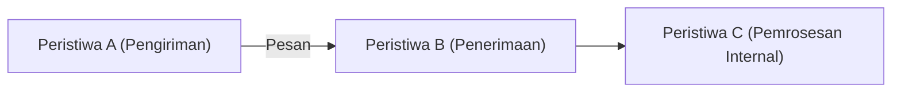
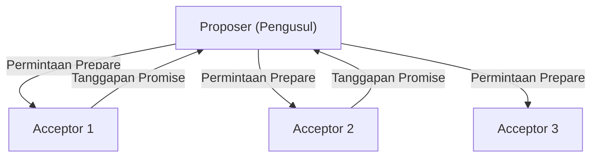
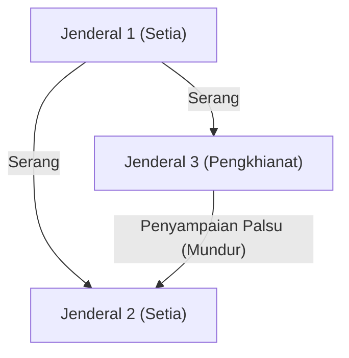

## Tokoh yang Memberikan "Waktu" dan "Konsensus" pada Sistem Terdistribusi: Leslie Lamport

Sistem terdistribusi, yang diwakili oleh internet modern, komputasi awan, dan blockchain. Di balik pengoperasian hal-hal ini yang seolah sudah menjadi hal biasa, dan manfaat yang kita terima dalam kehidupan sehari-hari, ada kehadiran seorang ilmuwan komputer yang jenius: Leslie Lamport.

Lamport, yang memenangkan Penghargaan Turing pada tahun 2013, meletakkan dasar bagi komputasi terdistribusi dan memecahkan banyak masalah yang sulit dengan ketelitian matematis. Dalam artikel ini, kita akan menggali lebih dalam tentang pencapaiannya yang luar biasa, yaitu "Jam Lamport (Lamport Clock)", "Algoritma Paxos", "Masalah Jenderal Bizantium", dan perannya sebagai pencipta "LaTeX" yang sangat penting di dunia akademis.

### 1. "Jam Lamport" yang Terinspirasi oleh Teori Relativitas Einstein

Salah satu masalah paling merepotkan dalam sistem terdistribusi adalah "waktu". Dalam lingkungan di mana beberapa komputer (node) berkomunikasi satu sama lain melalui jaringan, jam fisik yang dimiliki masing-masing akan selalu mengalami penyimpangan (clock drift). Mustahil untuk menentukan secara akurat menggunakan jam fisik saja mana yang benar-benar terjadi lebih dulu: peristiwa yang terjadi pada "12:00:00" di server A, atau peristiwa yang terjadi pada "12:00:01" di server B.

Untuk mengatasi masalah ini, Lamport menyajikan solusi inovatif dalam makalahnya tahun 1978, *Time, Clocks, and the Ordering of Events in a Distributed System*. Terinspirasi oleh konsep dalam teori relativitas khusus bahwa "tidak ada waktu absolut, dan waktu berjalan berbeda tergantung pada pengamat", ia menciptakan konsep "Jam Logis (Logical Clock)".

#### Hubungan Sebab-Akibat Peristiwa (Happens-Before)

Alih-alih waktu fisik, Lamport berfokus pada "hubungan sebab-akibat" antar peristiwa. Jika peristiwa 'a' menyebabkan peristiwa 'b', atau jika 'b' pasti terjadi setelah 'a', hal ini didefinisikan sebagai a -> b (a happens-before b).

"Jam Lamport" yang didasarkan pada aturan sederhana ini mengharuskan setiap node memiliki penghitung (counter) sendiri, yang diperbarui dan disinkronkan setiap kali pesan dikirim atau diterima. Hal ini memungkinkan sistem secara keseluruhan untuk menentukan urutan peristiwa tanpa kontradiksi. Makalah ini telah menjadi salah satu makalah yang paling banyak dikutip dalam sejarah ilmu komputer, dan menjadi dasar bagi kontrol transaksi dalam basis data terdistribusi saat ini.

### 2. Mahakarya Konsensus Terdistribusi: "Algoritma Paxos"

Rintangan besar lainnya dalam sistem terdistribusi adalah "Konsensus (Consensus)". Bagaimana sistem secara keseluruhan dapat menyepakati satu keadaan (nilai) yang konsisten di tengah gangguan seperti latensi jaringan dan matinya beberapa server?

Pada tahun 1989, Lamport menulis makalah berjudul *The Part-Time Parliament* dan menjelaskan algoritma konsensus terdistribusi ini menggunakan metafora parlemen di pulau fiksi Yunani bernama "Paxos".

#### Cara Kerja dan Kerumitan Paxos

Algoritma Paxos mendefinisikan peran Pengusul (Proposer), Penerima (Acceptor), dan Pelajar (Learner), dan dengan mendapatkan persetujuan mayoritas (Quorum), ia membentuk konsensus secara aman sambil bertahan terhadap kegagalan.

Awalnya, makalah yang menggunakan metafora Yunani ini terlalu rumit dan eksentrik, sehingga pengulas jurnal memintanya untuk "menghapus metafora dan menulis ulang". Lamport menolak hal ini, dan butuh waktu sekitar 10 tahun sebelum makalah tersebut diterbitkan secara resmi. Namun kemudian, sistem kritis di dunia nyata seperti Chubby dari Google dan protokol ZAB dari Apache ZooKeeper mulai mengadopsi Paxos (dan turunannya), yang membuktikan nilai sebenarnya.

### 3. Merumuskan Toleransi Kesalahan: "Masalah Jenderal Bizantium"

Kegagalan yang dihadapi oleh sistem terdistribusi tidak sekadar berhentinya mesin (crash fault). Ada kemungkinan "kebohongan" atau "kontradiksi" disusupkan ke dalam sistem akibat peretasan oleh node yang berniat jahat atau transmisi data abnormal yang tak terduga karena adanya kutu (bug).

Pada tahun 1982, Lamport, bersama Robert Shostak dan Marshall Pease, merumuskan masalah ini sebagai "Masalah Jenderal Bizantium (Byzantine Generals Problem)".

#### Para Jenderal yang Dikelilingi Musuh

Para jenderal Kekaisaran Bizantium mengepung kota musuh. Mereka harus sepakat untuk "menyerang" atau "mundur" secara bersamaan, tetapi komunikasi hanya dapat dilakukan melalui utusan, dan di antara para jenderal tersebut ada "pengkhianat". Pengkhianat mengirimkan pesan palsu kepada beberapa jenderal, menyuruh mereka "menyerang", sementara kepada jenderal lain menyuruh "mundur".

Lamport dan rekan-rekannya secara matematis membuktikan bahwa jika jumlah total node adalah N dan jumlah pengkhianat adalah f, selama N >= 3f + 1, jenderal yang jujur dapat mencapai konsensus dengan benar (Toleransi Kesalahan Bizantium / Byzantine Fault Tolerance: BFT).

Konsep ini telah lama dipelajari di bidang yang membutuhkan keandalan yang sangat tinggi, seperti sistem kontrol pesawat terbang, namun baru belakangan ini konsep ini mendapat sorotan sebagai inti dari teknologi "blockchain". *Proof of Work* Bitcoin juga dapat dikatakan sebagai solusi probabilistik terhadap Masalah Jenderal Bizantium dalam arti luas.

### 4. Pencipta Infrastruktur Akademis "LaTeX"

Kontribusi Lamport tidak terbatas pada sistem terdistribusi saja. "LaTeX", sistem penyusunan huruf yang telah menjadi standar de facto di seluruh dunia untuk penulisan makalah di bidang matematika dan ilmu komputer, dikembangkan olehnya.

Lamport membangun paket makro di atas sistem "TeX" yang kuat namun rumit, yang dikembangkan oleh Donald Knuth. "LaTeX" memungkinkan pengguna untuk berfokus pada struktur logis dokumen (bab, bagian, gambar, rumus, dll.). Filosofi "pemisahan konten dan desain" juga merupakan prinsip dasar desain web yang terhubung dengan HTML/CSS modern.

### Kesimpulan: Nilai Abadi yang Diciptakan oleh Ketelitian Logis

Melihat kembali pencapaian Leslie Lamport, kita dapat melihat betapa dia sangat menekankan pada "menghilangkan ambiguitas dan mendefinisikan masalah dengan ketelitian matematis". Pengembangan bahasa deskripsi spesifikasi sistem TLA+ (Temporal Logic of Actions) juga merupakan puncak dari pendekatannya dalam menghilangkan bug secara logis dari sistem yang kompleks.

Konsep yang ia ciptakan, seperti "Jam Lamport", "Paxos", dan "Masalah Jenderal Bizantium", memiliki kebenaran universal yang tidak bergantung pada perangkat keras tertentu atau tren teknologi. Itulah sebabnya teori-teori ini terus hidup di infrastruktur cloud dan blockchain modern setelah beberapa dekade.

Leslie Lamport tidak diragukan lagi adalah raksasa yang telah mendefinisikan ulang konsep "waktu" dan "konsensus" di era digital.
