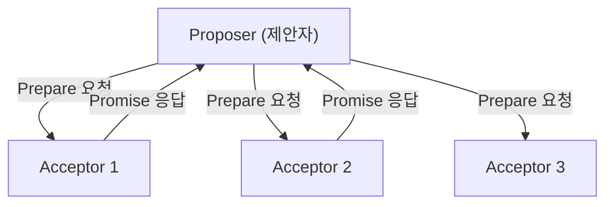
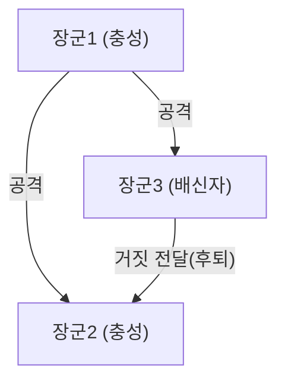

## 분산 시스템에 '시간'과 '합의'를 부여한 인물: 레슬리 램포트

현대의 인터넷, 클라우드 컴퓨팅, 그리고 블록체인으로 대표되는 분산 시스템. 이것들이 당연하다는 듯이 가동되고, 우리가 일상생활에서 혜택을 누릴 수 있는 그 이면에는 한 명의 천재적인 컴퓨터 과학자가 있습니다. 바로 레슬리 램포트(Leslie Lamport)입니다.

2013년 튜링상을 수상한 램포트는 분산 컴퓨팅의 기초를 다졌고, 많은 난해한 문제들을 수학적인 엄밀함으로 풀어냈습니다. 본 글에서는 그의 위대한 업적인 '램포트 시계(Lamport Clock)', '팍소스(Paxos) 알고리즘', '비잔틴 장군 문제', 그리고 학술계에 없어서는 안 될 'LaTeX'의 창시자로서의 측면을 깊이 파헤쳐 봅니다.

### 1. 아인슈타인의 상대성 이론에서 영감을 얻은 '램포트 시계'

분산 시스템에서 가장 골치 아픈 문제 중 하나가 바로 '시간'입니다. 여러 대의 컴퓨터(노드)가 네트워크를 통해 통신을 주고받는 환경에서는 각각이 가진 물리적인 시계에 반드시 오차(클럭 드리프트)가 발생합니다. A 서버에서 '12:00:00'에 발생한 이벤트와 B 서버에서 '12:00:01'에 발생한 이벤트 중 어느 것이 정말 먼저 일어났는지를 물리적인 시계만으로 정확하게 판정하는 것은 불가능합니다.

이 문제에 대해 램포트는 1978년 논문 『Time, Clocks, and the Ordering of Events in a Distributed System』에서 혁신적인 해답을 제시했습니다. 그는 특수 상대성 이론의 "절대적인 시간은 존재하지 않으며, 관측자에 따라 시간의 흐름이 다르다"는 개념에서 영감을 얻어 '논리적 시계(Logical Clock)'라는 개념을 만들어냈습니다.

#### 이벤트의 인과관계 (Happens-Before)

램포트는 물리적인 시간이 아닌 이벤트 간의 '인과관계'에 주목했습니다. 어떤 이벤트 a가 이벤트 b의 원인이 되거나, a 이후에 확실히 b가 일어나는 경우, 이를 a -> b (a happens-before b)로 정의했습니다.

이 단순한 규칙에 기반한 '램포트 시계'는 각 노드가 자신만의 카운터를 가지고, 메시지를 송수신할 때마다 카운터를 업데이트하고 동기화하는 것입니다. 이를 통해 시스템 전체에서 이벤트의 순서를 모순 없이 결정하는 것이 가능해졌습니다. 이 논문은 컴퓨터 과학 역사상 가장 많이 인용된 논문 중 하나가 되었으며, 현재의 분산 데이터베이스에서 트랜잭션 제어의 기초가 되고 있습니다.

### 2. 분산 합의의 금자탑 '팍소스(Paxos) 알고리즘'

분산 시스템의 또 다른 거대한 장벽은 '합의(Consensus)'입니다. 네트워크의 지연이나 일부 서버의 다운 등 장애가 발생하는 와중에 전체적으로 하나의 일관된 상태(값)에 합의하려면 어떻게 해야 할까요?

램포트는 1989년에 "The Part-Time Parliament(파트타임 의회)"라는 논문을 집필하고, 가상의 그리스 섬 '팍소스(Paxos)'의 의회를 메타포로 삼아 이 분산 합의 알고리즘을 설명했습니다.

#### 팍소스의 구조와 난해함

팍소스 알고리즘은 제안자(Proposer), 수락자(Acceptor), 학습자(Learner)라는 역할을 정의하고, 과반수(Quorum)의 동의를 얻음으로써 장애를 견뎌내며 안전하게 합의를 형성합니다.

당초 이 그리스 메타포를 사용한 논문은 너무나도 난해하고 기이했기 때문에, 논문지 심사위원들로부터 "메타포를 빼고 다시 쓰라"는 요구를 받았습니다. 램포트는 이를 거부했고, 논문이 정식으로 발표되기까지 약 10년의 세월이 걸렸습니다. 그러나 그 후 구글의 Chubby나 아파치 주키퍼(Apache ZooKeeper)의 ZAB 프로토콜 등 실세계의 미션 크리티컬한 시스템에 팍소스(및 그 파생형)가 채택되면서 그 진가가 증명되었습니다.

### 3. 내결함성을 정식화한 '비잔틴 장군 문제'

분산 시스템이 직면하는 장애는 단순한 머신의 정지(크래시 폴트)만이 아닙니다. 악의를 가진 노드의 해킹, 버그로 인한 예기치 않은 이상 데이터의 송신 등 시스템 내에 '거짓말'이나 '모순'이 섞여 들어갈 가능성이 있습니다.

램포트는 1982년 Robert Shostak, Marshall Pease와 함께 이 문제를 '비잔틴 장군 문제(Byzantine Generals Problem)'로 정식화했습니다.

#### 적에게 포위된 장군들

비잔틴 제국의 장군들이 적의 도시를 포위하고 있습니다. 그들은 일제히 '공격'할지 '후퇴'할지를 합의해야 하지만, 통신 수단은 전령뿐이며 심지어 장군 중에는 '배신자'가 섞여 있습니다. 배신자는 일부 장군에게는 "공격하라", 다른 장군에게는 "후퇴하라"고 거짓 메시지를 보냅니다.

램포트 일행은 전체 노드 수를 N, 배신자의 수를 f라고 할 때, N >= 3f + 1이면 정직한 장군들이 올바르게 합의에 도달할 수 있음(비잔틴 장애 허용: BFT)을 수학적으로 증명했습니다.

이 개념은 오랫동안 항공기 제어 시스템 등 극도로 높은 신뢰성이 요구되는 분야에서 연구되어 왔으나, 근래에 이르러 '블록체인' 기술의 핵심으로 각광받게 되었습니다. 비트코인의 작업 증명(Proof of Work) 역시 넓은 의미에서 비잔틴 장군 문제에 대한 확률론적인 해법이라고 할 수 있습니다.

### 4. 학술계의 인프라 'LaTeX'의 창시자

램포트의 공헌은 분산 시스템에만 머물지 않습니다. 수학이나 컴퓨터 과학의 논문 집필에 있어 전 세계적으로 사실상의 표준(디팩토 스탠다드)이 된 조판 시스템 'LaTeX(라텍)'은 그에 의해 개발되었습니다.

Donald Knuth가 개발한 강력하지만 복잡한 'TeX' 시스템 위에, 램포트가 매크로 패키지를 구축하여 사용자가 문서의 논리적인 구조(장, 절, 그림, 수식 등)에 집중할 수 있도록 한 것이 'LaTeX'입니다. '내용과 디자인의 분리'라는 사상은 현대의 HTML/CSS로 이어지는 웹 디자인의 기본 원칙이기도 합니다.

### 결론: 논리적 엄밀함이 낳은 영원한 가치

레슬리 램포트의 업적을 되돌아보면, 그가 얼마나 "모호함을 배제하고 수학적인 엄밀함으로 문제를 정의하는 것"을 중시했는지 알 수 있습니다. TLA+(Temporal Logic of Actions)라는 시스템 사양 기술 언어의 개발 역시 복잡한 시스템에서 버그를 논리적으로 배제하기 위한 그의 접근 방식의 집대성입니다.

그가 만들어낸 '램포트 시계', '팍소스', '비잔틴 장군 문제'라는 개념은 특정 하드웨어나 유행하는 기술에 의존하지 않는 보편적인 진리를 담고 있습니다. 그렇기 때문에 수십 년의 세월이 흐른 현대의 클라우드 인프라나 블록체인에서도 그 이론이 그대로 살아 숨 쉬고 있는 것입니다.

레슬리 램포트는 틀림없이 디지털 시대의 '시간'과 '합의'의 개념을 재정의한 거인이라 할 수 있습니다.
