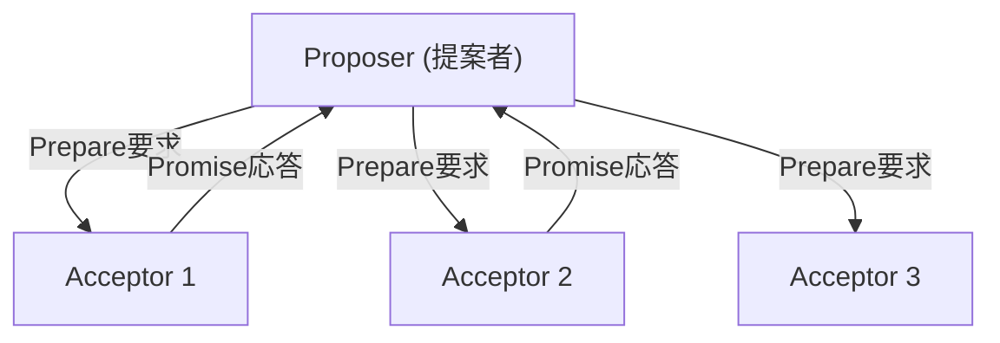
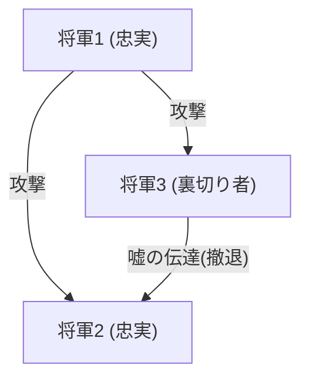

## 分散システムに「時間」と「合意」を与えた人物：レスリー・ランポート

現代のインターネット、クラウドコンピューティング、そしてブロックチェーンに代表される分散システム。これらが当たり前のように稼働し、私たちが日々の生活で恩恵を受けられる背後には、一人の天才的なコンピュータサイエンティストの存在があります。レスリー・ランポート（Leslie Lamport）です。

2013年にチューリング賞を受賞したランポートは、分散コンピューティングの基礎を築き、多くの難解な問題を数学的な厳密さで解き明かしました。本記事では、彼の偉大な業績である「Lamport時計」「Paxosアルゴリズム」「ビザンチン将軍問題」、そして学術界に欠かせない「LaTeX」の生みの親としての側面を深掘りします。

### 1. アインシュタインの相対性理論から着想を得た「Lamport時計」

分散システムにおいて最も厄介な問題の一つが「時間」です。複数のコンピュータ（ノード）がネットワーク越しに通信し合う環境では、それぞれが持つ物理的な時計は必ずズレ（クロックドリフト）が生じます。Aのサーバーで「12:00:00」に起きたイベントと、Bのサーバーで「12:00:01」に起きたイベント、どちらが本当に先に起きたのかを物理的な時計だけで正確に判定することは不可能です。

この問題に対してランポートは、1978年の論文『Time, Clocks, and the Ordering of Events in a Distributed System』で革新的な解を提示しました。彼は、特殊相対性理論において「絶対的な時間は存在せず、観測者によって時間の進み方が異なる」という概念からインスピレーションを受け、「論理クロック（Logical Clock）」という概念を生み出しました。

#### イベントの因果関係（Happens-Before）

ランポートは、物理的な時刻ではなく、イベント間の「因果関係」に注目しました。あるイベントaがイベントbの原因となっている、あるいはaの後に確実にbが起きている場合、これを a -> b (a happens-before b) と定義しました。

このシンプルなルールに基づく「Lamport時計」は、各ノードが自身のカウンタを持ち、メッセージを送受信するたびにカウンタを更新・同期するというものです。これにより、システム全体でイベントの順序を矛盾なく決定することが可能になりました。この論文は、コンピュータサイエンス史上最も引用された論文の一つとなり、現在の分散データベースにおけるトランザクション制御の基礎となっています。

### 2. 分散合意の金字塔「Paxosアルゴリズム」

分散システムにおけるもう一つの巨大な壁が「合意（Consensus）」です。ネットワークの遅延や、一部のサーバーのダウンなどの障害が発生する中で、全体として一つの一貫した状態（値）に合意するにはどうすればよいか。

ランポートは1989年に「The Part-Time Parliament（非常勤議会）」という論文を執筆し、架空のギリシャの島「Paxos」の議会をメタファーとして、この分散合意アルゴリズムを説明しました。

#### Paxosの仕組みと難解さ

Paxosアルゴリズムは、提案者（Proposer）、受諾者（Acceptor）、学習者（Learner）という役割を定義し、過半数（Quorum）の同意を得ることで、障害に耐えながら安全に合意を形成します。

当初、このギリシャのメタファーを用いた論文はあまりにも難解かつ風変わりであったため、論文誌の査読者から「メタファーを外して書き直せ」と求められました。ランポートはこれを拒否し、論文が正式に発表されるまでに約10年の歳月を要しました。しかしその後、GoogleのChubbyやApache ZooKeeperのZABプロトコルなど、実世界のミッションクリティカルなシステムでPaxos（およびその派生）が採用されるようになり、その真価が証明されました。

### 3. 耐故障性を定式化した「ビザンチン将軍問題」

分散システムが直面する障害は、単なるマシンの停止（クラッシュフォールト）だけではありません。悪意を持ったノードのハッキング、バグによる予期せぬ異常データの送信など、システム内に「嘘」や「矛盾」が混入する可能性があります。

ランポートは1982年、Robert Shostak、Marshall Peaseと共にこの問題を「ビザンチン将軍問題（Byzantine Generals Problem）」として定式化しました。

#### 敵に囲まれた将軍たち

ビザンチン帝国の将軍たちが、敵の都市を包囲しています。彼らは一斉に「攻撃」するか「撤退」するかを合意しなければなりませんが、通信手段は伝令のみであり、しかも将軍の中には「裏切り者」が混ざっています。裏切り者は、一部の将軍には「攻撃せよ」、別の将軍には「撤退せよ」と嘘のメッセージを送ります。

ランポートたちは、全体のノード数をN、裏切り者の数をfとしたとき、N >= 3f + 1であれば、正直な将軍たちは正しく合意に達することができる（ビザンチン・フォールト・トレランス：BFT）ことを数学的に証明しました。

この概念は、長らく航空機の制御システムなどの極めて高い信頼性が求められる分野で研究されてきましたが、近年になって「ブロックチェーン」技術の中核として脚光を浴びました。ビットコインのProof of Workも、広義のビザンチン将軍問題に対する確率的な解法と言えます。

### 4. 学術界のインフラ「LaTeX」の生みの親

ランポートの貢献は、分散システムだけに留まりません。数学やコンピュータサイエンスの論文執筆において世界中でデファクトスタンダードとなっている組版システム「LaTeX」は、彼によって開発されました。

Donald Knuthが開発した強力だが複雑な「TeX」システムの上に、ランポートがマクロパッケージを構築し、ユーザーが文書の論理的な構造（章、節、図、数式など）に集中できるようにしたのが「LaTeX」です。「内容とデザインの分離」という思想は、現代のHTML/CSSにも通じるウェブデザインの基本原則でもあります。

### 結論：論理的厳密さが生み出した永遠の価値

レスリー・ランポートの業績を振り返ると、彼がいかに「曖昧さを排除し、数学的な厳密さで問題を定義する」ことを重視していたかがわかります。TLA+（Temporal Logic of Actions）というシステム仕様記述言語の開発も、複雑なシステムからバグを論理的に排除するための彼のアプローチの集大成です。

彼の生み出した「Lamport時計」「Paxos」「ビザンチン将軍問題」という概念は、特定のハードウェアや流行の技術に依存しない普遍的な真理を持っています。だからこそ、数十年の時を経た現代のクラウドインフラやブロックチェーンにおいても、その理論がそのまま生き続けているのです。

レスリー・ランポートは、間違いなくデジタル時代の「時間」と「合意」の概念を再定義した巨人と言えるでしょう。
