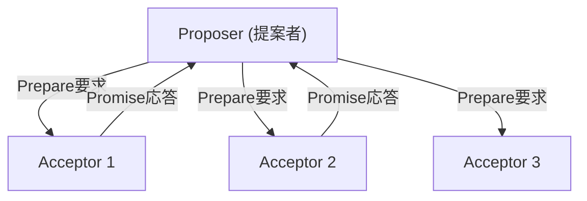
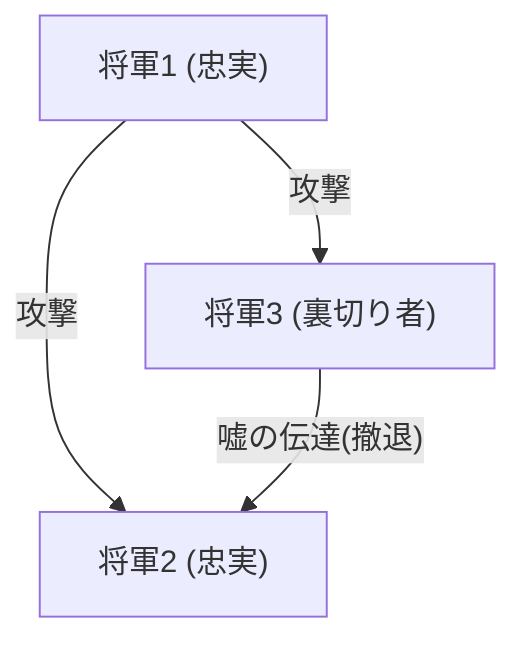

## O Homem que Deu "Tempo" e "Consenso" aos Sistemas Distribuídos: Leslie Lamport

Os sistemas distribuídos representados pela internet moderna, computação em nuvem e blockchain. Por trás do funcionamento natural dessas tecnologias e dos benefícios que usufruímos no nosso dia a dia, existe um cientista da computação genial: Leslie Lamport.

Vencedor do Prêmio Turing em 2013, Lamport construiu as fundações da computação distribuída e resolveu muitos problemas complexos com rigor matemático. Neste artigo, exploraremos profundamente suas grandes conquistas, como os "Relógios de Lamport", o "Algoritmo Paxos", o "Problema dos Generais Bizantinos", além de seu papel como criador do "LaTeX", indispensável no mundo acadêmico.

### 1. "Relógios de Lamport", Inspirados na Teoria da Relatividade de Einstein

Um dos problemas mais difíceis em sistemas distribuídos é o "tempo". Em um ambiente onde múltiplos computadores (nós) se comunicam através de uma rede, os relógios físicos que cada um possui inevitavelmente apresentarão desvios (clock drift). É impossível determinar com precisão apenas com relógios físicos se um evento que ocorreu no servidor A às "12:00:00" ou um evento que ocorreu no servidor B às "12:00:01" aconteceu primeiro de fato.

Para resolver esse problema, Lamport apresentou uma solução inovadora em seu artigo de 1978, *Time, Clocks, and the Ordering of Events in a Distributed System*. Inspirado pelo conceito da Teoria da Relatividade Restrita de que "não existe tempo absoluto, e a passagem do tempo difere dependendo do observador", ele criou o conceito de "Relógio Lógico" (Logical Clock).

#### Causalidade de Eventos (Happens-Before)

Em vez do tempo físico, Lamport focou na "causalidade" entre os eventos. Se um evento *a* é a causa de um evento *b*, ou se *b* certamente ocorre após *a*, ele definiu isso como *a* -> *b* (*a happens-before b*).

Os "Relógios de Lamport", baseados nessa regra simples, funcionam com cada nó mantendo seu próprio contador, atualizando e sincronizando o contador toda vez que envia ou recebe uma mensagem. Isso tornou possível determinar a ordem dos eventos em todo o sistema sem contradições. Este artigo se tornou um dos mais citados na história da ciência da computação e serve como base para o controle de transações em bancos de dados distribuídos modernos.

### 2. O Marco do Consenso Distribuído: "Algoritmo Paxos"

Outra barreira gigantesca nos sistemas distribuídos é o "Consenso" (Consensus). Como podemos concordar sobre um único estado consistente (valor) como um todo, em meio a falhas como atrasos de rede ou inatividade de alguns servidores?

Em 1989, Lamport escreveu um artigo intitulado "The Part-Time Parliament", usando o parlamento de uma ilha grega fictícia chamada "Paxos" como metáfora para explicar esse algoritmo de consenso distribuído.

#### A Mecânica e a Complexidade do Paxos

O algoritmo Paxos define os papéis de Propositor (Proposer), Aceitador (Acceptor) e Aprendiz (Learner). Ao obter o acordo de uma maioria (Quorum), ele forma o consenso de forma segura, resistindo a falhas.

Inicialmente, esse artigo que utilizava a metáfora grega foi considerado tão difícil e excêntrico que os revisores do jornal acadêmico pediram para ele "remover a metáfora e reescrever". Lamport recusou, e demorou cerca de 10 anos até que o artigo fosse formalmente publicado. No entanto, posteriormente, quando o Paxos (e suas variantes) passou a ser adotado em sistemas de missão crítica no mundo real, como o Chubby do Google e o protocolo ZAB do Apache ZooKeeper, seu verdadeiro valor foi provado.

### 3. Formalização da Tolerância a Falhas: O "Problema dos Generais Bizantinos"

As falhas que os sistemas distribuídos enfrentam não são apenas paradas de máquinas (crash faults). Existe a possibilidade de "mentiras" e "contradições" serem introduzidas no sistema devido a hacks de nós maliciosos ou envios inesperados de dados anômalos causados por bugs.

Em 1982, Lamport, juntamente com Robert Shostak e Marshall Pease, formalizou esse problema como o "Problema dos Generais Bizantinos" (Byzantine Generals Problem).

#### Generais Cercados por Inimigos

Generais do Império Bizantino estão cercando uma cidade inimiga. Eles devem concordar em "atacar" ou "recuar" simultaneamente, mas seu único meio de comunicação é através de mensageiros e, pior, existem "traidores" entre os generais. Os traidores enviam mensagens falsas, dizendo "atacar" para alguns generais e "recuar" para outros.

Lamport e seus colegas provaram matematicamente que, sendo *N* o número total de nós e *f* o número de traidores, se *N* >= 3*f* + 1, os generais honestos podem alcançar um acordo corretamente. Isso é conhecido como Tolerância a Falhas Bizantinas (BFT - Byzantine Fault Tolerance).

Esse conceito foi estudado por muito tempo em áreas que exigem confiabilidade extremamente alta, como sistemas de controle de aeronaves, mas ganhou destaque recentemente como o núcleo da tecnologia "blockchain". O Proof of Work do Bitcoin também pode ser considerado uma solução probabilística para o problema dos generais bizantinos em um sentido amplo.

### 4. Criador do "LaTeX", a Infraestrutura do Mundo Acadêmico

As contribuições de Lamport não se limitam aos sistemas distribuídos. O "LaTeX", o sistema de composição que se tornou o padrão de fato mundial para a redação de artigos de matemática e ciência da computação, foi desenvolvido por ele.

Em cima do poderoso, porém complexo, sistema "TeX" desenvolvido por Donald Knuth, Lamport construiu um pacote de macros que permitia aos usuários focar na estrutura lógica do documento (capítulos, seções, figuras, fórmulas, etc.). Foi assim que surgiu o "LaTeX". A filosofia de "separação entre conteúdo e design" é também um princípio fundamental do web design moderno, refletido no uso de HTML/CSS.

### Conclusão: O Valor Eterno Gerado pelo Rigor Lógico

Olhando para as realizações de Leslie Lamport, podemos ver o quanto ele valorizava "eliminar a ambiguidade e definir problemas com rigor matemático". O desenvolvimento da linguagem de especificação de sistemas TLA+ (Temporal Logic of Actions) também é a culminação de sua abordagem para eliminar logicamente bugs de sistemas complexos.

Os conceitos de "Relógios de Lamport", "Paxos" e "Problema dos Generais Bizantinos" que ele criou possuem verdades universais que não dependem de hardware específico ou tecnologias da moda. É por isso que, mesmo décadas depois, essas teorias continuam vivas na infraestrutura em nuvem moderna e no blockchain.

Leslie Lamport é, sem dúvida, um gigante que redefiniu os conceitos de "tempo" e "consenso" na era digital.
