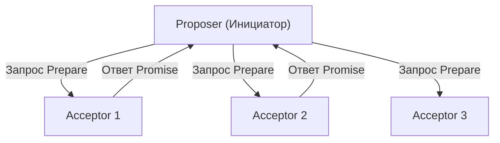
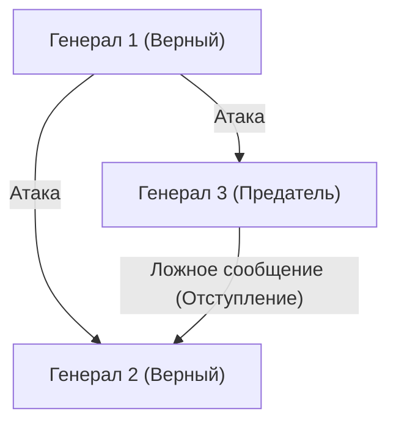

## Человек, который дал распределенным системам «время» и «консенсус»: Лесли Лэмпорт

Распределенные системы, примерами которых являются современный интернет, облачные вычисления и блокчейн. За тем фактом, что они работают как нечто само собой разумеющееся и мы ежедневно пользуемся их благами в нашей жизни, стоит один гениальный ученый в области компьютерных наук. Это Лесли Лэмпорт (Leslie Lamport).

Получив премию Тьюринга в 2013 году, Лэмпорт заложил основы распределенных вычислений и решил множество сложнейших проблем с математической строгостью. В этой статье мы подробно рассмотрим его великие достижения: «Часы Лэмпорта», «Алгоритм Paxos», «Задачу византийских генералов», а также его роль как создателя «LaTeX», который стал незаменимым в академическом мире.

### 1. «Часы Лэмпорта», вдохновленные теорией относительности Эйнштейна

Одной из самых сложных проблем в распределенных системах является «время». В среде, где несколько компьютеров (узлов) обмениваются данными по сети, физические часы каждого из них неизбежно имеют отклонения (дрейф часов). Невозможно точно определить только с помощью физических часов, что произошло раньше: событие на сервере A в «12:00:00» или событие на сервере B в «12:00:01».

Для решения этой проблемы в 1978 году в своей статье «Time, Clocks, and the Ordering of Events in a Distributed System» (Время, часы и упорядочение событий в распределенной системе) Лэмпорт предложил инновационное решение. Вдохновившись концепцией специальной теории относительности о том, что «абсолютного времени не существует, и ход времени различается в зависимости от наблюдателя», он создал концепцию «логических часов» (Logical Clock).

#### Причинно-следственная связь событий (Happens-Before)

Лэмпорт обратил внимание не на физическое время, а на «причинно-следственную связь» между событиями. Если событие 'a' является причиной события 'b', или если 'b' достоверно происходит после 'a', он определил это как a -> b (a происходит до b / happens-before).

«Часы Лэмпорта», основанные на этом простом правиле, означают, что каждый узел имеет свой собственный счетчик, который обновляется и синхронизируется при каждой отправке и получении сообщения. Это позволило непротиворечиво определять порядок событий во всей системе. Эта статья стала одной из самых цитируемых в истории информатики и является основой управления транзакциями в современных распределенных базах данных.

### 2. Вершина распределенного консенсуса: «Алгоритм Paxos»

Еще одной огромной стеной в распределенных системах является «консенсус» (Consensus). Как достичь согласия в отношении одного согласованного состояния (значения) в целом, когда происходят сбои, такие как задержки в сети или падение некоторых серверов?

В 1989 году Лэмпорт написал статью под названием «The Part-Time Parliament» (Парламент, работающий неполный рабочий день), в которой объяснил этот алгоритм распределенного консенсуса, используя метафору парламента на вымышленном греческом острове «Paxos».

#### Механизм и сложность Paxos

Алгоритм Paxos определяет роли: инициатор (Proposer), принимающий (Acceptor) и ученик (Learner), и путем получения согласия большинства (Quorum) он безопасно формирует консенсус, сохраняя устойчивость к сбоям.

Первоначально статья, в которой использовалась эта греческая метафора, была настолько сложной и необычной, что рецензенты журнала потребовали переписать её без метафоры. Лэмпорт отказался, и прошло около 10 лет, прежде чем статья была официально опубликована. Однако впоследствии алгоритм Paxos (и его производные) стал применяться в критически важных системах реального мира, таких как Chubby от Google и протокол ZAB в Apache ZooKeeper, что доказало его истинную ценность.

### 3. Формализация отказоустойчивости: «Задача византийских генералов»

Сбои, с которыми сталкиваются распределенные системы, - это не просто остановка машин (сбои типа crash fault). В систему могут проникать «ложь» и «противоречия» из-за взлома злонамеренных узлов или отправки неожиданно ошибочных данных из-за ошибок.

В 1982 году Лэмпорт вместе с Робертом Шостаком (Robert Shostak) и Маршаллом Пизом (Marshall Pease) формализовал эту проблему как «Задачу византийских генералов» (Byzantine Generals Problem).

#### Генералы, окруженные врагами

Генералы Византийской империи осаждают вражеский город. Они должны договориться, будут ли они все вместе «атаковать» или «отступать», но их единственным средством связи являются гонцы, и к тому же среди генералов есть «предатели». Предатели посылают ложные сообщения, приказывая одним генералам «атаковать», а другим - «отступать».

Лэмпорт и его коллеги математически доказали, что если общее количество узлов N, а количество предателей f, то при N >= 3f + 1 честные генералы могут правильно достичь согласия (Византийская отказоустойчивость: BFT).

Эта концепция долгое время изучалась в областях, требующих чрезвычайно высокой надежности, таких как системы управления самолетами, но в последние годы она оказалась в центре внимания как ядро технологии «блокчейн». Proof of Work в биткойне также можно рассматривать как вероятностное решение задачи византийских генералов в широком смысле.

### 4. Создатель «LaTeX», инфраструктуры академического мира

Вклад Лэмпорта не ограничивается только распределенными системами. «LaTeX», система верстки, ставшая стандартом де-факто во всем мире для написания статей по математике и информатике, была разработана им.

«LaTeX» — это результат создания Лэмпортом пакета макросов поверх мощной, но сложной системы «TeX», разработанной Дональдом Кнутом (Donald Knuth), что позволило пользователям сосредоточиться на логической структуре документа (главы, разделы, рисунки, формулы и т. д.). Философия «отделения содержания от дизайна» также является фундаментальным принципом веб-дизайна, схожим с современными HTML/CSS.

### Заключение: Вечная ценность, рожденная логической строгостью

Оглядываясь на достижения Лесли Лэмпорта, можно увидеть, насколько он ценил «устранение двусмысленности и определение проблем с математической строгостью». Разработка языка описания спецификаций систем TLA+ (Temporal Logic of Actions) также является кульминацией его подхода к логическому устранению ошибок из сложных систем.

Созданные им концепции «Часов Лэмпорта», «Paxos» и «Задачи византийских генералов» содержат универсальные истины, которые не зависят от конкретного оборудования или модных технологий. Именно поэтому даже в современных облачных инфраструктурах и блокчейнах спустя несколько десятилетий эти теории продолжают жить в неизменном виде.

Лесли Лэмпорта без сомнения можно назвать гигантом, который переосмыслил концепции «времени» и «консенсуса» в цифровую эпоху.
