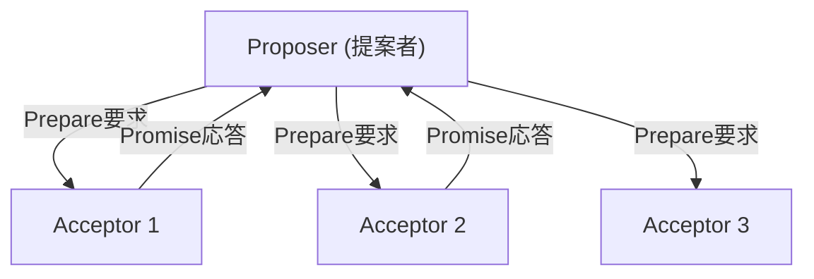
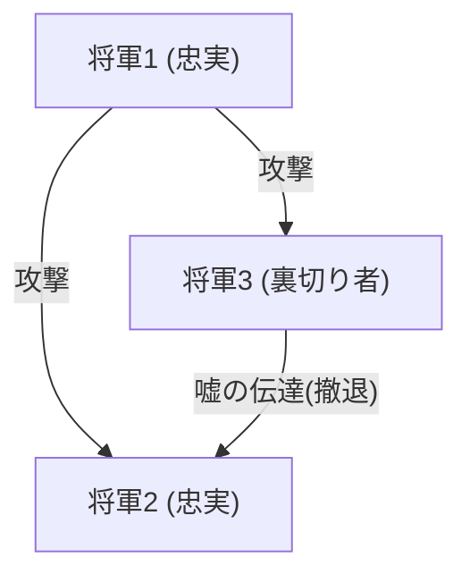

## 赋予分布式系统“时间”与“共识”的巨人：莱斯利·兰波特

以现代互联网、云计算和区块链为代表的分布式系统。它们理所当然般地运行着，让我们在日常生活中受益，而在这一切的背后，有一位天才的计算机科学家：莱斯利·兰波特（Leslie Lamport）。

荣获2013年图灵奖的兰波特，奠定了分布式计算的基础，并以数学的严谨性解开了许多深奥的难题。在本文中，我们将深入探讨他的伟大成就：“Lamport时钟”、“Paxos算法”、“拜占庭将军问题”，以及作为学术界不可或缺的“LaTeX”之父的一面。

### 1. 从爱因斯坦相对论中获得灵感的“Lamport时钟”

分布式系统中最棘手的问题之一就是“时间”。在多个计算机（节点）跨越网络相互通信的环境中，它们各自拥有的物理时钟必然会产生偏差（时钟漂移）。A服务器在“12:00:00”发生的事件与B服务器在“12:00:01”发生的事件，到底哪一个真正先发生？仅靠物理时钟是无法准确判断的。

针对这个问题，兰波特在1978年的论文《Time, Clocks, and the Ordering of Events in a Distributed System》（分布式系统中的时间、时钟和事件顺序）中提出了革命性的解决方案。他从狭义相对论中“不存在绝对时间，时间的流逝因观察者而异”的概念中获得灵感，创造了“逻辑时钟（Logical Clock）”的概念。

#### 事件的因果关系（Happens-Before）

兰波特关注的不是物理时间，而是事件之间的“因果关系”。如果事件a是事件b的原因，或者a确实在b之前发生，则将其定义为 a -> b (a happens-before b)。

基于这一简单规则的“Lamport时钟”，即每个节点拥有自己的计数器，每次发送和接收消息时更新并同步计数器。这样一来，整个系统就能毫无矛盾地确定事件的顺序。这篇论文成为计算机科学史上被引用次数最多的论文之一，也是现代分布式数据库中事务控制的基础。

### 2. 分布式共识的金字塔：“Paxos算法”

分布式系统中另一个巨大的障碍是“共识（Consensus）”。在网络延迟或部分服务器宕机等故障发生的情况下，如何作为一个整体就单一且一致的状态（值）达成共识？

1989年，兰波特撰写了名为《The Part-Time Parliament》（兼职议会）的论文，以虚构的希腊岛屿“Paxos”的议会为隐喻，解释了这种分布式共识算法。

#### Paxos的机制与艰涩

Paxos算法定义了提议者（Proposer）、接受者（Acceptor）和学习者（Learner）的角色，通过获得多数派（Quorum）的同意，在容忍故障的同时安全地达成共识。

起初，这篇使用希腊隐喻的论文因为过于晦涩和古怪，被期刊的审稿人要求“去掉隐喻重写”。兰波特拒绝了这一要求，直到论文正式发表，花费了大约10年的时间。然而在那之后，包括Google的Chubby和Apache ZooKeeper的ZAB协议等现实世界中的关键任务系统开始采用Paxos（及其衍生算法），证明了它的真正价值。

### 3. 将容错性形式化的“拜占庭将军问题”

分布式系统面临的故障不仅仅是简单的机器停机（崩溃故障）。恶意的节点黑客攻击、由于Bug发送了意外的异常数据等，系统中可能会混入“谎言”或“矛盾”。

1982年，兰波特与Robert Shostak、Marshall Pease一起，将这一问题形式化为“拜占庭将军问题（Byzantine Generals Problem）”。

#### 被敌人包围的将军们

拜占庭帝国的将军们正在包围一座敌方城市。他们必须一致同意“攻击”或“撤退”，但通信手段只有传令兵，而且将军中还混有“叛徒”。叛徒会向一部分将军发送“攻击”的消息，向另一部分将军发送“撤退”的消息传递谎言。

兰波特等人通过数学证明了，假设总节点数为N，叛徒数为f，当 N >= 3f + 1 时，诚实的将军们就能正确地达成共识（拜占庭容错：BFT）。

这个概念长期以来在诸如飞机控制系统等需要极高可靠性的领域中被研究，但近年来作为“区块链”技术的核心而备受瞩目。比特币的工作量证明（Proof of Work）也可以说是对广义拜占庭将军问题的一种概率性解法。

### 4. 学术界基础设施“LaTeX”之父

兰波特的贡献不仅限于分布式系统。在全世界的数学和计算机科学论文写作中成为事实标准的排版系统“LaTeX”，正是由他开发的。

在Donald Knuth开发的强大但复杂的“TeX”系统之上，兰波特构建了宏包，让用户能够专注于文档的逻辑结构（章、节、图、公式等），这就是“LaTeX”。“内容与设计分离”的思想也是通用于现代HTML/CSS的网页设计基本原则。

### 结论：逻辑严密性所创造的永恒价值

回顾莱斯利·兰波特的成就，我们可以看出他有多么重视“消除模棱两可，以数学的严谨性定义问题”。TLA+（Temporal Logic of Actions）系统规范描述语言的开发，也是他致力于从复杂系统中逻辑性地排除Bug这一方法的集大成者。

他所创造的“Lamport时钟”、“Paxos”、“拜占庭将军问题”等概念，蕴含着不依赖于特定硬件或流行技术的普遍真理。正因为如此，在经过数十年后的现代云基础设施和区块链中，这些理论依然鲜活存在着。

莱斯利·兰波特毫无疑问是一位重新定义了数字时代“时间”和“共识”概念的巨人。
