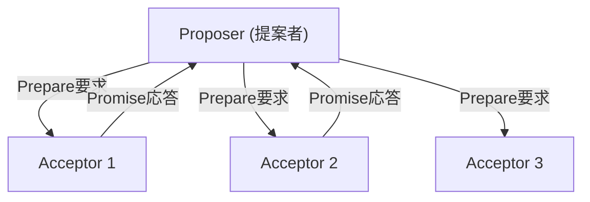
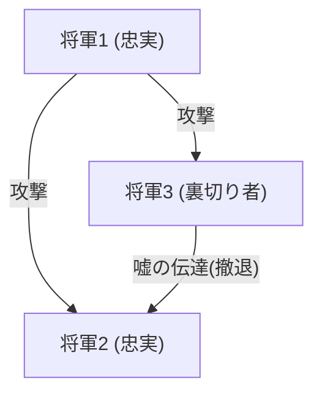

## 賦予分散式系統「時間」與「共識」的靈魂人物：Leslie Lamport

在現代網際網路、雲端運算以及以區塊鏈為代表的分散式系統中。這些系統理所當然地運作著，讓我們在日常生活中受益，而在這背後，有一位天才電腦科學家的存在，他就是 Leslie Lamport（萊斯利·蘭波特）。

Lamport 於 2013 年榮獲圖靈獎（Turing Award），他奠定了分散式運算的基礎，並以數學的嚴謹性解決了許多艱澀難懂的問題。本文將深入探討他的偉大成就：「Lamport 時鐘」、「Paxos 演算法」、「拜占庭將軍問題」，以及身為學術界不可或缺的排版系統「LaTeX」發明者的面向。

### 1. 從愛因斯坦相對論汲取靈感的「Lamport 時鐘」

分散式系統中最棘手的問題之一就是「時間」。在多台電腦（節點）透過網路互相通訊的環境中，各自擁有的實體時鐘必然會產生誤差（時鐘漂移）。伺服器 A 在「12:00:00」發生的事件，與伺服器 B 在「12:00:01」發生的事件，光靠實體時鐘是無法準確判定哪一個真正先發生的。

針對這個問題，Lamport 在 1978 年的論文《Time, Clocks, and the Ordering of Events in a Distributed System》中提出了革命性的解答。他從狹義相對論中「絕對時間並不存在，時間的流逝因觀察者而異」的概念中獲得靈感，創造了「邏輯時鐘（Logical Clock）」的概念。

#### 事件的因果關係（Happens-Before）

Lamport 關注的不是實體時間，而是事件之間的「因果關係」。如果事件 a 是事件 b 的原因，或者 a 確實發生在 b 之前，這就被定義為 a -> b (a happens-before b)。

基於這個簡單規則的「Lamport 時鐘」，讓每個節點都擁有自己的計數器，每次發送或接收訊息時都會更新並同步計數器。這使得整個系統能夠毫無矛盾地決定事件的順序。這篇論文成為電腦科學史上被引用次數最多的論文之一，也是現代分散式資料庫中交易控制的基礎。

### 2. 分散式共識的里程碑「Paxos 演算法」

分散式系統中的另一座巨大高牆是「共識（Consensus）」。在網路延遲、部分伺服器當機等故障發生的情況下，整體該如何達成一個一致的狀態（值）？

Lamport 在 1989 年撰寫了一篇名為《The Part-Time Parliament（兼職議會）》的論文，他以虛構的希臘島嶼「Paxos」的議會為隱喻，說明了這個分散式共識演算法。

#### Paxos 的機制與艱澀

Paxos 演算法定義了提案者（Proposer）、接受者（Acceptor）和學習者（Learner）的角色，透過取得過半數（Quorum）的同意，在容忍故障的同時安全地形成共識。

起初，這篇使用希臘隱喻的論文過於艱澀且風格怪異，因此被期刊的審稿人要求「拿掉隱喻重新改寫」。Lamport 拒絕了這個要求，導致該論文花了大約 10 年的時間才正式發表。然而在之後，Google 的 Chubby 和 Apache ZooKeeper 的 ZAB 協定等現實世界中執行關鍵任務的系統紛紛採用了 Paxos（及其衍生演算法），證明了它的真正價值。

### 3. 將容錯性公式化的「拜占庭將軍問題」

分散式系統面臨的故障，不僅僅是單純的機器停止運作（崩潰故障）。還可能有惡意節點的駭客攻擊、錯誤導致傳送非預期的異常資料等，系統內可能會混入「謊言」和「矛盾」。

1982 年，Lamport 與 Robert Shostak、Marshall Pease 共同將這個問題公式化，稱為「拜占庭將軍問題（Byzantine Generals Problem）」。

#### 被敵人包圍的將軍們

拜占庭帝國的將軍們包圍了敵人的城市。他們必須一致同意「攻擊」或「撤退」，但通訊手段只有傳令兵，而且將軍中還混入了「叛徒」。叛徒會傳遞虛假訊息，告訴部分將軍「攻擊」，卻告訴其他將軍「撤退」。

Lamport 等人以數學證明了，如果總節點數為 N，叛徒數為 f，當 N >= 3f + 1 時，誠實的將軍們就能正確地達成共識（拜占庭容錯：Byzantine Fault Tolerance, BFT）。

這個概念長久以來一直在飛機控制系統等需要極高可靠性的領域中進行研究，直到近年來才作為「區塊鏈」技術的核心而備受矚目。比特幣的工作量證明（Proof of Work）也可以說是一種廣義的拜占庭將軍問題的機率性解法。

### 4. 學術界基礎設施「LaTeX」的發明者

Lamport 的貢獻不僅限於分散式系統。在數學和電腦科學論文寫作中成為全球事實標準的排版系統「LaTeX」，也是由他開發的。

在 Donald Knuth 開發的強大但複雜的「TeX」系統之上，Lamport 建構了巨集套件，讓使用者能專注於文件的邏輯結構（章、節、圖、公式等），這就是「LaTeX」。「內容與設計分離」的思想，也是與現代 HTML/CSS 共通的網頁設計基本原則。

### 結論：邏輯嚴謹性創造的永恆價值

回顧 Leslie Lamport 的成就，就可以看出他有多麼重視「消除模糊性，以數學的嚴謹性定義問題」。開發 TLA+（Temporal Logic of Actions）系統規格描述語言，也是他為了從複雜系統中在邏輯上排除錯誤的方法之集大成。

他所創造的「Lamport 時鐘」、「Paxos」、「拜占庭將軍問題」等概念，具有不依賴特定硬體或流行技術的普遍真理。正因如此，即使經過了數十年，這些理論在現代的雲端基礎設施和區塊鏈中依然發揮著作用。

毫無疑問地，Leslie Lamport 是重新定義數位時代「時間」與「共識」概念的科學巨擘。
