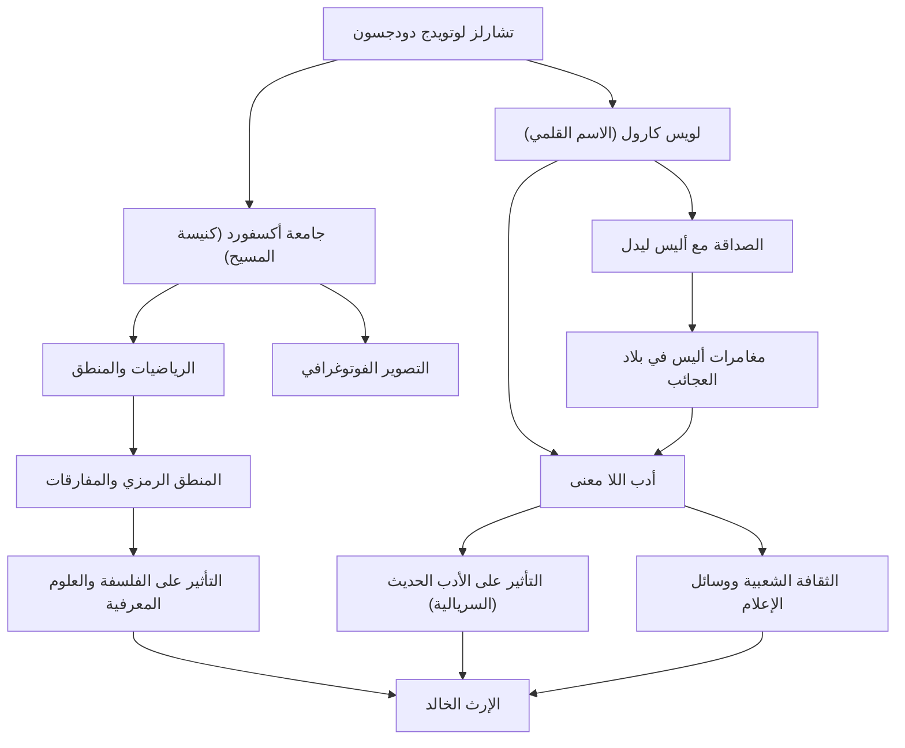

## مقدمة

عند سماع اسم "لويس كارول"، يتبادر إلى ذهن الكثيرين مؤلف كتاب الأطفال المحبوب عالميًا "مغامرات أليس في بلاد العجائب". ومع ذلك، كان اسمه الحقيقي تشارلز لوتويدج دودجسون. كان محاضرًا في الرياضيات في كنيسة المسيح بجامعة أكسفورد، ومصورًا، وعالم منطق. إن "أدب اللا معنى" الذي ابتكره ليس مجرد قصة للأطفال ولكنه لا يزال يترك تأثيرًا عميقًا في اللغويات والفلسفة والمنطق. في هذا المقال، سنتعمق في حياة لويس كارول متعدد الأوجه، والفلسفة التي تكمن وراء أعماله، وتأثيره على الأجيال اللاحقة.

## الحياة المبكرة: من صبي في منزل قس إلى عالم رياضيات في أكسفورد

وُلد تشارلز لوتويدج دودجسون في عام 1832 في منزل قس في دارسبري، شيشاير، في شمال غرب إنجلترا. نشأ في بيئة عائلية صارمة ومثقفة، وأظهر اهتمامًا قويًا بألعاب الكلمات والألغاز والحيل السحرية والدمى المتحركة منذ سن مبكرة. أظهرت أيامه الأولى، حيث كان ينشر مجلة عائلية مصنوعة يدويًا لإخوته تتميز بقصائد فكاهية ورسوم توضيحية، لمحات من لويس كارول في المستقبل.

عند التحاقه بكنيسة المسيح في أكسفورد في عام 1851، أظهر موهبة غير عادية في الرياضيات وتخرج على رأس فصله. استمر في تدريس الرياضيات هناك لمدة 26 عامًا. تضمنت حياته اليومية التنقل بين وجهين: دودجسون، عالم الرياضيات الصارم والجاد، وكارول، الرجل واسع الخيال الذي أحب اللعب مع الأطفال.

في 4 يوليو 1862، أثناء التجديف في نهر التايمز مع بنات هنري ليدل الثلاث، عميد كنيسة المسيح - بمن فيهن أليس ليدل - ارتجل كارول قصة لهن. ناشدته أليس، التي أسرتها القصة، قائلة: "اكتب هذه القصة لي"، مما أدى إلى ابتكار التحفة التاريخية "مغامرات أليس في بلاد العجائب" (1865). ونشر بعد ذلك تكملة القصة "عبر المرآة" (1871) وقصيدة اللا معنى الطويلة "صيد السنارك" (1876)، مما رسخ شهرته كمؤلف.

كما لفت انتباهه سريعًا تكنولوجيا التصوير الفوتوغرافي المخترعة حديثًا وأصبح مصورًا بارزًا للصور الشخصية. تظل صوره للمشاهير والأطفال تمثيلات قيمة لفن التصوير الفوتوغرافي الفيكتوري.

## الفلسفة ورؤية العالم: الحدود بين المنطق واللا معنى

يكمن السحر الأكبر في أعمال لويس كارول في دمج "المنطق الشامل" مع "اللا معنى". إن عالم أليس، الذي يبدو للوهلة الأولى سخيفًا وغير عقلاني، مبني في الواقع على أنه الوجه الآخر لقواعد رياضية ومنطقية عالية التجريد.

بصفته دودجسون، كان عالم منطق صارم قام بتأليف كتب متخصصة مثل "رسالة أولية في المحددات" (1867) و"المنطق الرمزي" (1896). أدب اللا معنى لديه هو لعبة فكرية تستخدم بمهارة غموض الكلمات، ومغالطات القياس المنطقي، وتشويه الزمان والمكان. إن تقنيته في تفكيك المعنى المطلق "للكلمات" وتحرير القراء من حدود المنطق السليم لها عمق يتصل بفلسفة اللغة الحديثة.

على سبيل المثال، المشهد الشهير الذي يؤكد فيه هامبتي دامبتي، "عندما أستخدم كلمة، فإنها تعني بالضبط ما أختاره لتعنيه"، هو نظرة ثاقبة حول اعتباطية اللغة وطبيعة التواصل. ويقال إن هذا أثر على الفلاسفة اللاحقين مثل لودفيج فيتجنشتاين. بالنسبة له، كان "المنطق" هو القانون المطلق الذي يحدد العالم وكذلك "اللعبة" النهائية التي يمكنها خلق عالم موازٍ مختلف تمامًا بمجرد تعديل الشروط قليلاً.

## الإرث: تأثيرات في الأدب والثقافة والعلوم

يمتد إرث لويس كارول إلى ما هو أبعد من مجال أدب الأطفال.

أولاً، في مجال الأدب، أحدث ابتعادًا عن "النزعة التعليمية". في حين كان أدب الأطفال في ذلك الوقت أداة لتعليم الأطفال الأخلاق إلى حد كبير، أسس كارول أدب اللا معنى باعتباره "ترفيهًا" خالصًا. أثر هذا النهج على العديد من الكتاب اللاحقين، بما في ذلك جيمس جويس وفلاديمير نابوكوف وخورخي لويس بورخيس، ويعتبر أيضًا رائدًا للسريالية.

إن تأثيره على الثقافة الشعبية لا يقاس بالمثل. بدءًا من فيلم الرسوم المتحركة الذي أنتجته ديزني وصولًا إلى الأفلام والمسرح والموسيقى والألعاب، تم إعادة ابتكار فكرة "أليس" بشكل متكرر عبر جميع وسائل الإعلام. حتى في ثقافة المخدرات وأعمال الخيال العلمي (مثل عبارة "اتبع الأرنب الأبيض" في فيلم "ماتريكس")، فإن رؤية العالم التي ابتكرها كارول تعمل كأيقونة رمزية.

علاوة على ذلك، لا يزال اسمه حيًا في مجالات العلوم والرياضيات. ليس من غير المألوف أن يتم الاستشهاد بمفارقات كارول في أوراق بحثية في الفيزياء والمنطق والعلوم المعرفية. ولا تزال نصوصه، التي أثبتت وجود خط رفيع بين المنطق والجنون، تحفز الفضول الفكري للناس اليوم.

## مخطط تدفق الإنجازات والارتباطات

## الخاتمة

ابتكر لويس كارول، أو تشارلز لوتويدج دودجسون، "عالمًا من الكلمات" لم يصل إليه أحد من قبل من خلال ربط تفكيره المنطقي الفريد وخياله الخصب داخل المجتمع الصارم في العصر الفيكتوري. عند تتبع حياته، يمكن للمرء أن يشهد معجزة كيف يمكن للرياضيات الدقيقة والخيالات العبثية أن تتردد صداها داخل عقل إنسان واحد.

لا يزال الحفرة التي قفز إليها وهو يطارد الأرنب الأبيض بلا قاع حتى اليوم، بعد أكثر من 150 عامًا. عندما نواجه حدود المنطق السليم، ستظل النصوص التي تركها كارول تتألق إلى الأبد كـ "سحر الكلمات" للتسلل عبر تلك الجدران.
