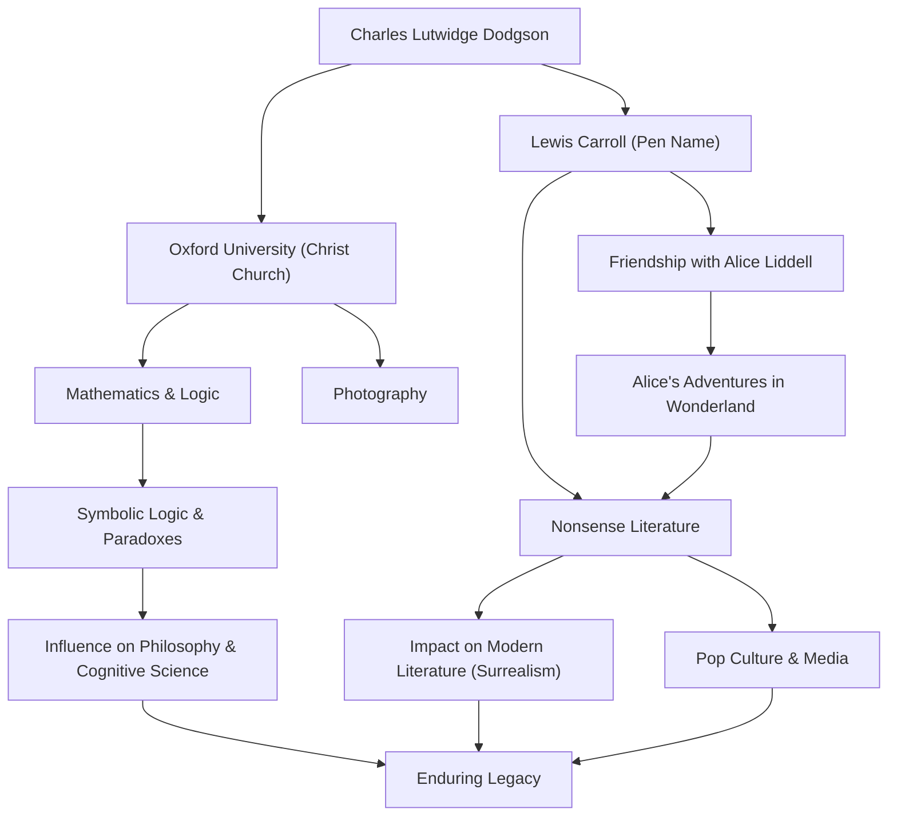

## Introduction

When hearing the name "Lewis Carroll," many people think of the author of the globally beloved children's book "Alice's Adventures in Wonderland." However, his real name was Charles Lutwidge Dodgson. He was a mathematics lecturer at Christ Church, Oxford University, a photographer, and a logician. The "nonsense literature" he created is not merely a story for children but continues to have a profound impact on linguistics, philosophy, and logic. In this article, we will delve into the life of the multifaceted Lewis Carroll, the philosophy underlying his work, and his influence on later generations.

## Early Life: From a Parsonage Boy to an Oxford Mathematician

Charles Lutwidge Dodgson was born in 1832 in a parsonage in Daresbury, Cheshire, in North West England. Raised in a strict and intellectual family environment, he showed a strong interest in wordplay, puzzles, magic tricks, and marionettes from a young age. His early days, publishing a handmade family magazine for his siblings featuring humorous poems and illustrations, showed glimpses of the future Lewis Carroll.

Upon entering Christ Church, Oxford in 1851, he demonstrated extraordinary talent in mathematics and graduated at the top of his class. He went on to teach as a mathematics lecturer there for 26 years. His daily life involved navigating between two faces: Dodgson, the rigid and earnest mathematician, and Carroll, the imaginative man who loved playing with children.

On July 4, 1862, while rowing up the River Thames with the three daughters of Henry Liddell, the Dean of Christ Church—including Alice Liddell—Carroll improvised a story for them. Alice, captivated by the tale, pleaded, "Write this story down for me," which led to the creation of the historical masterpiece "Alice's Adventures in Wonderland" (1865). He subsequently published the sequel "Through the Looking-Glass" (1871) and the long nonsense poem "The Hunting of the Snark" (1876), establishing his fame as an author.

He also quickly took notice of the newly invented photographic technology and became a preeminent portrait photographer. His photographs of celebrities and children remain valuable representations of Victorian photographic art.

## Philosophy and Worldview: The Boundary Between Logic and Nonsense

The greatest charm of Lewis Carroll's work lies in the fusion of "thorough logic" and "nonsense." The world of Alice, which at first glance seems absurd and irrational, is actually constructed as the reverse of highly mathematical and logical rules.

As Dodgson, he was a rigorous logician who authored specialized books such as "An Elementary Treatise on Determinants" (1867) and "Symbolic Logic" (1896). His nonsense literature is an intellectual game that skillfully utilizes the ambiguity of words, syllogistic fallacies, and the distortion of time and space. His technique of dismantling the absolute meaning of "words" and liberating readers from the confines of common sense has a depth that connects to modern philosophy of language.

For instance, the famous scene where Humpty Dumpty asserts, "When I use a word, it means just what I choose it to mean," is a sharp insight into the arbitrariness of language and the nature of communication. It is said to have influenced later philosophers like Ludwig Wittgenstein. For him, "logic" was both the absolute law defining the world and the ultimate "toy" that could create a completely different parallel universe just by slightly tweaking the conditions.

## Legacy: Ripples Across Literature, Culture, and Science

Lewis Carroll's legacy extends far beyond the realm of children's literature.

First, in the field of literature, he brought about a departure from "didacticism." While children's literature at the time was largely a tool for teaching morals to children, Carroll established nonsense literature as pure "entertainment." This approach influenced numerous later writers, including James Joyce, Vladimir Nabokov, and Jorge Luis Borges, and he is also regarded as a pioneer of surrealism.

His influence on popular culture is equally immeasurable. From Disney's animated film adaptation to movies, theater, music, and games, the "Alice" motif has been repeatedly recreated across all media. Even in psychedelic culture and sci-fi works (such as the phrase "follow the white rabbit" in the movie "The Matrix"), the worldview created by Carroll serves as a symbolic icon.

Furthermore, his name lives on in the fields of science and mathematics. It is not uncommon for Carroll's paradoxes to be cited in papers on physics, logic, and cognitive science. His texts, which proved a fine line between logic and madness, continue to stimulate people's intellectual curiosity today.

## Achievement and Correlation Flowchart

## Conclusion

Lewis Carroll, or Charles Lutwidge Dodgson, created a "universe of words" that no one had ever reached before by linking his unique logical thinking and rich imagination within the strict society of the Victorian era. Tracing his life, one can witness the miracle of how rigorous mathematics and absurd fantasies could resonate within the mind of a single human being.

The hole he jumped into chasing the white rabbit remains completely bottomless even today, over 150 years later. When we face the limits of common sense and logic, the texts Carroll left behind will forever shine as the "magic of words" to slip through those walls.
