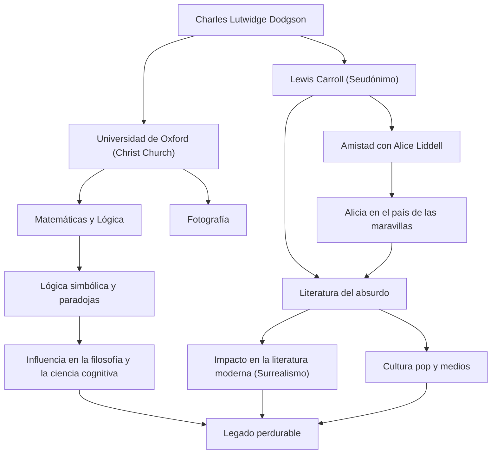

## Introducción

Al escuchar el nombre de "Lewis Carroll", la mayoría de las personas piensan en el autor del querido cuento infantil "Alicia en el país de las maravillas". Sin embargo, su verdadero nombre era Charles Lutwidge Dodgson. Fue profesor de matemáticas en Christ Church de la Universidad de Oxford, fotógrafo y lógico. La "literatura del absurdo" que creó no se limita a ser meras historias para niños, sino que sigue teniendo un profundo impacto en los campos de la lingüística, la filosofía y la lógica. En este artículo, profundizaremos en la vida del polifacético Lewis Carroll, la filosofía que subyace en su obra y su influencia en las generaciones posteriores.

## Primeros años: De un niño de rectoría a matemático de Oxford

Charles Lutwidge Dodgson nació en 1832 en una rectoría en Daresbury, Cheshire, en el noroeste de Inglaterra. Criado en un entorno familiar estricto e intelectual, mostró un gran interés por los juegos de palabras, los rompecabezas, la magia y las marionetas desde una edad temprana. Sus primeros años, en los que publicó una revista familiar hecha a mano para sus hermanos con poemas humorísticos e ilustraciones, mostraban ya destellos del futuro Lewis Carroll.

Al ingresar a Christ Church, Oxford, en 1851, demostró un talento extraordinario para las matemáticas y se graduó como el primero de su clase. Posteriormente enseñó matemáticas allí durante 26 años. Su vida diaria transcurría entre dos facetas: Dodgson, el matemático rígido y serio, y Carroll, el hombre imaginativo que amaba jugar con los niños.

El 4 de julio de 1862, mientras navegaba en bote por el río Támesis con las tres hijas de Henry Liddell, el decano de Christ Church (entre ellas Alicia Liddell), Carroll improvisó una historia para ellas. Alicia, cautivada por el relato, le rogó: "Escríbeme esta historia", lo que llevó a la creación de la obra maestra histórica "Alicia en el país de las maravillas" (1865). Posteriormente publicó la secuela "A través del espejo" (1871) y el largo poema sin sentido "La caza del Snark" (1876), estableciendo su fama como autor.

También se interesó rápidamente por la tecnología fotográfica recién inventada y se convirtió en un destacado fotógrafo de retratos. Sus fotografías de celebridades y niños siguen siendo valiosos ejemplos del arte fotográfico victoriano.

## Filosofía y visión del mundo: La frontera entre la lógica y el absurdo

El mayor encanto de la obra de Lewis Carroll reside en la fusión de "lógica exhaustiva" y "absurdo". El mundo de Alicia, que a primera vista parece irracional, está en realidad construido como el reverso de reglas altamente matemáticas y lógicas.

Como Dodgson, era un lógico riguroso que escribió libros especializados como "Tratado elemental de los determinantes" (1867) y "Lógica simbólica" (1896). Su literatura del absurdo es un juego intelectual que utiliza hábilmente la ambigüedad de las palabras, las falacias silogísticas y la distorsión del tiempo y el espacio. Su técnica de desmantelar el significado absoluto de las "palabras" y liberar a los lectores de los confines del sentido común tiene una profundidad que conecta con la filosofía del lenguaje moderna.

Por ejemplo, la famosa escena en la que Humpty Dumpty afirma: "Cuando yo uso una palabra, significa exactamente lo que yo decido que signifique", es una aguda perspicacia sobre la arbitrariedad del lenguaje y la naturaleza de la comunicación. Se dice que influyó en filósofos posteriores como Ludwig Wittgenstein. Para él, la "lógica" era tanto la ley absoluta que definía el mundo como el "juguete" definitivo que podía crear un universo paralelo completamente diferente con solo modificar ligeramente las condiciones.

## Legado: Repercusiones en la literatura, la cultura y la ciencia

El legado de Lewis Carroll se extiende mucho más allá del ámbito de la literatura infantil.

Primero, en el campo de la literatura, provocó un alejamiento del "didactismo". Mientras que la literatura infantil de la época era en gran medida una herramienta para enseñar moral a los niños, Carroll estableció la literatura del absurdo como puro "entretenimiento". Este enfoque influyó en numerosos escritores posteriores, como James Joyce, Vladimir Nabokov y Jorge Luis Borges, y también es considerado un pionero del surrealismo.

Su influencia en la cultura popular es igualmente inmensurable. Desde la adaptación cinematográfica animada de Disney hasta películas, teatro, música y juegos, el motivo de "Alicia" se ha recreado repetidamente en todos los medios. Incluso en la cultura psicodélica y las obras de ciencia ficción (como la frase "sigue al conejo blanco" en la película "The Matrix"), la visión del mundo creada por Carroll sirve como un icono simbólico.

Además, su nombre perdura en los campos de la ciencia y las matemáticas. No es raro que las paradojas de Carroll se citen en artículos de física, lógica y ciencia cognitiva. Sus textos, que demostraron la fina línea entre la lógica y la locura, continúan estimulando la curiosidad intelectual de las personas en la actualidad.

## Diagrama de flujo de logros y correlaciones

## Conclusión

Lewis Carroll, o Charles Lutwidge Dodgson, creó un "universo de palabras" que nadie había alcanzado antes al vincular su pensamiento lógico único y su rica imaginación dentro de la estricta sociedad de la época victoriana. Al rastrear su vida, uno puede presenciar el milagro de cómo las matemáticas rigurosas y las fantasías absurdas pudieron resonar dentro de la mente de un solo ser humano.

El agujero al que saltó persiguiendo al conejo blanco sigue siendo completamente insondable incluso hoy, más de 150 años después. Cuando nos enfrentamos a los límites del sentido común y la lógica, los textos que Carroll dejó atrás brillarán para siempre como la "magia de las palabras" para atravesar esos muros.
