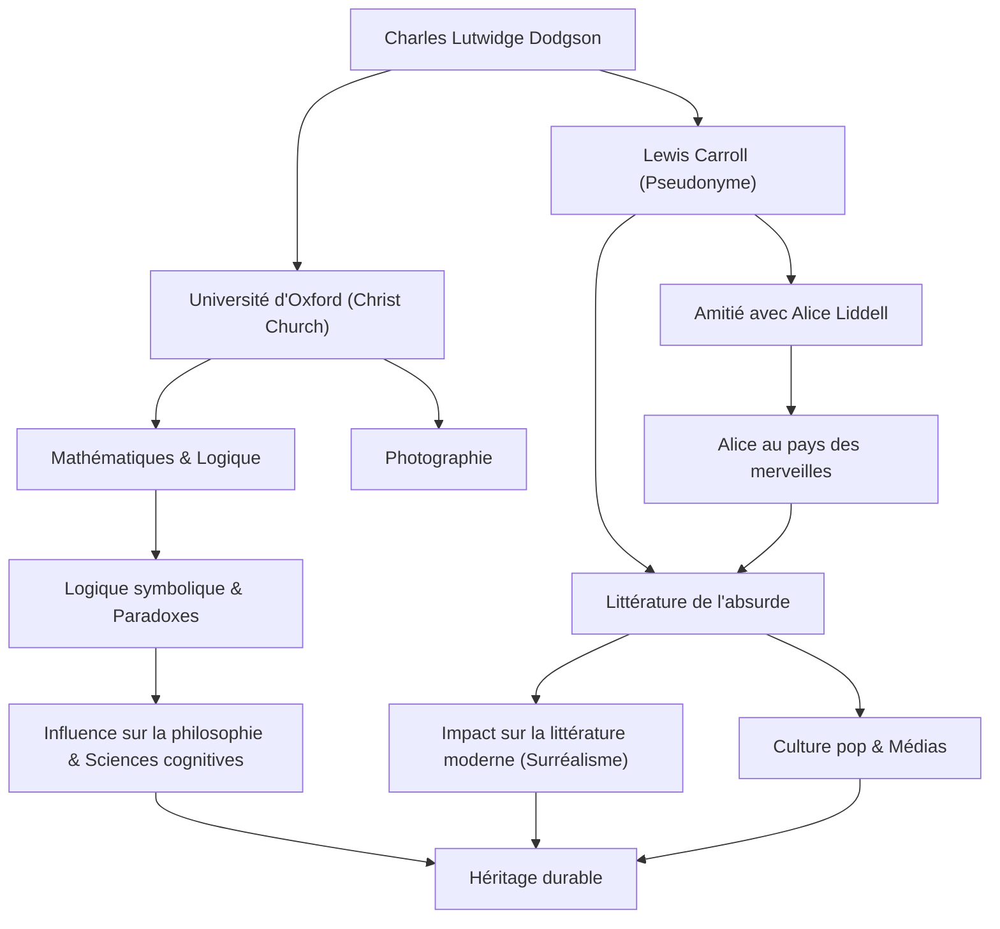

## Introduction

En entendant le nom de « Lewis Carroll », beaucoup de gens pensent à l'auteur du livre pour enfants mondialement apprécié « Alice au pays des merveilles ». Cependant, son vrai nom était Charles Lutwidge Dodgson. Il était professeur de mathématiques à Christ Church, à l'Université d'Oxford, photographe et logicien. La « littérature de l'absurde » (nonsense) qu'il a créée n'est pas simplement une histoire pour enfants, mais continue d'avoir un impact profond sur la linguistique, la philosophie et la logique. Dans cet article, nous plongerons dans la vie du talentueux Lewis Carroll, la philosophie sous-jacente de son œuvre et son influence sur les générations ultérieures.

## Jeunesse : D'un garçon de presbytère à un mathématicien d'Oxford

Charles Lutwidge Dodgson est né en 1832 dans un presbytère à Daresbury, dans le Cheshire, au nord-ouest de l'Angleterre. Élevé dans un environnement familial strict et intellectuel, il a montré dès son plus jeune âge un vif intérêt pour les jeux de mots, les énigmes, les tours de magie et les marionnettes. Ses premières années, au cours desquelles il publiait un magazine familial fait à la main pour ses frères et sœurs, avec des poèmes humoristiques et des illustrations, laissaient déjà entrevoir le futur Lewis Carroll.

En entrant à Christ Church, Oxford, en 1851, il a démontré un talent extraordinaire en mathématiques et a obtenu son diplôme en tête de sa promotion. Il a ensuite enseigné les mathématiques à cet endroit pendant 26 ans. Son quotidien consistait à naviguer entre deux visages : Dodgson, le mathématicien rigide et sérieux, et Carroll, l'homme imaginatif qui aimait jouer avec les enfants.

Le 4 juillet 1862, alors qu'il remontait la Tamise en barque avec les trois filles de Henry Liddell, le doyen de Christ Church — dont Alice Liddell —, Carroll a improvisé une histoire pour elles. Alice, captivée par le récit, l'a supplié : « Écris cette histoire pour moi », ce qui a conduit à la création du chef-d'œuvre historique « Alice au pays des merveilles » (1865). Il a ensuite publié la suite « De l'autre côté du miroir » (1871) et le long poème absurde « La Chasse au Snark » (1876), asseyant ainsi sa renommée d'auteur.

Il s'est également rapidement intéressé à la technologie photographique nouvellement inventée et est devenu un éminent photographe de portraits. Ses photographies de célébrités et d'enfants restent des représentations précieuses de l'art photographique victorien.

## Philosophie et vision du monde : La frontière entre la logique et l'absurde

Le plus grand charme de l'œuvre de Lewis Carroll réside dans la fusion d'une « logique absolue » et du « nonsense » (absurde). Le monde d'Alice, qui semble à première vue absurde et irrationnel, est en réalité construit comme l'envers de règles hautement mathématiques et logiques.

Sous le nom de Dodgson, il était un logicien rigoureux qui a rédigé des livres spécialisés tels que « Traité élémentaire sur les déterminants » (1867) et « Logique symbolique » (1896). Sa littérature de l'absurde est un jeu intellectuel qui utilise habilement l'ambiguïté des mots, les sophismes syllogistiques et la distorsion du temps et de l'espace. Sa technique consistant à démanteler le sens absolu des « mots » et à libérer les lecteurs des limites du bon sens possède une profondeur qui rejoint la philosophie moderne du langage.

Par exemple, la célèbre scène où Humpty Dumpty affirme : « Quand j'utilise un mot, il signifie exactement ce que je choisis qu'il signifie », est un aperçu aigu de l'arbitraire du langage et de la nature de la communication. On dit que cela a influencé des philosophes ultérieurs comme Ludwig Wittgenstein. Pour lui, la « logique » était à la fois la loi absolue définissant le monde et le « jouet » ultime qui pouvait créer un univers parallèle complètement différent simplement en modifiant légèrement les conditions.

## Héritage : Répercussions sur la littérature, la culture et la science

L'héritage de Lewis Carroll s'étend bien au-delà du domaine de la littérature pour enfants.

Premièrement, dans le domaine de la littérature, il a provoqué un éloignement du « didactisme ». Alors que la littérature pour enfants de l'époque était en grande partie un outil pour enseigner la morale aux enfants, Carroll a établi la littérature de l'absurde comme un pur « divertissement ». Cette approche a influencé de nombreux écrivains ultérieurs, tels que James Joyce, Vladimir Nabokov et Jorge Luis Borges, et il est également considéré comme un pionnier du surréalisme.

Son influence sur la culture populaire est tout aussi incommensurable. De l'adaptation cinématographique d'animation de Disney aux films, au théâtre, à la musique et aux jeux, le motif d'« Alice » a été recréé à maintes reprises sur tous les supports. Même dans la culture psychédélique et les œuvres de science-fiction (comme la phrase « suis le lapin blanc » dans le film « Matrix »), la vision du monde créée par Carroll sert d'icône symbolique.

De plus, son nom perdure dans les domaines de la science et des mathématiques. Il n'est pas rare que les paradoxes de Carroll soient cités dans des articles de physique, de logique et de sciences cognitives. Ses textes, qui ont prouvé la mince ligne entre la logique et la folie, continuent de stimuler la curiosité intellectuelle des gens aujourd'hui.

## Organigramme des réalisations et corrélations

## Conclusion

Lewis Carroll, ou Charles Lutwidge Dodgson, a créé un « univers de mots » que personne n'avait jamais atteint auparavant en liant sa pensée logique unique et sa riche imagination au sein de la société stricte de l'ère victorienne. En retraçant sa vie, on peut être témoin du miracle de voir comment des mathématiques rigoureuses et des fantaisies absurdes ont pu résonner dans l'esprit d'un seul être humain.

Le trou dans lequel il a sauté en chassant le lapin blanc reste totalement sans fond même aujourd'hui, plus de 150 ans plus tard. Lorsque nous sommes confrontés aux limites du bon sens et de la logique, les textes laissés par Carroll brilleront à jamais comme la « magie des mots » pour se faufiler à travers ces murs.
