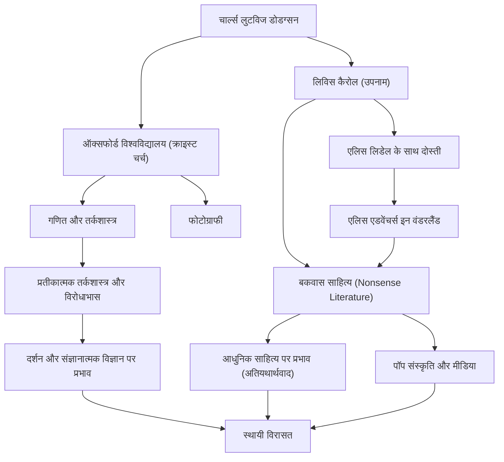

## परिचय

"लिविस कैरोल" का नाम सुनकर, बहुत से लोग विश्व स्तर पर प्रिय बाल पुस्तक "एलिस एडवेंचर्स इन वंडरलैंड" के लेखक के बारे में सोचते हैं। हालाँकि, उनका असली नाम चार्ल्स लुटविज डोडग्सन था। वे क्राइस्ट चर्च, ऑक्सफोर्ड विश्वविद्यालय में गणित के व्याख्याता, एक फोटोग्राफर और एक तर्कशास्त्री थे। उनके द्वारा बनाया गया "बकवास साहित्य" (Nonsense Literature) केवल बच्चों के लिए एक कहानी नहीं है, बल्कि भाषा विज्ञान, दर्शन और तर्कशास्त्र के क्षेत्र में इसका गहरा प्रभाव जारी है। इस लेख में, हम बहुआयामी लिविस कैरोल के जीवन, उनके काम में निहित दर्शन और बाद की पीढ़ियों पर उनके प्रभाव के बारे में गहराई से जानेंगे।

## प्रारंभिक जीवन: एक पादरी के लड़के से ऑक्सफोर्ड के गणितज्ञ तक

चार्ल्स लुटविज डोडग्सन का जन्म 1832 में इंग्लैंड के उत्तर-पश्चिम में चेशायर के डेर्सबरी में एक पादरी के घर में हुआ था। एक सख्त और बौद्धिक पारिवारिक माहौल में पले-बढ़े, उन्होंने कम उम्र से ही शब्दों के खेल, पहेली, जादू के करतब और कठपुतलियों में गहरी दिलचस्पी दिखाई। उनके शुरुआती दिनों में, अपने भाई-बहनों के लिए एक हस्तनिर्मित पारिवारिक पत्रिका प्रकाशित करना, जिसमें हास्य कविताएँ और चित्र शामिल थे, भविष्य के लिविस कैरोल की झलक दिखाते हैं।

1851 में क्राइस्ट चर्च, ऑक्सफोर्ड में प्रवेश करने पर, उन्होंने गणित में असाधारण प्रतिभा का प्रदर्शन किया और अपनी कक्षा में शीर्ष पर रहे। इसके बाद उन्होंने 26 वर्षों तक वहां गणित के व्याख्याता के रूप में पढ़ाया। उनका दैनिक जीवन दो चेहरों के बीच घूमता था: डोडग्सन, एक कठोर और गंभीर गणितज्ञ, और कैरोल, कल्पनाशील व्यक्ति जो बच्चों के साथ खेलना पसंद करता था।

4 जुलाई, 1862 को, क्राइस्ट चर्च के डीन हेनरी लिडेल की तीन बेटियों—जिनमें एलिस लिडेल भी शामिल थीं—के साथ टेम्स नदी में नाव चलाते समय, कैरोल ने उनके लिए तुरंत एक कहानी गढ़ी। कहानी से मंत्रमुग्ध होकर एलिस ने विनती की, "मेरे लिए इस कहानी को लिखो," जिसके कारण ऐतिहासिक कृति "एलिस एडवेंचर्स इन वंडरलैंड" (1865) का निर्माण हुआ। इसके बाद उन्होंने सीक्वल "थ्रू द लुकिंग-ग्लास" (1871) और लंबी बकवास कविता "द हंटिंग ऑफ द शार्क" (1876) प्रकाशित की, जिससे एक लेखक के रूप में उनकी प्रसिद्धि स्थापित हुई।

उन्होंने नव-आविष्कृत फोटोग्राफी तकनीक पर भी तुरंत ध्यान दिया और एक प्रमुख पोर्ट्रेट फोटोग्राफर बन गए। मशहूर हस्तियों और बच्चों की उनकी तस्वीरें विक्टोरियन फोटोग्राफिक कला का मूल्यवान प्रतिनिधित्व बनी हुई हैं।

## दर्शन और विश्वदृष्टि: तर्क और बकवास के बीच की सीमा

लिविस कैरोल के काम का सबसे बड़ा आकर्षण "संपूर्ण तर्क" और "बकवास" (nonsense) का संलयन है। एलिस की दुनिया, जो पहली नज़र में बेतुकी और तर्कहीन लगती है, वास्तव में अत्यधिक गणितीय और तार्किक नियमों के उलट के रूप में निर्मित है।

डोडग्सन के रूप में, वे एक कठोर तर्कशास्त्री थे जिन्होंने "एन एलीमेंट्री ट्रीटीज़ ऑन डिटरमिनेंट्स" (1867) और "सिंबोलिक लॉजिक" (1896) जैसी विशिष्ट पुस्तकें लिखीं। उनका बकवास साहित्य एक बौद्धिक खेल है जो शब्दों की अस्पष्टता, न्यायवाक्य संबंधी भ्रांतियों और समय व स्थान की विकृति का कुशलतापूर्वक उपयोग करता है। "शब्दों" के पूर्ण अर्थ को नष्ट करने और पाठकों को सामान्य ज्ञान की सीमाओं से मुक्त करने की उनकी तकनीक में वह गहराई है जो आधुनिक भाषा दर्शन से जुड़ती है।

उदाहरण के लिए, प्रसिद्ध दृश्य जहां हम्प्टी डम्प्टी का दावा है, "जब मैं किसी शब्द का उपयोग करता हूं, तो इसका ठीक वही अर्थ होता है जो मैं चुनता हूं," भाषा की मनमानी और संचार की प्रकृति में एक तीक्ष्ण अंतर्दृष्टि है। कहा जाता है कि इसने लुडविग विट्गेन्स्टाइन जैसे बाद के दार्शनिकों को प्रभावित किया। उनके लिए, "तर्क" दुनिया को परिभाषित करने वाला पूर्ण नियम होने के साथ-साथ अंतिम "खिलौना" भी था जो केवल परिस्थितियों को थोड़ा बदलकर एक पूरी तरह से अलग समानांतर ब्रह्मांड बना सकता था।

## विरासत: साहित्य, संस्कृति और विज्ञान पर प्रभाव

लिविस कैरोल की विरासत बाल साहित्य के दायरे से कहीं आगे तक फैली हुई है।

सबसे पहले, साहित्य के क्षेत्र में, उन्होंने "उपदेशात्मकता" से विचलन लाया। जबकि उस समय का बाल साहित्य काफी हद तक बच्चों को नैतिकता सिखाने का एक साधन था, कैरोल ने बकवास साहित्य को शुद्ध "मनोरंजन" के रूप में स्थापित किया। इस दृष्टिकोण ने जेम्स जॉयस, व्लादिमीर नाबोकोव और जॉर्ज लुइस बोर्जेस सहित कई बाद के लेखकों को प्रभावित किया, और उन्हें अतियथार्थवाद का अग्रणी भी माना जाता है।

लोकप्रिय संस्कृति में उनका प्रभाव समान रूप से अथाह है। डिज्नी के एनिमेटेड फिल्म रूपांतरण से लेकर फिल्मों, थिएटर, संगीत और खेलों तक, "एलिस" आकृति को सभी माध्यमों में बार-बार फिर से बनाया गया है। यहां तक ​​कि साइकेडेलिक संस्कृति और विज्ञान-कथा कार्यों (जैसे फिल्म "द मैट्रिक्स" में वाक्यांश "सफेद खरगोश का पालन करें") में, कैरोल द्वारा बनाई गई विश्वदृष्टि एक प्रतीकात्मक आइकन के रूप में कार्य करती है।

इसके अलावा, उनका नाम विज्ञान और गणित के क्षेत्र में जीवित है। भौतिकी, तर्कशास्त्र और संज्ञानात्मक विज्ञान के शोधपत्रों में कैरोल के विरोधाभासों का उद्धृत होना असामान्य नहीं है। उनके ग्रंथ, जिन्होंने तर्क और पागलपन के बीच एक महीन रेखा साबित की, आज भी लोगों की बौद्धिक जिज्ञासा को उत्तेजित करते हैं।

## उपलब्धि और सहसंबंध फ़्लोचार्ट

## निष्कर्ष

लिविस कैरोल, या चार्ल्स लुटविज डोडग्सन ने विक्टोरियन युग के सख्त समाज के भीतर अपनी अनूठी तार्किक सोच और समृद्ध कल्पना को जोड़कर "शब्दों का ब्रह्मांड" बनाया, जहां पहले कोई नहीं पहुंचा था। उनके जीवन का पता लगाने पर, कोई भी चमत्कार देख सकता है कि कैसे कठोर गणित और बेतुकी कल्पनाएं एक ही इंसान के दिमाग में गूंज सकती हैं।

जिस छेद में वे सफेद खरगोश का पीछा करते हुए कूदे थे, वह आज 150 से अधिक वर्षों के बाद भी पूरी तरह से अथाह है। जब हम सामान्य ज्ञान और तर्क की सीमाओं का सामना करते हैं, तो कैरोल द्वारा पीछे छोड़े गए ग्रंथ उन दीवारों के माध्यम से खिसकने के लिए "शब्दों के जादू" के रूप में हमेशा चमकेंगे।
