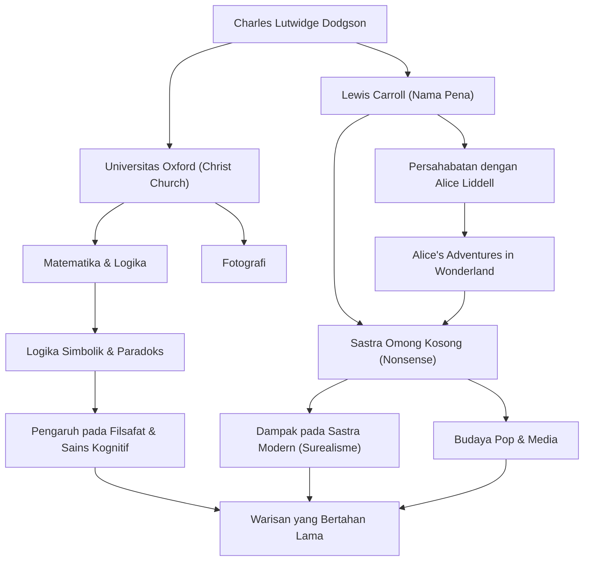

## Pendahuluan

Mendengar nama "Lewis Carroll," banyak orang akan teringat pada penulis buku anak-anak yang dicintai di seluruh dunia, "Alice's Adventures in Wonderland." Namun, nama aslinya adalah Charles Lutwidge Dodgson. Ia adalah seorang dosen matematika di Christ Church, Universitas Oxford, fotografer, dan ahli logika. "Sastra omong kosong" (nonsense literature) yang ia ciptakan tidak hanya sekadar cerita untuk anak-anak, tetapi terus memberikan dampak mendalam pada linguistik, filsafat, dan logika. Dalam artikel ini, kita akan menggali lebih dalam tentang kehidupan Lewis Carroll yang multifaset, filosofi yang mendasari karyanya, dan pengaruhnya terhadap generasi penerus.

## Masa Muda: Dari Anak Pendeta Menjadi Matematikawan Oxford

Charles Lutwidge Dodgson lahir pada tahun 1832 di sebuah rumah pendeta di Daresbury, Cheshire, di Inggris Barat Laut. Dibesarkan di lingkungan keluarga yang ketat dan intelektual, ia menunjukkan minat yang kuat pada permainan kata, teka-teki, sulap, dan boneka sejak usia muda. Masa lalunya, menerbitkan majalah buatan sendiri untuk saudara-saudaranya yang menampilkan puisi humor dan ilustrasi, menunjukkan sekilas tentang Lewis Carroll di masa depan.

Setelah memasuki Christ Church, Oxford pada tahun 1851, ia menunjukkan bakat luar biasa dalam matematika dan lulus sebagai lulusan terbaik. Ia kemudian mengajar matematika di sana selama 26 tahun. Kehidupan sehari-harinya dihabiskan dengan beralih di antara dua sisi: Dodgson, ahli matematika yang kaku dan serius, dan Carroll, pria imajinatif yang suka bermain dengan anak-anak.

Pada tanggal 4 Juli 1862, saat mendayung di Sungai Thames bersama ketiga putri Henry Liddell, Dekan Christ Church—termasuk Alice Liddell—Carroll secara spontan menceritakan sebuah kisah kepada mereka. Alice, yang terpikat oleh cerita itu, memohon, "Tuliskan cerita ini untukku," yang berujung pada terciptanya mahakarya bersejarah "Alice's Adventures in Wonderland" (1865). Ia kemudian menerbitkan sekuelnya, "Through the Looking-Glass" (1871), dan puisi omong kosong panjang, "The Hunting of the Snark" (1876), mengukuhkan ketenarannya sebagai penulis.

Ia juga dengan cepat memperhatikan teknologi fotografi yang baru ditemukan saat itu dan menjadi fotografer potret terkemuka. Foto-foto selebritas dan anak-anak yang diambilnya tetap menjadi representasi berharga dari seni fotografi Victoria.

## Filsafat dan Pandangan Dunia: Batasan Antara Logika dan Omong Kosong

Daya tarik terbesar karya Lewis Carroll terletak pada perpaduan antara "logika yang menyeluruh" dan "omong kosong" (nonsense). Dunia Alice, yang pada pandangan pertama tampak absurd dan tidak rasional, sebenarnya dibangun sebagai kebalikan dari aturan matematika dan logika tingkat tinggi.

Sebagai Dodgson, ia adalah seorang ahli logika yang ketat dan menulis buku-buku khusus seperti "An Elementary Treatise on Determinants" (1867) dan "Symbolic Logic" (1896). Sastra omong kosongnya adalah permainan intelektual yang dengan cerdik memanfaatkan ambiguitas kata, kesalahan silogisme, serta distorsi ruang dan waktu. Tekniknya dalam membongkar makna absolut "kata-kata" dan membebaskan pembaca dari batas akal sehat memiliki kedalaman yang berhubungan dengan filsafat bahasa modern.

Misalnya, adegan terkenal di mana Humpty Dumpty menegaskan, "Ketika saya menggunakan sebuah kata, artinya tepat seperti yang saya pilih," adalah wawasan tajam tentang kesewenang-wenangan bahasa dan sifat komunikasi. Hal ini dikatakan telah memengaruhi filsuf-filsuf di kemudian hari seperti Ludwig Wittgenstein. Baginya, "logika" adalah hukum mutlak yang mendefinisikan dunia sekaligus "mainan" utama yang dapat menciptakan alam semesta paralel yang sama sekali berbeda hanya dengan sedikit mengubah kondisi.

## Warisan: Dampak pada Sastra, Budaya, dan Sains

Warisan yang ditinggalkan Lewis Carroll melampaui bidang sastra anak-anak.

Pertama, di bidang sastra, ia membawa perubahan yang menjauh dari "didaktisisme." Sementara sastra anak-anak pada masa itu sebagian besar merupakan alat untuk mengajarkan moral, Carroll menjadikan sastra omong kosong sebagai hiburan murni. Pendekatan ini memengaruhi banyak penulis generasi berikutnya, termasuk James Joyce, Vladimir Nabokov, dan Jorge Luis Borges, dan ia juga dianggap sebagai pelopor surealisme.

Pengaruhnya dalam budaya populer juga tak terukur. Dari adaptasi film animasi Disney hingga film, teater, musik, dan game, motif "Alice" telah berulang kali diciptakan kembali di semua media. Bahkan dalam budaya psikedelik dan karya fiksi ilmiah (seperti frasa "ikuti kelinci putih" di film "The Matrix"), pandangan dunia yang diciptakan oleh Carroll berfungsi sebagai ikon simbolis.

Selain itu, namanya tetap hidup dalam bidang sains dan matematika. Bukan hal yang tidak biasa jika paradoks Carroll dikutip dalam makalah tentang fisika, logika, dan sains kognitif. Teks-teksnya, yang membuktikan batas tipis antara logika dan kegilaan, terus merangsang rasa ingin tahu intelektual orang-orang saat ini.

## Bagan Alur Pencapaian dan Korelasi

## Penutup

Lewis Carroll, atau Charles Lutwidge Dodgson, menciptakan "alam semesta kata-kata" yang belum pernah dicapai siapa pun sebelumnya dengan menghubungkan pemikiran logisnya yang unik dan imajinasi yang kaya di dalam masyarakat yang ketat pada era Victoria. Menelusuri kehidupannya, kita bisa menyaksikan keajaiban bagaimana matematika yang ketat dan fantasi absurd bisa bergema di dalam pikiran satu manusia.

Lubang tempat ia melompat saat mengejar kelinci putih tetap tak berdasar bahkan saat ini, lebih dari 150 tahun kemudian. Ketika kita menghadapi batas akal sehat dan logika, teks-teks yang ditinggalkan Carroll akan selamanya bersinar sebagai "sihir kata-kata" untuk menembus batas-batas tersebut.
