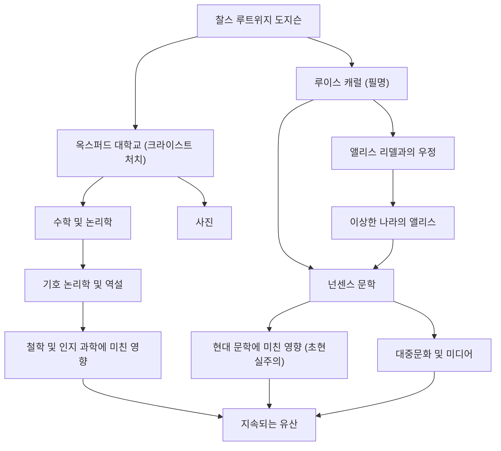

## 머리말

'루이스 캐럴'이라는 이름을 들으면 많은 사람들이 전 세계적으로 사랑받는 동화 『이상한 나라의 앨리스』의 작가를 떠올릴 것입니다. 하지만 그의 본명은 찰스 루트위지 도지슨입니다. 그는 영국 옥스퍼드 대학교 크라이스트 처치의 수학 강사이자 사진작가였으며 논리학자이기도 했습니다. 그가 창조해낸 '넌센스 문학'은 단순한 어린이용 이야기에서 머물지 않고 언어학, 철학, 논리학의 영역에까지 깊은 영향을 계속 미치고 있습니다. 본 기사에서는 다방면의 재능을 가진 루이스 캐럴의 생애, 그의 작품 기저에 흐르는 철학, 그리고 후세에 미친 영향에 대해 깊이 파헤쳐 보겠습니다.

## 생애: 목사관의 소년에서 옥스퍼드의 수학자로

1832년, 영국 북서부 체셔주의 대어스베리 목사관에서 찰스 루트위지 도지슨이 태어났습니다. 엄격하고 지적인 가정 환경에서 자란 그는 어린 시절부터 말장난과 퍼즐, 마술, 꼭두각시에 강한 관심을 보였습니다. 형제자매들을 위해 손수 만든 가정 내 잡지를 발행하고 유머러스한 시와 일러스트를 실었던 일화에서는 훗날 루이스 캐럴의 편린을 엿볼 수 있습니다.

1851년 옥스퍼드 대학교 크라이스트 처치에 입학한 후 수학에서 비범한 재능을 발휘하여 수석으로 졸업했습니다. 이후 동 대학교의 수학 강사로 26년간 교편을 잡게 됩니다. 그의 일상은 완고하고 성실한 수학자 도지슨과 상상력이 풍부하고 아이들과 노는 것을 사랑하는 캐럴이라는 두 얼굴 사이를 오가는 것이었습니다.

1862년 7월 4일, 크라이스트 처치 학장 헨리 리델의 딸인 앨리스 리델 등 세 자매와 함께 템스강을 보트로 거슬러 올라갈 때 캐럴은 즉흥적으로 이야기를 들려주었습니다. 이 이야기에 푹 빠진 앨리스가 "저를 위해 이 이야기를 적어 주세요"라고 간청한 것이 계기가 되어 역사적 걸작 『이상한 나라의 앨리스』(1865년)가 탄생하게 됩니다. 이후에도 속편 『거울 나라의 앨리스』(1871년)나 장편 넌센스 시 『스나크 사냥』(1876년) 등을 발표하며 작가로서의 명성을 확고히 했습니다.

또한 그는 당시 갓 발명된 사진 기술에도 일찍이 눈을 돌려 탁월한 인물 사진작가로도 활약했습니다. 그가 촬영한 저명인사들과 아이들의 사진은 빅토리아 시대의 사진 예술을 대표하는 귀중한 자료로 남아 있습니다.

## 철학과 세계관: 논리와 넌센스의 경계

루이스 캐럴 작품을 관통하는 최대의 매력은 '철저한 논리'와 '넌센스(무의미)'의 융합에 있습니다. 언뜻 보기에 황당무계하고 부조리해 보이는 앨리스의 세계는 사실 고도의 수학적·논리적 규칙의 이면으로 구축되어 있습니다.

도지슨으로서의 그는 『행렬식 초보』(1867년)나 『기호 논리학』(1896년)과 같은 전문 서적을 집필하는 엄격한 논리학자였습니다. 그가 만들어낸 넌센스 문학은 단어의 다의성, 삼단논법의 오류, 시간과 공간의 왜곡 등을 교묘하게 이용한 지적 유희입니다. '말'이 가진 절대적인 의미를 해체하고 독자를 상식의 틀에서 해방시키는 수법은 현대의 언어 철학과도 통하는 깊이를 지니고 있습니다.

예를 들어 험프티 덤프티가 "내가 단어를 사용할 때 그 단어는 내가 선택한 의미가 된다"라고 주장하는 유명한 장면은 언어의 자의성과 커뮤니케이션의 본질을 찌른 예리한 통찰로서 훗날 철학자 루트비히 비트겐슈타인 등에게도 영향을 주었다고 알려져 있습니다. 그에게 '논리'란 세계를 규정하는 절대적인 법칙인 동시에, 조건을 조금만 비틀어도 전혀 다른 평행 세계를 만들어낼 수 있는 궁극의 '장난감'이었습니다.

## 후세에 미친 영향: 문학·문화·과학에 미치는 파급

루이스 캐럴이 남긴 공적은 아동 문학의 틀을 훨씬 뛰어넘어 확산되어 있습니다.

먼저 문학 분야에서 그는 '교훈주의'로부터의 탈피를 가져왔습니다. 당시 아동 문학은 아이들에게 도덕을 가르치기 위한 도구라는 측면이 강했던 반면, 캐럴은 순수한 '오락'으로서의 넌센스 문학을 확립했습니다. 이 접근법은 제임스 조이스나 블라디미르 나보코프, 호르헤 루이스 보르헤스 등 후세의 수많은 작가에게 영향을 주었으며 초현실주의(쉬르레알리스무)의 선구자로도 평가받고 있습니다.

대중문화에 미친 영향도 헤아릴 수 없습니다. 디즈니의 애니메이션 영화화를 비롯하여 영화, 연극, 음악, 게임 등 모든 미디어에서 '앨리스'의 모티프는 반복적으로 재창조되고 있습니다. 사이키델릭 컬처나 SF 작품(예를 들어 영화 『매트릭스』의 "흰 토끼를 쫓아라"라는 대사)에 있어서도 캐럴이 만들어낸 세계관은 상징적인 아이콘으로 기능하고 있습니다.

나아가 과학이나 수학 분야에서도 그의 이름은 계속 살아 숨 쉬고 있습니다. 물리학, 논리학, 인지 과학 논문에서 캐럴의 역설이 인용되는 것은 드문 일이 아닙니다. 논리학과 광기가 종이 한 장 차이임을 증명한 그의 텍스트는 지금도 사람들의 지적 호기심을 계속 자극하고 있는 것입니다.

## 공적 및 상관관계 흐름도

## 맺음말

루이스 캐럴, 즉 찰스 루트위지 도지슨은 빅토리아 시대의 엄격한 사회 속에서 독자적인 논리적 사고와 풍부한 상상력을 결합함으로써 아무도 도달한 적 없는 '말의 우주'를 창조했습니다. 그의 생애를 되짚어보면 한 인간의 두뇌 속에서 엄밀한 수학과 황당무계한 몽상이 어떻게 공명할 수 있는지에 대한 기적을 볼 수 있습니다.

그가 흰 토끼를 쫓아 뛰어든 구멍은 150년 이상 지난 현대에도 전혀 바닥이 보이지 않습니다. 우리가 상식이나 논리의 한계에 직면했을 때, 캐럴이 남긴 텍스트는 그 벽을 빠져나가기 위한 '말의 마법'으로서 영원히 빛날 것입니다.
