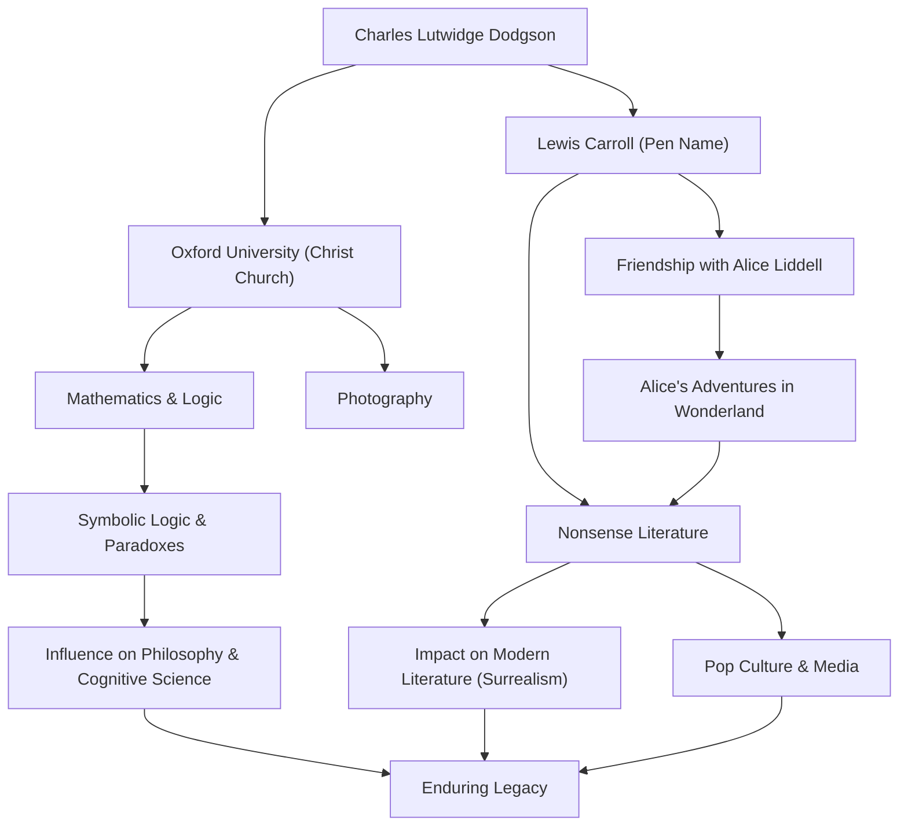

## はじめに

「ルイス・キャロル」という名前を聞いて、多くの人が思い浮かべるのは、世界中で愛読されている童話『不思議の国のアリス』の作者という顔でしょう。しかし、彼の本名はチャールズ・ラトウィッジ・ドジソン。イギリス・オックスフォード大学クライスト・チャーチの数学講師であり、写真家、そして論理学者でもありました。彼の生み出した「ナンセンス文学」は、単なる子供向けの物語にとどまらず、言語学、哲学、論理学の領域にまで深い影響を与え続けています。本記事では、多面的な才能を持ったルイス・キャロルの生涯、彼の根底に流れる哲学、そして後世への影響について深く掘り下げていきます。

## 生涯：牧師館の少年からオックスフォードの数学者へ

1832年、イングランド北西部のチェシャー州にあるデアズベリーの牧師館で、チャールズ・ラトウィッジ・ドジソンは誕生しました。厳格かつ知的な家庭環境で育った彼は、幼い頃から言葉遊びやパズル、手品、操り人形に強い関心を示しました。兄弟姉妹のために手作りの家庭内雑誌を発行し、ユーモアあふれる詩やイラストを掲載していたエピソードからは、後のルイス・キャロルの片鱗が窺えます。

1851年にオックスフォード大学クライスト・チャーチに入学すると、数学において並外れた才能を発揮し、首席で卒業。その後、同大学の数学講師として26年間教鞭を執ることになります。彼の日常は、堅物で生真面目な数学者としてのドジソンと、想像力豊かで子供たちと遊ぶことを愛するキャロルという、二つの顔の間を行き来するものでした。

1862年7月4日、クライスト・チャーチの学寮長ヘンリー・リデルの娘であるアリス・リデルら三姉妹と共にテムズ川をボートで遡った際、キャロルは即興で物語を語って聞かせました。この物語に夢中になったアリスが「私のためにこのお話を書き留めて」と懇願したことがきっかけとなり、歴史的傑作『不思議の国のアリス』（1865年）が誕生します。その後も続編『鏡の国のアリス』（1871年）や、長編ナンセンス詩『スナーク狩り』（1876年）などを発表し、作家としての名声を確立しました。

また、彼は当時発明されたばかりの写真技術にもいち早く目をつけ、卓越したポートレート写真家としても活躍しました。彼が撮影した著名人や子供たちの写真は、ヴィクトリア朝時代の写真芸術を代表する貴重な資料となっています。

## 哲学と世界観：論理とナンセンスの境界

ルイス・キャロルの作品を貫く最大の魅力は、「徹底した論理」と「ナンセンス（無意味）」の融合にあります。一見すると荒唐無稽で不条理に思えるアリスの世界は、実は高度な数学的・論理的なルールの裏返しとして構築されています。

ドジソンとしての彼は、『行列式初歩』（1867年）や『記号論理学』（1896年）といった専門書を執筆する厳格な論理学者でした。彼の生み出したナンセンス文学は、言葉の多義性、三段論法の誤謬、時間や空間の歪みなどを巧みに利用した知的な遊戯です。「言葉」が持つ絶対的な意味を解体し、読者を常識の枠から解放する手法は、現代の言語哲学にも通じる深みを持っています。

たとえば、ハンプティ・ダンプティが「私が言葉を使うとき、その言葉は私が選んだ意味になる」と主張する有名なシーンは、言語の恣意性やコミュニケーションの本質を突いた鋭い洞察として、後年の哲学者ルートヴィヒ・ウィトゲンシュタインなどにも影響を与えたと言われています。彼にとって「論理」とは世界を規定する絶対的な法則であると同時に、少し条件を狂わせるだけで全く別のパラレルワールドを生み出せる、究極の「おもちゃ」だったのです。

## 後世への影響：文学・文化・科学に及ぶ波及

ルイス・キャロルが遺した功績は、児童文学の枠を遥かに超えて広がっています。

まず文学の分野において、彼は「教訓主義」からの脱却をもたらしました。当時の児童文学は子供に道徳を教えるためのツールという側面が強かったのに対し、キャロルは純粋な「娯楽」としてのナンセンス文学を確立しました。このアプローチは、ジェイムズ・ジョイスやウラジーミル・ナボコフ、ホルヘ・ルイス・ボルヘスなど、後世の数多くの作家に影響を与え、シュルレアリスム（超現実主義）の先駆者としても評価されています。

大衆文化における影響も計り知れません。ディズニーによるアニメーション映画化をはじめ、映画、演劇、音楽、ゲームなど、あらゆるメディアで「アリス」のモチーフは繰り返し再創造されています。サイケデリック・カルチャーやSF作品（例えば映画『マトリックス』の「白ウサギを追え」というフレーズ）においても、キャロルの作り上げた世界観は象徴的なアイコンとして機能しています。

さらに、科学や数学の分野でも彼の名は生き続けています。物理学、論理学、認知科学の論文においてキャロルのパラドックスが引用されることは珍しくありません。論理学と狂気が紙一重であることを証明した彼のテキストは、今なお人々の知的好奇心を刺激し続けているのです。

## 功績と相関のフロー図

## おわりに

ルイス・キャロル、すなわちチャールズ・ラトウィッジ・ドジソンは、ヴィクトリア朝の厳格な社会の中で、独自の論理的思考と豊かな想像力を結びつけることで、誰も到達したことのない「言葉の宇宙」を創造しました。彼の生涯を辿ると、一人の人間の頭脳の中で、厳密な数学と荒唐無稽な夢想がいかにして共鳴し得るかという奇跡を見ることができます。

彼が白ウサギを追って飛び込んだ穴は、150年以上経った現代でも全く底が見えません。私たちが常識や論理の限界に直面したとき、キャロルの残したテキストは、その壁をすり抜けるための「言葉の魔法」として、永遠に輝き続けることでしょう。
