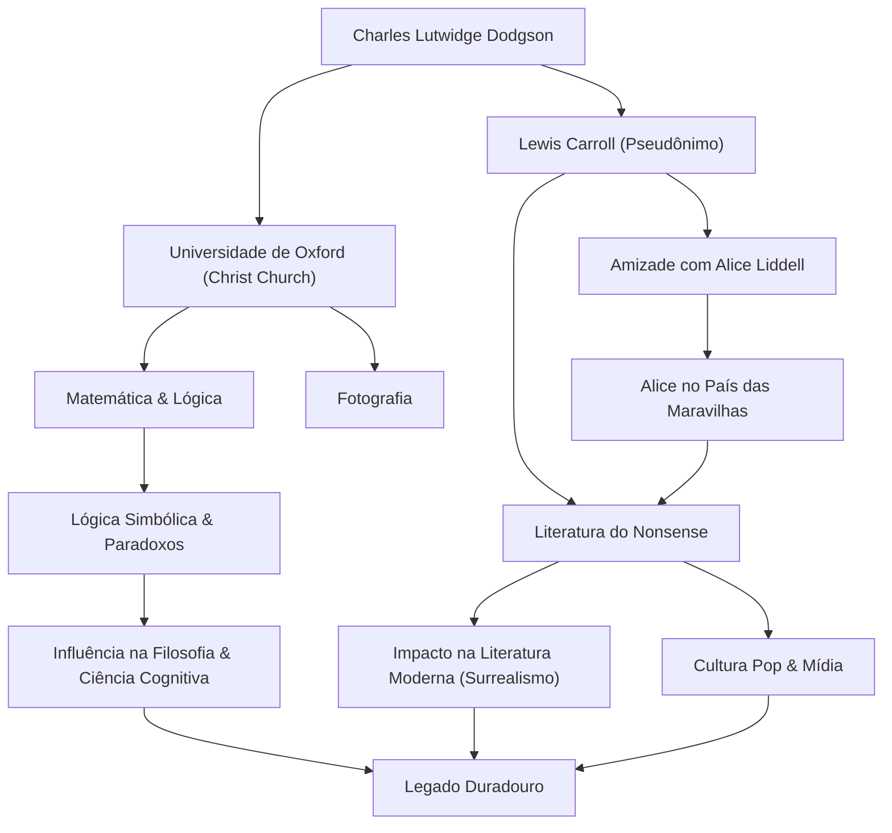

## Introdução

Ao ouvir o nome "Lewis Carroll", muitas pessoas pensam no autor do mundialmente amado livro infantil "Alice no País das Maravilhas". No entanto, seu verdadeiro nome era Charles Lutwidge Dodgson. Ele era professor de matemática na Christ Church, Universidade de Oxford, fotógrafo e lógico. A "literatura do nonsense" que ele criou não é apenas uma história para crianças, mas continua a ter um impacto profundo na linguística, filosofia e lógica. Neste artigo, vamos mergulhar na vida do multifacetado Lewis Carroll, na filosofia subjacente ao seu trabalho e na sua influência nas gerações posteriores.

## Primeiros Anos: De um Menino da Paróquia a um Matemático de Oxford

Charles Lutwidge Dodgson nasceu em 1832 em uma paróquia em Daresbury, Cheshire, no noroeste da Inglaterra. Criado em um ambiente familiar rigoroso e intelectual, ele demonstrou um forte interesse por jogos de palavras, quebra-cabeças, truques de mágica e marionetes desde muito jovem. Seus primeiros anos, publicando uma revista familiar feita à mão para seus irmãos, com poemas bem-humorados e ilustrações, mostraram vislumbres do futuro Lewis Carroll.

Ao ingressar na Christ Church, Oxford, em 1851, ele demonstrou extraordinário talento em matemática e se formou como o primeiro de sua turma. Ele passou a ensinar matemática lá por 26 anos. Sua vida diária envolvia navegar entre dois rostos: Dodgson, o matemático rígido e sério, e Carroll, o homem imaginativo que adorava brincar com as crianças.

Em 4 de julho de 1862, enquanto remava pelo rio Tâmisa com as três filhas de Henry Liddell, o Reitor da Christ Church — incluindo Alice Liddell —, Carroll improvisou uma história para elas. Alice, cativada pelo conto, implorou: "Escreva esta história para mim", o que levou à criação da obra-prima histórica "Alice no País das Maravilhas" (1865). Ele publicou subsequentemente a sequência "Através do Espelho" (1871) e o longo poema nonsense "A Caça ao Snark" (1876), estabelecendo sua fama como autor.

Ele também notou rapidamente a recém-inventada tecnologia fotográfica e se tornou um preeminente fotógrafo de retratos. Suas fotografias de celebridades e crianças continuam sendo representações valiosas da arte fotográfica vitoriana.

## Filosofia e Visão de Mundo: A Fronteira Entre a Lógica e o Nonsense

O maior encanto do trabalho de Lewis Carroll reside na fusão de "lógica exaustiva" e "nonsense". O mundo de Alice, que à primeira vista parece absurdo e irracional, é na verdade construído como o reverso de regras altamente matemáticas e lógicas.

Como Dodgson, ele era um lógico rigoroso que foi autor de livros especializados como "Tratado Elementar sobre Determinantes" (1867) e "Lógica Simbólica" (1896). Sua literatura do nonsense é um jogo intelectual que utiliza habilmente a ambiguidade das palavras, as falácias silogísticas e a distorção do tempo e do espaço. Sua técnica de desmantelar o significado absoluto das "palavras" e libertar os leitores dos limites do senso comum tem uma profundidade que se conecta com a moderna filosofia da linguagem.

Por exemplo, a famosa cena em que Humpty Dumpty afirma: "Quando eu uso uma palavra, ela significa exatamente o que eu escolho que ela signifique", é uma percepção aguda sobre a arbitrariedade da linguagem e a natureza da comunicação. Diz-se que isso influenciou filósofos posteriores como Ludwig Wittgenstein. Para ele, a "lógica" era tanto a lei absoluta que definia o mundo quanto o "brinquedo" definitivo que poderia criar um universo paralelo completamente diferente apenas ajustando levemente as condições.

## Legado: Repercussões na Literatura, Cultura e Ciência

O legado de Lewis Carroll se estende muito além do reino da literatura infantil.

Primeiro, no campo da literatura, ele provocou um afastamento do "didatismo". Enquanto a literatura infantil da época era em grande parte uma ferramenta para ensinar moral às crianças, Carroll estabeleceu a literatura do nonsense como puro "entretenimento". Essa abordagem influenciou vários escritores posteriores, incluindo James Joyce, Vladimir Nabokov e Jorge Luis Borges, e ele também é considerado um pioneiro do surrealismo.

Sua influência na cultura popular é igualmente imensurável. Desde a adaptação cinematográfica animada da Disney até filmes, teatro, música e jogos, o motivo de "Alice" foi repetidamente recriado em todas as mídias. Mesmo na cultura psicodélica e em obras de ficção científica (como a frase "siga o coelho branco" no filme "Matrix"), a visão de mundo criada por Carroll serve como um ícone simbólico.

Além disso, seu nome vive nos campos da ciência e da matemática. Não é incomum que os paradoxos de Carroll sejam citados em artigos sobre física, lógica e ciências cognitivas. Seus textos, que provaram a tênue linha entre a lógica e a loucura, continuam a estimular a curiosidade intelectual das pessoas hoje.

## Fluxograma de Conquistas e Correlações

## Conclusão

Lewis Carroll, ou Charles Lutwidge Dodgson, criou um "universo de palavras" que ninguém havia alcançado antes ao vincular seu pensamento lógico único e rica imaginação dentro da sociedade estrita da era vitoriana. Traçando sua vida, pode-se testemunhar o milagre de como a matemática rigorosa e as fantasias absurdas puderam ressoar na mente de um único ser humano.

O buraco no qual ele pulou perseguindo o coelho branco permanece completamente sem fundo até hoje, mais de 150 anos depois. Quando nos deparamos com os limites do senso comum e da lógica, os textos que Carroll deixou para trás brilharão para sempre como a "magia das palavras" para deslizar através dessas paredes.
