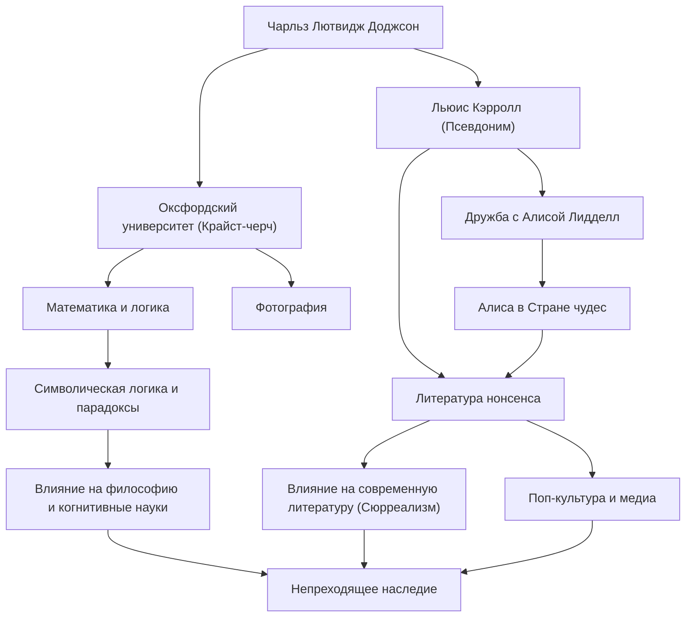

## Введение

Услышав имя «Льюис Кэрролл», многие вспоминают автора всемирно любимой детской книги «Алиса в Стране чудес». Однако его настоящее имя — Чарльз Лютвидж Доджсон. Он был преподавателем математики в колледже Крайст-черч Оксфордского университета, фотографом и логиком. Созданная им «литература нонсенса» (абсурда) — это не просто детская сказка; она продолжает оказывать глубокое влияние на лингвистику, философию и логику. В этой статье мы подробно рассмотрим жизнь многогранного Льюиса Кэрролла, философию, лежащую в основе его творчества, и его влияние на последующие поколения.

## Ранние годы: От мальчика из дома священника до оксфордского математика

Чарльз Лютвидж Доджсон родился в 1832 году в доме священника в Дарсбери, графство Чешир, на северо-западе Англии. Выросший в строгой и интеллектуальной семейной атмосфере, он с ранних лет проявлял сильный интерес к играм со словами, головоломкам, фокусам и марионеткам. То, как он издавал домашний рукописный журнал для своих братьев и сестер с юмористическими стихами и иллюстрациями, уже тогда предвещало появление Льюиса Кэрролла.

Поступив в колледж Крайст-черч в Оксфорде в 1851 году, он продемонстрировал выдающиеся математические способности и окончил учебу с отличием. Впоследствии он преподавал там математику в течение 26 лет. Его повседневная жизнь была разделена между двумя ролями: Доджсоном, строгим и серьезным математиком, и Кэрроллом, человеком с богатым воображением, который любил играть с детьми.

4 июля 1862 года, катаясь на лодке по Темзе с тремя дочерьми Генри Лидделла, декана Крайст-черч, — в том числе с Алисой Лидделл, — Кэрролл на ходу придумал для них историю. Алиса, увлеченная рассказом, умоляла: «Запиши эту историю для меня», что и привело к созданию исторического шедевра «Алиса в Стране чудес» (1865). Позже он опубликовал продолжение «Алиса в Зазеркалье» (1871) и длинную поэму абсурда «Охота на Снарка» (1876), укрепив свою славу писателя.

Он также быстро обратил внимание на недавно изобретенную фотографию и стал выдающимся портретным фотографом. Его фотографии знаменитостей и детей до сих пор остаются ценными образцами викторианского фотоискусства.

## Философия и мировоззрение: Граница между логикой и абсурдом

Главное очарование произведений Льюиса Кэрролла кроется в слиянии «железной логики» и «нонсенса». Мир Алисы, который на первый взгляд кажется нелепым и иррациональным, на самом деле построен как изнанка строгих математических и логических правил.

Под именем Доджсон он был строгим логиком, написавшим такие специализированные труды, как «Элементарное руководство по теории детерминантов» (1867) и «Символическая логика» (1896). Его литература нонсенса — это интеллектуальная игра, умело использующая многозначность слов, ошибки силлогизмов и искажение времени и пространства. Его метод разрушения абсолютного смысла «слов» и освобождения читателей от рамок здравого смысла обладает глубиной, перекликающейся с современной философией языка.

Например, знаменитая сцена, где Шалтай-Болтай утверждает: «Когда я беру слово, оно значит то, что я хочу, не больше и не меньше», — это проницательный взгляд на произвольность языка и природу общения. Считается, что это оказало влияние на более поздних философов, таких как Людвиг Витгенштейн. Для него «логика» была одновременно и абсолютным законом, определяющим мир, и величайшей «игрушкой», с помощью которой можно было создать совершенно иную параллельную вселенную, лишь слегка изменив исходные условия.

## Наследие: Влияние на литературу, культуру и науку

Наследие Льюиса Кэрролла выходит далеко за рамки детской литературы.

Во-первых, в области литературы он способствовал отходу от «дидактизма». Если детская литература того времени была по большей части инструментом морального воспитания, то Кэрролл утвердил литературу нонсенса как чистое «развлечение». Этот подход повлиял на многих более поздних писателей, включая Джеймса Джойса, Владимира Набокова и Хорхе Луиса Борхеса, и его также считают предшественником сюрреализма.

Его влияние на популярную культуру столь же неизмеримо. От диснеевских мультфильмов до кино, театра, музыки и игр — мотив «Алисы» многократно переосмыслялся во всех медиа. Даже в психоделической культуре и научной фантастике (например, фраза «следуй за белым кроликом» в фильме «Матрица») мир, созданный Кэрроллом, служит символическим ориентиром.

Кроме того, его имя продолжает жить в науке и математике. Парадоксы Кэрролла нередко цитируются в статьях по физике, логике и когнитивным наукам. Его тексты, доказавшие, что логика и безумие разделены тонкой гранью, и сегодня продолжают стимулировать интеллектуальное любопытство людей.

## Блок-схема достижений и связей

## Заключение

Льюис Кэрролл, он же Чарльз Лютвидж Доджсон, создал «вселенную слов», которой до него никто не достигал, объединив свое уникальное логическое мышление и богатое воображение в строгом обществе викторианской эпохи. Прослеживая его жизнь, мы можем стать свидетелями чуда: как строгая математика и нелепые фантазии смогли найти отклик в уме одного человека.

Нора, в которую он прыгнул, погнавшись за белым кроликом, остается совершенно бездонной и сегодня, спустя более 150 лет. Когда мы сталкиваемся с границами здравого смысла и логики, тексты, оставленные Кэрроллом, будут вечно сиять как «магия слов», помогающая пройти сквозь эти стены.
